<a href="https://colab.research.google.com/github/vflores-io/Portfolio/blob/main/Bayesian%20Methods%20Tutorials/Python/NumPyro/NP01_LogReg_Surv_Analysis/NP01_LogReg_Surv_Analysis.ipynb" target="_parent"></a>

# 1. Introduction

Cirrhosis is a progressive liver disease characterized by the replacement of healthy liver tissue with scar tissue, leading to impaired liver function. Early prediction of patient survival can significantly impact treatment decisions and improve outcomes. In this project, we employ Bayesian statistical methods to analyze and predict the survival of patients with cirrhosis using a publicly available dataset from the UCI ML Dataset Repository.

1. **Bayesian Classification (Logistic Regression):** We develop a Bayesian logistic regression model to predict the survival status of patients based on various clinical features. This probabilistic approach allows us to incorporate prior knowledge and quantify uncertainty in our predictions.

2. **Bayesian Survival Analysis:** We perform a comprehensive survival analysis using Bayesian methods. We start with a basic Weibull model without covariates to understand the baseline survival function. We then introduce covariates to the Weibull model, and despite encountering challenges with this approach, we proceed to implement a log-normal model with covariates, which demonstrates improved performance. Finally, we refine the Weibull model by including selected covariates and accounting for censored data to enhance the model's applicability to real-world scenarios.

Throughout this project, we emphasize the iterative nature of model development in Bayesian statistics and showcase how to handle practical issues that may arise during analysis.


## 1.1 Importing Packages

To begin our analysis, we first import the necessary Python libraries for data manipulation, visualization, and Bayesian modeling.


```python
import sys

if 'google.colab' in str(get_ipython()):
    if 'numpyro' not in sys.modules:
        from google.colab import drive
        drive.mount('/content/drive')
        print("Running on Google Colab. NumPyro will be installed in this environment.")
        !pip install -q numpyro@git+https://github.com/pyro-ppl/numpyro arviz

    else:
        print("NumPyro is already installed. Skipping installation.")
else:
    print("Running locally. Make sure NumPyro and dependencies are installed in the environment.")

```

    Running locally. Make sure NumPyro and dependencies are installed in the environment.
    


```python
import numpyro
numpyro.set_host_device_count(4)
import numpyro.distributions as dist
from numpyro.infer import MCMC, NUTS, Predictive
from jax import random
import jax.numpy as jnp
import numpy as np
import seaborn as sns
import arviz as az
import pandas as pd
import matplotlib.pyplot as plt
from matplotlib import cm
from sklearn.preprocessing import LabelEncoder, scale
```

## 1.2 Loading the Dataset

We load the cirrhosis dataset, adjusting the file path depending on whether we're running the code on Google Colab or locally. After reading the data into a pandas DataFrame, we display the first few rows to preview the dataset.


```python
if 'google.colab' in str(get_ipython()):
  data_path = 'https://archive.ics.uci.edu/static/public/878/data.csv'
else:
  data_path = 'data/cirrhosis.csv'

data = pd.read_csv(data_path)
data.head()
```


<div>
<style scoped>
    .dataframe tbody tr th:only-of-type {
        vertical-align: middle;
    }

    .dataframe tbody tr th {
        vertical-align: top;
    }

    .dataframe thead th {
        text-align: right;
    }
</style>
<table border="1" class="dataframe">
  <thead>
    <tr style="text-align: right;">
      <th></th>
      <th>ID</th>
      <th>N_Days</th>
      <th>Status</th>
      <th>Drug</th>
      <th>Age</th>
      <th>Sex</th>
      <th>Ascites</th>
      <th>Hepatomegaly</th>
      <th>Spiders</th>
      <th>Edema</th>
      <th>Bilirubin</th>
      <th>Cholesterol</th>
      <th>Albumin</th>
      <th>Copper</th>
      <th>Alk_Phos</th>
      <th>SGOT</th>
      <th>Tryglicerides</th>
      <th>Platelets</th>
      <th>Prothrombin</th>
      <th>Stage</th>
    </tr>
  </thead>
  <tbody>
    <tr>
      <th>0</th>
      <td>1</td>
      <td>400</td>
      <td>D</td>
      <td>D-penicillamine</td>
      <td>21464</td>
      <td>F</td>
      <td>Y</td>
      <td>Y</td>
      <td>Y</td>
      <td>Y</td>
      <td>14.5</td>
      <td>261.0</td>
      <td>2.60</td>
      <td>156.0</td>
      <td>1718.0</td>
      <td>137.95</td>
      <td>172.0</td>
      <td>190.0</td>
      <td>12.2</td>
      <td>4.0</td>
    </tr>
    <tr>
      <th>1</th>
      <td>2</td>
      <td>4500</td>
      <td>C</td>
      <td>D-penicillamine</td>
      <td>20617</td>
      <td>F</td>
      <td>N</td>
      <td>Y</td>
      <td>Y</td>
      <td>N</td>
      <td>1.1</td>
      <td>302.0</td>
      <td>4.14</td>
      <td>54.0</td>
      <td>7394.8</td>
      <td>113.52</td>
      <td>88.0</td>
      <td>221.0</td>
      <td>10.6</td>
      <td>3.0</td>
    </tr>
    <tr>
      <th>2</th>
      <td>3</td>
      <td>1012</td>
      <td>D</td>
      <td>D-penicillamine</td>
      <td>25594</td>
      <td>M</td>
      <td>N</td>
      <td>N</td>
      <td>N</td>
      <td>S</td>
      <td>1.4</td>
      <td>176.0</td>
      <td>3.48</td>
      <td>210.0</td>
      <td>516.0</td>
      <td>96.10</td>
      <td>55.0</td>
      <td>151.0</td>
      <td>12.0</td>
      <td>4.0</td>
    </tr>
    <tr>
      <th>3</th>
      <td>4</td>
      <td>1925</td>
      <td>D</td>
      <td>D-penicillamine</td>
      <td>19994</td>
      <td>F</td>
      <td>N</td>
      <td>Y</td>
      <td>Y</td>
      <td>S</td>
      <td>1.8</td>
      <td>244.0</td>
      <td>2.54</td>
      <td>64.0</td>
      <td>6121.8</td>
      <td>60.63</td>
      <td>92.0</td>
      <td>183.0</td>
      <td>10.3</td>
      <td>4.0</td>
    </tr>
    <tr>
      <th>4</th>
      <td>5</td>
      <td>1504</td>
      <td>CL</td>
      <td>Placebo</td>
      <td>13918</td>
      <td>F</td>
      <td>N</td>
      <td>Y</td>
      <td>Y</td>
      <td>N</td>
      <td>3.4</td>
      <td>279.0</td>
      <td>3.53</td>
      <td>143.0</td>
      <td>671.0</td>
      <td>113.15</td>
      <td>72.0</td>
      <td>136.0</td>
      <td>10.9</td>
      <td>3.0</td>
    </tr>
  </tbody>
</table>
</div>


# 2. Preparing and Cleaning the Data
We examine the dataset's structure and data types using the `data.info()` method. This provides an overview of the dataset, including the number of entries, columns, non-null counts, data types, and memory usage. This step is crucial for identifying missing values and planning how to handle them in our analysis.


```python
data.info()
```

    <class 'pandas.core.frame.DataFrame'>
    RangeIndex: 418 entries, 0 to 417
    Data columns (total 20 columns):
     #   Column         Non-Null Count  Dtype  
    ---  ------         --------------  -----  
     0   ID             418 non-null    int64  
     1   N_Days         418 non-null    int64  
     2   Status         418 non-null    object 
     3   Drug           312 non-null    object 
     4   Age            418 non-null    int64  
     5   Sex            418 non-null    object 
     6   Ascites        312 non-null    object 
     7   Hepatomegaly   312 non-null    object 
     8   Spiders        312 non-null    object 
     9   Edema          418 non-null    object 
     10  Bilirubin      418 non-null    float64
     11  Cholesterol    284 non-null    float64
     12  Albumin        418 non-null    float64
     13  Copper         310 non-null    float64
     14  Alk_Phos       312 non-null    float64
     15  SGOT           312 non-null    float64
     16  Tryglicerides  282 non-null    float64
     17  Platelets      407 non-null    float64
     18  Prothrombin    416 non-null    float64
     19  Stage          412 non-null    float64
    dtypes: float64(10), int64(3), object(7)
    memory usage: 65.4+ KB
    

To assess the extent of missing data in our dataset, we calculate the total number of NaN (missing) values. 


```python
# check for nan
nan_values = data.isna().sum()

print('Number of NaN values:', nan_values.sum())
```

    Number of NaN values: 1033
    

This reveals that there are **1,033 missing values** across various columns. Understanding the amount and distribution of missing data is crucial for deciding how to handle it in our analysis, whether through imputation, removal, or other methods.

To pinpoint which columns contain missing values, we identify and list all columns with NaN entries. Recognizing these columns is essential for data cleaning and preprocessing steps. To handle the missing data, we choose to fill all NaN values with zeros using the `fillna(0)` method. This approach ensures that our dataset is complete and ready for analysis, without excluding any records due to missing values. After performing this operation, we display the updated dataset to confirm that all missing values have been addressed.


```python
# find columns with NaN values
nan_columns = data.columns[data.isna().any()].tolist()
print("Columns with NaN values:\n", nan_columns)

# fill NaN values with 0
data = data.fillna(0)

data

```

    Columns with NaN values:
     ['Drug', 'Ascites', 'Hepatomegaly', 'Spiders', 'Cholesterol', 'Copper', 'Alk_Phos', 'SGOT', 'Tryglicerides', 'Platelets', 'Prothrombin', 'Stage']
    


<div>
<style scoped>
    .dataframe tbody tr th:only-of-type {
        vertical-align: middle;
    }

    .dataframe tbody tr th {
        vertical-align: top;
    }

    .dataframe thead th {
        text-align: right;
    }
</style>
<table border="1" class="dataframe">
  <thead>
    <tr style="text-align: right;">
      <th></th>
      <th>ID</th>
      <th>N_Days</th>
      <th>Status</th>
      <th>Drug</th>
      <th>Age</th>
      <th>Sex</th>
      <th>Ascites</th>
      <th>Hepatomegaly</th>
      <th>Spiders</th>
      <th>Edema</th>
      <th>Bilirubin</th>
      <th>Cholesterol</th>
      <th>Albumin</th>
      <th>Copper</th>
      <th>Alk_Phos</th>
      <th>SGOT</th>
      <th>Tryglicerides</th>
      <th>Platelets</th>
      <th>Prothrombin</th>
      <th>Stage</th>
    </tr>
  </thead>
  <tbody>
    <tr>
      <th>0</th>
      <td>1</td>
      <td>400</td>
      <td>D</td>
      <td>D-penicillamine</td>
      <td>21464</td>
      <td>F</td>
      <td>Y</td>
      <td>Y</td>
      <td>Y</td>
      <td>Y</td>
      <td>14.5</td>
      <td>261.0</td>
      <td>2.60</td>
      <td>156.0</td>
      <td>1718.0</td>
      <td>137.95</td>
      <td>172.0</td>
      <td>190.0</td>
      <td>12.2</td>
      <td>4.0</td>
    </tr>
    <tr>
      <th>1</th>
      <td>2</td>
      <td>4500</td>
      <td>C</td>
      <td>D-penicillamine</td>
      <td>20617</td>
      <td>F</td>
      <td>N</td>
      <td>Y</td>
      <td>Y</td>
      <td>N</td>
      <td>1.1</td>
      <td>302.0</td>
      <td>4.14</td>
      <td>54.0</td>
      <td>7394.8</td>
      <td>113.52</td>
      <td>88.0</td>
      <td>221.0</td>
      <td>10.6</td>
      <td>3.0</td>
    </tr>
    <tr>
      <th>2</th>
      <td>3</td>
      <td>1012</td>
      <td>D</td>
      <td>D-penicillamine</td>
      <td>25594</td>
      <td>M</td>
      <td>N</td>
      <td>N</td>
      <td>N</td>
      <td>S</td>
      <td>1.4</td>
      <td>176.0</td>
      <td>3.48</td>
      <td>210.0</td>
      <td>516.0</td>
      <td>96.10</td>
      <td>55.0</td>
      <td>151.0</td>
      <td>12.0</td>
      <td>4.0</td>
    </tr>
    <tr>
      <th>3</th>
      <td>4</td>
      <td>1925</td>
      <td>D</td>
      <td>D-penicillamine</td>
      <td>19994</td>
      <td>F</td>
      <td>N</td>
      <td>Y</td>
      <td>Y</td>
      <td>S</td>
      <td>1.8</td>
      <td>244.0</td>
      <td>2.54</td>
      <td>64.0</td>
      <td>6121.8</td>
      <td>60.63</td>
      <td>92.0</td>
      <td>183.0</td>
      <td>10.3</td>
      <td>4.0</td>
    </tr>
    <tr>
      <th>4</th>
      <td>5</td>
      <td>1504</td>
      <td>CL</td>
      <td>Placebo</td>
      <td>13918</td>
      <td>F</td>
      <td>N</td>
      <td>Y</td>
      <td>Y</td>
      <td>N</td>
      <td>3.4</td>
      <td>279.0</td>
      <td>3.53</td>
      <td>143.0</td>
      <td>671.0</td>
      <td>113.15</td>
      <td>72.0</td>
      <td>136.0</td>
      <td>10.9</td>
      <td>3.0</td>
    </tr>
    <tr>
      <th>...</th>
      <td>...</td>
      <td>...</td>
      <td>...</td>
      <td>...</td>
      <td>...</td>
      <td>...</td>
      <td>...</td>
      <td>...</td>
      <td>...</td>
      <td>...</td>
      <td>...</td>
      <td>...</td>
      <td>...</td>
      <td>...</td>
      <td>...</td>
      <td>...</td>
      <td>...</td>
      <td>...</td>
      <td>...</td>
      <td>...</td>
    </tr>
    <tr>
      <th>413</th>
      <td>414</td>
      <td>681</td>
      <td>D</td>
      <td>0</td>
      <td>24472</td>
      <td>F</td>
      <td>0</td>
      <td>0</td>
      <td>0</td>
      <td>N</td>
      <td>1.2</td>
      <td>0.0</td>
      <td>2.96</td>
      <td>0.0</td>
      <td>0.0</td>
      <td>0.00</td>
      <td>0.0</td>
      <td>174.0</td>
      <td>10.9</td>
      <td>3.0</td>
    </tr>
    <tr>
      <th>414</th>
      <td>415</td>
      <td>1103</td>
      <td>C</td>
      <td>0</td>
      <td>14245</td>
      <td>F</td>
      <td>0</td>
      <td>0</td>
      <td>0</td>
      <td>N</td>
      <td>0.9</td>
      <td>0.0</td>
      <td>3.83</td>
      <td>0.0</td>
      <td>0.0</td>
      <td>0.00</td>
      <td>0.0</td>
      <td>180.0</td>
      <td>11.2</td>
      <td>4.0</td>
    </tr>
    <tr>
      <th>415</th>
      <td>416</td>
      <td>1055</td>
      <td>C</td>
      <td>0</td>
      <td>20819</td>
      <td>F</td>
      <td>0</td>
      <td>0</td>
      <td>0</td>
      <td>N</td>
      <td>1.6</td>
      <td>0.0</td>
      <td>3.42</td>
      <td>0.0</td>
      <td>0.0</td>
      <td>0.00</td>
      <td>0.0</td>
      <td>143.0</td>
      <td>9.9</td>
      <td>3.0</td>
    </tr>
    <tr>
      <th>416</th>
      <td>417</td>
      <td>691</td>
      <td>C</td>
      <td>0</td>
      <td>21185</td>
      <td>F</td>
      <td>0</td>
      <td>0</td>
      <td>0</td>
      <td>N</td>
      <td>0.8</td>
      <td>0.0</td>
      <td>3.75</td>
      <td>0.0</td>
      <td>0.0</td>
      <td>0.00</td>
      <td>0.0</td>
      <td>269.0</td>
      <td>10.4</td>
      <td>3.0</td>
    </tr>
    <tr>
      <th>417</th>
      <td>418</td>
      <td>976</td>
      <td>C</td>
      <td>0</td>
      <td>19358</td>
      <td>F</td>
      <td>0</td>
      <td>0</td>
      <td>0</td>
      <td>N</td>
      <td>0.7</td>
      <td>0.0</td>
      <td>3.29</td>
      <td>0.0</td>
      <td>0.0</td>
      <td>0.00</td>
      <td>0.0</td>
      <td>350.0</td>
      <td>10.6</td>
      <td>4.0</td>
    </tr>
  </tbody>
</table>
<p>418 rows × 20 columns</p>
</div>


### 2.1 Data Preprocessing

To prepare the dataset for modeling, we perform several preprocessing steps, including handling categorical variables, scaling numerical features, and encoding target variables.

**1. Extracting and Processing Categorical Data:**

- **Selecting Categorical Columns:** We extract all columns with data type `'object'`, which represent categorical variables in the dataset.

- **Including `'Stage'` as Categorical:** Although the `'Stage'` column is numeric, it represents categorical stages of cirrhosis, so we include it in the categorical data.

- **Mapping `'Status'` to Binary Values:** The `'Status'` column indicates the patient's survival status with values `'C'` (Censored), `'CL'` (Censored Liver), and `'D'` (Deceased). We map these to binary values for modeling, where `'C'` and `'CL'` are mapped to 0 (survived), and `'D'` is mapped to 1 (did not survive).

**2. Extracting and Scaling Numerical Data:**

- **Selecting Numerical Features:** We select all numerical columns from the dataset, excluding `'ID'`, `'N_Days'`, and `'Stage'`.

  - **`'ID'`:** A unique identifier for each patient, which does not contribute to the model and can be excluded.
  - **`'N_Days'`:** Represents the number of days of follow-up and will be used as the target variable in survival analysis.
  - **`'Stage'`:** Already included as a categorical variable.

- **Scaling Numerical Features:** We scale the numerical features using standard scaling (mean = 0, variance = 1) to normalize the data, which can improve the performance of many machine learning models.

**3. Encoding Categorical Variables:**

- **Label Encoding:** We encode the categorical variables into numerical format using label encoding, which assigns unique integer values to each category in a column.

**4. Combining Processed Data:**

- **Concatenating DataFrames:** We concatenate the encoded categorical data, the scaled numerical data, and the `'ID'`, `'N_Days'`, and `'Stage'` columns into a single DataFrame. This consolidated dataset is now ready for modeling.

Finally, we display the first few rows of the processed dataset to verify that the preprocessing steps have been applied correctly.


```python
# separate categorical and numerical features
categorical_data = data.select_dtypes(include = 'object').astype(str)

# include 'Stage' in categorical data
categorical_data['Stage'] = data['Stage']

# map status to binary vlaues
status_mapping = {'C': 0, 'CL': 0, 'D': 1}
categorical_data['Status'] = categorical_data['Status'].map(status_mapping)

# select numerical features, excluding 'Stage', 'ID' and 'N_Days'
# 'Stage' is actually a categorical feature
# 'ID' has no relevance
# 'N_Days' is the target value
numerical_data = data.select_dtypes(include = 'number').drop(['ID', 'N_Days', 'Stage'], axis = 1)

# scale numerical features
numerical_scaled = scale(numerical_data)
numerical_scaled_df = pd.DataFrame(numerical_scaled, columns = numerical_data.columns)

# label encoder
label_encoder = LabelEncoder()
categorical_data = categorical_data.apply(lambda x: label_encoder.fit_transform(x))


# concatenate encoded categorical and scaled numerical features
data = pd.concat([categorical_data, data[['ID', 'N_Days', 'Stage']], numerical_scaled_df], axis = 1)

data.head()

```


<div>
<style scoped>
    .dataframe tbody tr th:only-of-type {
        vertical-align: middle;
    }

    .dataframe tbody tr th {
        vertical-align: top;
    }

    .dataframe thead th {
        text-align: right;
    }
</style>
<table border="1" class="dataframe">
  <thead>
    <tr style="text-align: right;">
      <th></th>
      <th>Status</th>
      <th>Drug</th>
      <th>Sex</th>
      <th>Ascites</th>
      <th>Hepatomegaly</th>
      <th>Spiders</th>
      <th>Edema</th>
      <th>Stage</th>
      <th>ID</th>
      <th>N_Days</th>
      <th>...</th>
      <th>Age</th>
      <th>Bilirubin</th>
      <th>Cholesterol</th>
      <th>Albumin</th>
      <th>Copper</th>
      <th>Alk_Phos</th>
      <th>SGOT</th>
      <th>Tryglicerides</th>
      <th>Platelets</th>
      <th>Prothrombin</th>
    </tr>
  </thead>
  <tbody>
    <tr>
      <th>0</th>
      <td>1</td>
      <td>1</td>
      <td>0</td>
      <td>2</td>
      <td>2</td>
      <td>2</td>
      <td>2</td>
      <td>4</td>
      <td>1</td>
      <td>400</td>
      <td>...</td>
      <td>0.768941</td>
      <td>2.562152</td>
      <td>0.038663</td>
      <td>-2.114296</td>
      <td>0.981918</td>
      <td>0.116853</td>
      <td>0.642305</td>
      <td>1.110012</td>
      <td>-0.572406</td>
      <td>1.20688</td>
    </tr>
    <tr>
      <th>1</th>
      <td>0</td>
      <td>1</td>
      <td>0</td>
      <td>1</td>
      <td>2</td>
      <td>2</td>
      <td>0</td>
      <td>3</td>
      <td>2</td>
      <td>4500</td>
      <td>...</td>
      <td>0.546706</td>
      <td>-0.481759</td>
      <td>0.198060</td>
      <td>1.513818</td>
      <td>-0.216383</td>
      <td>2.902613</td>
      <td>0.304654</td>
      <td>0.048897</td>
      <td>-0.277943</td>
      <td>-0.06384</td>
    </tr>
    <tr>
      <th>2</th>
      <td>1</td>
      <td>1</td>
      <td>1</td>
      <td>1</td>
      <td>1</td>
      <td>1</td>
      <td>1</td>
      <td>4</td>
      <td>3</td>
      <td>1012</td>
      <td>...</td>
      <td>1.852567</td>
      <td>-0.413611</td>
      <td>-0.291793</td>
      <td>-0.041088</td>
      <td>1.616312</td>
      <td>-0.473001</td>
      <td>0.063889</td>
      <td>-0.367969</td>
      <td>-0.942860</td>
      <td>1.04804</td>
    </tr>
    <tr>
      <th>3</th>
      <td>1</td>
      <td>1</td>
      <td>0</td>
      <td>1</td>
      <td>2</td>
      <td>2</td>
      <td>1</td>
      <td>4</td>
      <td>4</td>
      <td>1925</td>
      <td>...</td>
      <td>0.383244</td>
      <td>-0.322748</td>
      <td>-0.027428</td>
      <td>-2.255651</td>
      <td>-0.098903</td>
      <td>2.277917</td>
      <td>-0.426348</td>
      <td>0.099427</td>
      <td>-0.638898</td>
      <td>-0.30210</td>
    </tr>
    <tr>
      <th>4</th>
      <td>0</td>
      <td>2</td>
      <td>0</td>
      <td>1</td>
      <td>2</td>
      <td>2</td>
      <td>0</td>
      <td>3</td>
      <td>5</td>
      <td>1504</td>
      <td>...</td>
      <td>-1.210972</td>
      <td>0.040704</td>
      <td>0.108642</td>
      <td>0.076708</td>
      <td>0.829193</td>
      <td>-0.396938</td>
      <td>0.299540</td>
      <td>-0.153220</td>
      <td>-1.085342</td>
      <td>0.17442</td>
    </tr>
  </tbody>
</table>
<p>5 rows × 21 columns</p>
</div>


### 2.2 Exploratory Data Analysis (EDA)

With the data preprocessed, we now perform Exploratory Data Analysis to gain insights into the dataset. This involves visualizing the distributions of key variables and exploring patterns that might inform our modeling approach.

#### Visualizing Survival Status

We begin by examining the distribution of the 'Status' variable, which indicates whether a patient survived (0) or did not survive (1). Understanding the class balance is crucial for classification tasks and can impact the performance of our predictive models.


```python
# count plot
_, ax = plt.subplots()
sns.countplot(x = 'Status', data = data, ax = ax, color = 'lightblue')
ax.set_title('Status');
```


    
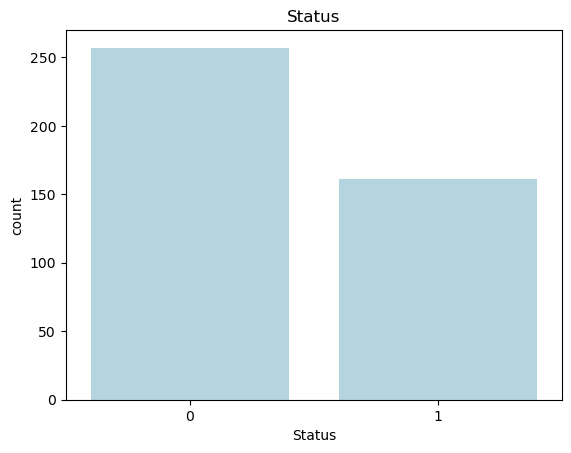
    


The bar plot above shows the distribution of patient survival status in the dataset. The `'Status'` variable is binary, with 0 representing patients who survived and 1 representing those who did not survive. The plot reveals that there are more patients who survived (labeled as 0) compared to those who did not survive (labeled as 1), indicating a slight class imbalance in the dataset.


#### Correlation Heatmap

Next, we examine the relationships between the numerical features by visualizing their pairwise correlations using a heatmap. A correlation heatmap helps us understand how different variables are related to one another, which is particularly useful for identifying multicollinearity or discovering variables that might be strong predictors of survival.

In this plot, the correlation coefficients range from -1 to 1:
- **Positive correlation (values closer to 1)** indicates that as one variable increases, the other also increases.
- **Negative correlation (values closer to -1)** indicates that as one variable increases, the other decreases.
- **Values near 0** suggest little to no linear relationship between the variables.


```python
# correlation heatmap
_, ax = plt.subplots(figsize = (10, 8))
sns.heatmap(numerical_data.corr(), ax = ax, cmap = 'coolwarm', annot = True)
ax.set_title('Correlation Heatmap');
```


    
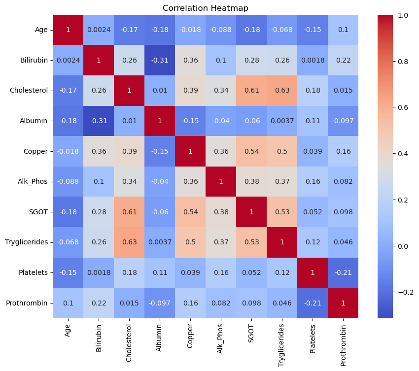
    


**Interpretation of the Correlation Heatmap**

The heatmap reveals several interesting relationships between the features. For example:
- **Cholesterol and SGOT** have a relatively high positive correlation (0.61), indicating that as cholesterol levels increase, SGOT tends to increase as well.
- **Cholesterol and Triglycerides** also show a strong positive correlation (0.63), which suggests that these two features might capture similar information.
- **Bilirubin and Copper** exhibit a moderate positive correlation (0.36), which could indicate some physiological link between these features.

By identifying correlated features, we can make informed decisions on feature selection for modeling to avoid multicollinearity or redundancy in the predictors.

#### Correlation of Features with the Target

To further investigate the predictive power of each feature, we calculate the absolute correlation between each feature and the target variable, `Status`, which represents patient survival. Correlation with the target helps us identify which features are most strongly associated with survival and might be valuable predictors in our classification and survival models.


```python
# calculate correlations with the target variable
correlations = data.drop(['ID', 'N_Days', 'Stage', 'Status'], axis=1).corrwith(data['Status']).abs().sort_values(ascending=False)

# generate colors
n_features = len(correlations)
colors = cm.rainbow(np.linspace(0, 1, n_features))

# plot horizontal bar plot for feature correlations with the target
correlations.plot.barh(color=colors)
plt.title('Feature Correlations with the Target')
plt.xlabel('Correlation')
plt.ylabel('Feature');

```


    
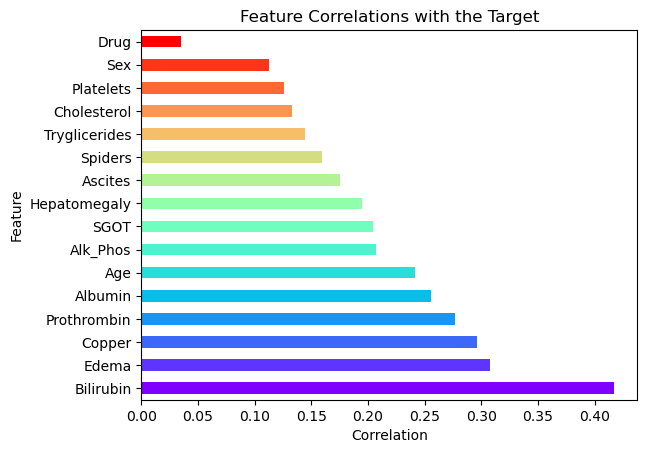
    


 **Plotting Feature Correlations**

In the horizontal bar plot above, the features are sorted by their correlation with the target variable. Features with higher correlations are likely to be more informative in predicting the patient's survival status.
 
 **Interpretation of the Plot**

- **Bilirubin**, **Edema**, and **Copper** are among the features with the strongest correlation to the target, suggesting they may be highly influential in determining survival outcomes.
- **Sex** and **Drug** show relatively weak correlations, indicating they might have less impact on survival predictions.
- This plot will help guide the selection of features in our model, focusing on those with higher correlations for better predictive performance.

#### Pair Plot of Selected Features
To explore the relationships between the most significant features and the target variable, we create a pair plot. This type of plot is particularly useful for visualizing the pairwise relationships between features, along with their distributions, while also distinguishing between different classes of the target variable.

**Selecting Top Features**

We focus on the top features identified from the previous correlation analysis to avoid overloading the plot with too many variables. The selected features have the strongest correlation with the target variable, `Status`, and are likely to be the most informative for our analysis.


```python
# pairplot

# first, take care of the warning:
# FutureWarning: use_inf_as_na option is deprecated and will be removed
# in a future version. Convert inf values to NaN before operating instead.
data.replace([np.inf, -np.inf], np.nan)

# there are too many features, so we only plot some of them
# we have previously assigned the correlations and sorted them
# so now we select the top features
top_features = correlations.index[:7]
selected_features = data[top_features.to_list() + ['Status']]

print(top_features.to_list())
sns.pairplot(selected_features, hue = 'Status');
```

    ['Bilirubin', 'Edema', 'Copper', 'Prothrombin', 'Albumin', 'Age', 'Alk_Phos']
    


    
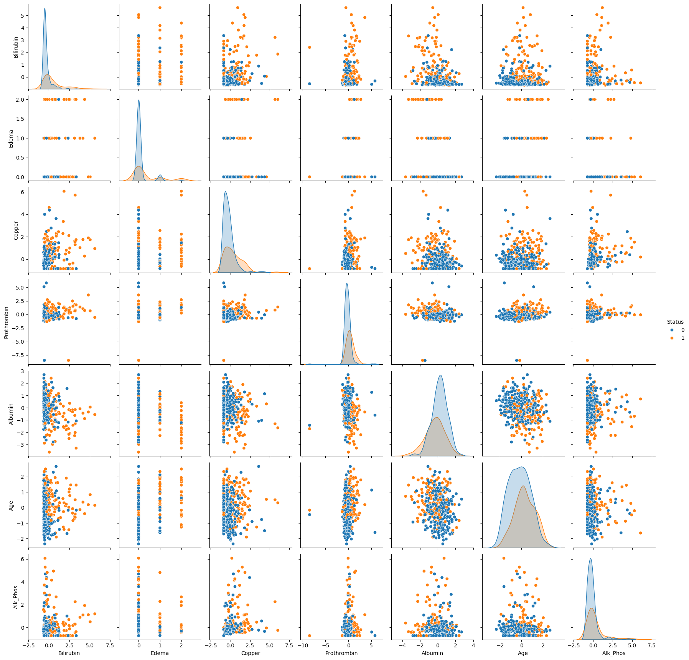
    


**Interpretation of the Pair Plot**

In the pair plot above, we observe scatter plots for each pair of selected features, with data points colored by the patient's survival status (`Status`):
- **Blue** represents patients who survived (`Status = 0`).
- **Orange** represents patients who did not survive (`Status = 1`).

Diagonal plots show the distribution of individual features, while off-diagonal plots reveal the relationships between different features. This helps us identify potential clusters, outliers, and separations between survival classes based on feature combinations. For example, we can observe how **Bilirubin** and **Edema** may differ between the two groups, providing insights into their predictive power.

# 3. Bayesian Logistic Regression for Survival Classification

In this section, we implement a Bayesian logistic regression model to predict patient survival based on clinical features. The logistic regression model is a widely used method for binary classification tasks. In a Bayesian framework, the model allows us to incorporate prior knowledge and quantify uncertainty in the predictions, making it especially suitable for medical applications where uncertainty plays a crucial role.

## 3.1 Defining the Bayesian Logistic Regression Model

The logistic regression model predicts the probability of an event (in this case, patient survival) occurring. The model's structure can be described as:

\begin{aligned}
\text{logit}(P(y = 1 \mid X)) = \alpha + X\beta
\end{aligned}

Where:
- $ y $ is the binary outcome (survival: 0 or 1).
- $ X $ is the matrix of features (predictors).
- $ \alpha $ is the intercept term (a scalar).
- $ \beta $ is the vector of coefficients corresponding to the features in $ X $.
- $ \text{logit}(p) $ is the log-odds transformation: $ \text{logit}(p) = \log\left(\frac{p}{1 - p}\right) $.

The posterior distribution for the model parameters $ \alpha $ and $ \beta $ is obtained using Bayesian inference, which combines prior distributions with the likelihood of the data.

### Code Explanation

In the code below, we define the Bayesian logistic regression model using [**NumPyro**](https://num.pyro.ai/en/stable/index.html):

- **Priors:** We assume normal priors for both the intercept term $ \alpha $ and the coefficients $ \beta $. These priors reflect our belief about the parameters before observing the data:
  - $ \alpha \sim \mathcal{N}(0, 1) $
  - $ \beta_j \sim \mathcal{N}(0, 1) $ for each feature $ j $.

- **Likelihood:** The likelihood function specifies how the data (observed outcomes) are generated given the parameters. In this case, the likelihood follows a Bernoulli distribution, where the probability of success (survival) is given by the logistic function applied to the linear combination of the features.

\begin{aligned}
P(y_i = 1 \mid X_i, \alpha, \beta) = \frac{1}{1 + \exp^{-(\alpha + X_i\beta)}}
\end{aligned}

The code block defines the model structure, including priors and likelihood, and will be used in the next steps for inference using MCMC (Markov Chain Monte Carlo).


```python
# define the bayesian model
import jax.numpy as jnp

def cirrhosis_classification_model(X, y = None):
    # define priors
    alpha = numpyro.sample('alpha', dist.Normal(0, 1))
    beta = numpyro.sample('beta',
                          dist.Normal(
                              jnp.zeros([X.shape[1]]),
                              jnp.ones([X.shape[1]]))
                          )

    logits = alpha + jnp.matmul(X, beta)

    # define likelihood
    with numpyro.plate('data', X.shape[0]):
        numpyro.sample('y', dist.Bernoulli(logits = logits), obs = y)
```

### Preparing the Data for Modeling

Before fitting the Bayesian logistic regression model, we need to prepare the input data. We use the top features identified from the correlation analysis as our predictors, and the `Status` column as the binary outcome (survival).

- **`X`:** The matrix of predictor variables (features), consisting of the top correlated features selected during EDA.
- **`y`:** The target variable, representing the patient's survival status (0 for survived, 1 for not survived).

We then check the shape of `X` to confirm that it has the correct dimensions for modeling (rows corresponding to patients and columns corresponding to features).


```python
# prepare the data
X = data[top_features.to_list()].values
y = data['Status'].values

X.shape
```


    (418, 7)


### Visualizing the Model Structure

To better understand the structure of our Bayesian logistic regression model, we generate a graphical representation using `numpyro.render_model()`. This function provides a clear visualization of the model's components, including the priors, likelihood, and data dependencies.

In the rendered graph, we can see:
- **Priors:** The intercept `alpha` and coefficients `beta` are sampled from normal distributions.
- **Likelihood:** The binary target variable `y` follows a Bernoulli distribution with probabilities defined by the logistic transformation of the linear combination of features (`logits`).

This graphical model representation helps ensure that the model is correctly specified and provides insights into how the data interacts with the parameters.


```python
numpyro.render_model(cirrhosis_classification_model, model_args = (X, y))
```


    
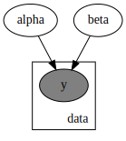
    


### 3.2 Running MCMC Inference

We use **Markov Chain Monte Carlo (MCMC)** with the **No-U-Turn Sampler (NUTS)** to perform Bayesian inference on our logistic regression model. MCMC is a powerful method for sampling from the posterior distribution of our model's parameters, especially in cases where analytical solutions are intractable.

- **`NUTS`:** A variant of Hamiltonian Monte Carlo (HMC) that automatically tunes the step size and trajectory length, improving the efficiency of the sampling process.
- **`num_warmup`:** The number of warm-up steps (burn-in period) where the sampler adapts to the posterior distribution.
- **`num_samples`:** The number of samples to draw from the posterior after the warm-up phase.
- **`num_chains`:** The number of independent MCMC chains to run in parallel, allowing us to evaluate the convergence of the model.

We then execute the sampling procedure using the `run()` method, which generates samples from the posterior distribution of the model parameters. After sampling, we print the summary of the results, which includes posterior means, standard deviations, and diagnostics such as effective sample size (ESS) and R-hat (a measure of convergence).


```python
mcmc = MCMC(NUTS(cirrhosis_classification_model),
            num_warmup = 1000,
            num_samples = 1000,
            num_chains = 4)

mcmc.run(random.PRNGKey(0), X, y)
mcmc.print_summary()
```


      0%|          | 0/2000 [00:00<?, ?it/s]


      0%|          | 0/2000 [00:00<?, ?it/s]


      0%|          | 0/2000 [00:00<?, ?it/s]


      0%|          | 0/2000 [00:00<?, ?it/s]


    
                    mean       std    median      5.0%     95.0%     n_eff     r_hat
         alpha     -0.54      0.14     -0.54     -0.76     -0.32   6398.50      1.00
       beta[0]      1.21      0.21      1.21      0.85      1.55   6336.86      1.00
       beta[1]      0.65      0.30      0.65      0.11      1.09   4819.01      1.00
       beta[2]      0.32      0.15      0.32      0.06      0.55   6200.94      1.00
       beta[3]      0.44      0.15      0.44      0.21      0.69   6358.73      1.00
       beta[4]     -0.14      0.13     -0.15     -0.36      0.07   6798.94      1.00
       beta[5]      0.64      0.14      0.64      0.41      0.86   7289.60      1.00
       beta[6]      0.41      0.13      0.40      0.19      0.62   6308.57      1.00
    
    Number of divergences: 0
    

#### MCMC Inference Summary

The output of the MCMC inference provides a summary of the posterior distributions for each parameter in the model, including the intercept (`alpha`) and the coefficients for the selected features (`beta` values). Each row represents a parameter, and the summary includes the following key statistics:

- **mean:** The mean of the posterior distribution, which gives us a point estimate of the parameter.
- **std:** The standard deviation of the posterior, indicating the uncertainty in the parameter estimate.
- **median:** The median of the posterior distribution, often used as a robust point estimate.
- **5.0% and 95.0% percentiles:** The lower and upper bounds of the 90% credible interval, giving us a range within which the true value of the parameter is likely to lie with 90% probability.
- **n_eff:** The effective sample size, which quantifies the amount of independent information in the MCMC samples. A higher value suggests that the chain is well-mixed and the samples are less correlated.
- **r_hat:** The R-hat statistic, which measures the convergence of the MCMC chains. Values close to 1 indicate good convergence, meaning the chains have converged to the same distribution.

#### Interpretation

- **`alpha`:** The intercept has a posterior mean of -0.54 with a standard deviation of 0.14, indicating moderate uncertainty. The 90% credible interval ranges from -0.76 to -0.32.
- **`beta[0]`:** This coefficient has the highest posterior mean (1.21) and the smallest credible interval, suggesting that it has a strong positive effect on the probability of survival.
- **`beta[1]` to `beta[6]`:** These coefficients represent the effects of the top features on survival. The values range between -0.14 and 0.65, indicating varying levels of influence. For example, `beta[5]` (0.64) and `beta[6]` (0.41) show relatively strong positive associations with the target variable.

- **Effective Sample Size (n_eff):** All parameters have high effective sample sizes (in the thousands), indicating that the MCMC sampler performed efficiently and produced a large number of independent samples.

- **R-hat:** The R-hat values are all 1.00, confirming that the MCMC chains have converged successfully for each parameter.

The inference results show that the model has converged well, and we have meaningful posterior estimates for the model parameters. The posterior means and credible intervals provide insights into how the features are associated with the probability of survival, with several coefficients (e.g., `beta[0]`, `beta[5]`) standing out as strong predictors.

### 3.3 Trace and Pair Plots for MCMC Diagnostics

To assess the performance and convergence of the MCMC sampler, we generate trace plots and pair plots of the sampled posterior distributions. These plots allow us to visually inspect how well the sampler explored the parameter space and whether there were any issues, such as divergences.

1. **Trace Plot:**
   The trace plot shows the sampled values of each parameter across the MCMC iterations. Ideally, we expect to see "well-mixed" chains, where the samples quickly explore the parameter space without getting stuck, indicating good convergence.

2. **Pair Plot:**
   The pair plot visualizes the relationships between the parameters by plotting their joint posterior distributions. We also include information about divergences, which can indicate potential problems with the sampling process. Divergences suggest that the sampler struggled to explore certain regions of the posterior, often due to ill-specified priors or likelihoods.

These plots provide valuable diagnostics for ensuring that the MCMC sampling was successful and that the posterior estimates are reliable.


```python
trace = az.from_numpyro(mcmc)

az.plot_trace(trace, compact = False)
plt.tight_layout()
plt.show()
```


    
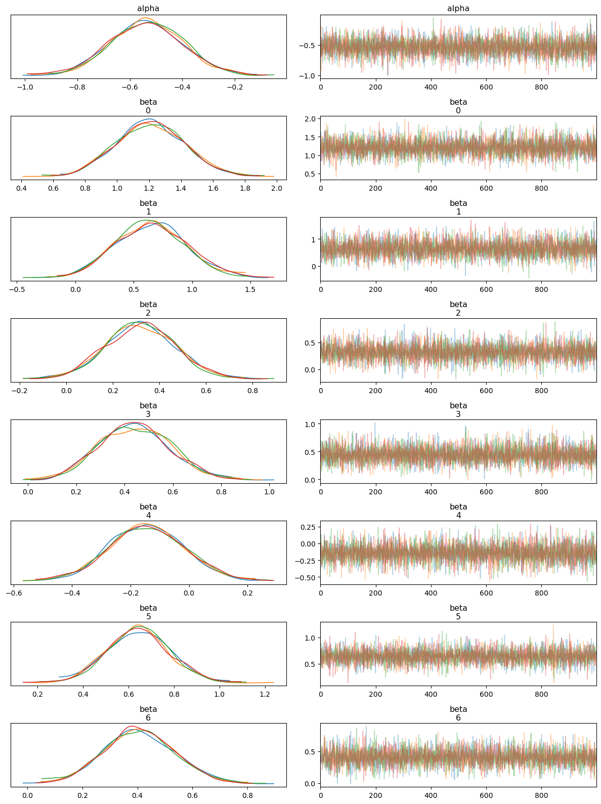
    


#### Interpreting the Trace Plot

The **trace plot** shows the sampled values of each parameter (both `alpha` and `beta` coefficients) across the iterations of the MCMC chains. The left-hand side of each panel displays the posterior distribution (density plot), while the right-hand side shows the trace of the samples.

- **Posterior Distributions:** Each parameter's posterior distribution appears well-behaved and roughly Gaussian, with all MCMC chains overlapping significantly. This indicates good convergence across the different chains.
  
- **Trace of Samples:** The trace plots show that the MCMC samples fluctuate around a stable mean, with no obvious trends or drifts. This behavior suggests that the chains have mixed well and are sampling from the stationary distribution, which is essential for reliable posterior estimates.

Overall, the trace plot confirms that the model parameters have converged and the posterior distributions are stable.


```python
az.plot_pair(trace, divergences = True)
plt.show()
```


    
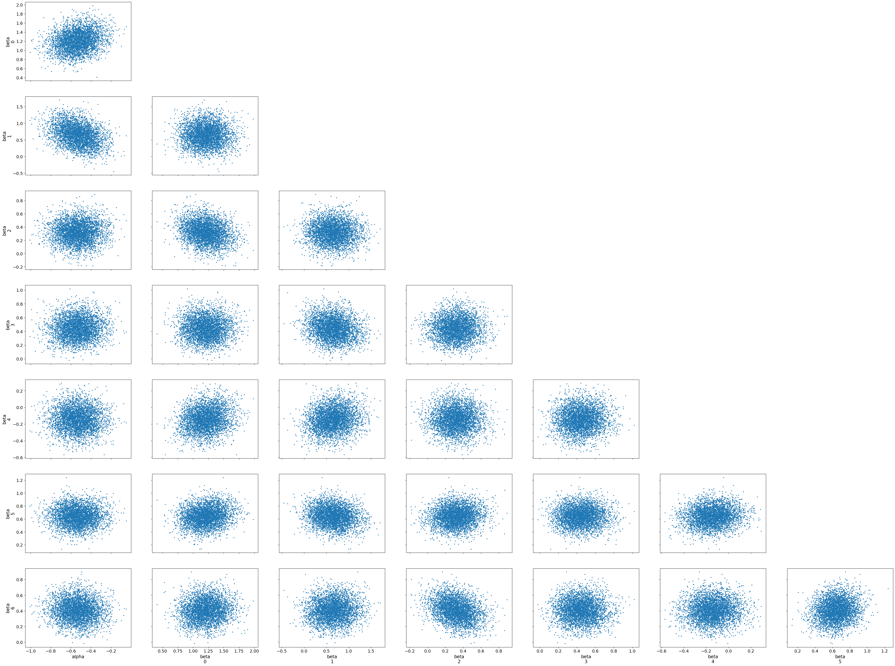
    


#### Interpreting the Pair Plot

The **pair plot** shows pairwise relationships between the parameters (`alpha` and `beta` coefficients), with each dot representing a sample from the posterior distribution. The diagonal plots display the marginal distributions for each parameter, while the off-diagonal scatter plots show the joint distributions between pairs of parameters.

- **Joint Distributions:** The scatter plots between parameter pairs show no strong patterns, such as high correlations or dependencies. This suggests that the parameters are relatively independent of each other, which is a positive sign for the model's stability and interpretability.
  
- **Divergences:** No major divergences or problematic regions are visible in the joint distributions, indicating that the sampler did not struggle with any particular combination of parameters.

The pair plot helps us visually confirm that the posterior samples form well-behaved distributions, with no obvious issues like strong correlations or divergences. Together, the trace and pair plots provide strong evidence that the MCMC sampling has performed effectively and that the posterior estimates are trustworthy.

### 3.4 Prior Predictive Checks

Before analyzing the posterior predictive distribution, it is important to first check the prior predictive distribution to ensure that our prior assumptions make sense. A **prior predictive check** involves generating data from the model using only the priors, without any influence from the observed data. This allows us to see if the priors we have chosen are reasonable and if they align with plausible outcomes.

- **`Predictive`:** We use the `Predictive` class to sample from the prior distribution of our Bayesian model.
- **`y_prior`:** This contains samples generated from the prior distribution. These are drawn without considering the observed data, giving us a sense of the expected outcomes under the prior assumptions.
- **`prior_data`:** The prior samples are converted into an `InferenceData` object, which allows us to use **ArviZ**'s plotting utilities.
- **Plotting Prior Predictive Samples:** The prior predictive plot shows the range of outcomes generated purely from the prior distributions.

This check ensures that our prior assumptions are not unrealistic and that the prior distributions provide a reasonable range of expected outcomes.


```python
prior = Predictive(cirrhosis_classification_model, num_samples=1000)

# get the prior samples
y_prior = prior(random.PRNGKey(42), X)

# convert to InferenceData
prior_data = az.from_numpyro(mcmc, prior = y_prior)

# plot the prior samples
az.plot_ppc(prior_data, group = 'prior', observed = True);

```


    
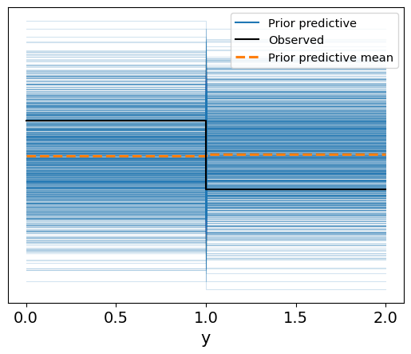
    


#### Interpretation of the Prior Predictive Check

The prior predictive check plot shows the range of possible outcomes (in blue) generated from the model based purely on the prior distributions. The dashed orange line represents the mean of the prior predictive distribution, while the solid black line indicates the observed data.

- **Prior Predictive Range:** The blue lines show a wide spread of potential outcomes, indicating that the priors we defined for the model parameters allow for a broad range of values for the binary target variable (`y`), which corresponds to patient survival. This ensures that the priors are not overly restrictive.
  
- **Comparison to Observed Data:** The observed data (black lines) mostly align within the range of the prior predictive distribution, suggesting that the priors are reasonable and that the model is well-calibrated to allow for plausible outcomes before even fitting to the actual data.

Overall, this plot suggests that the prior distributions are neither too narrow nor too unrealistic, providing a good foundation for the next step: posterior inference based on observed data.

### 3.5 Posterior Predictive Check

After fitting the model to the observed data, we perform a **posterior predictive check**. This step involves generating new data from the posterior distribution of the model, which incorporates both the prior information and the observed data. By comparing the posterior predictive distribution to the actual observed outcomes, we can assess how well the model fits the data.

- **`posterior_samples`:** These are the samples drawn from the posterior distribution after fitting the model to the data using MCMC.
- **`Predictive`:** We use the `Predictive` class to generate predictions based on the posterior samples.
- **Posterior Predictive Distribution:** The plot visualizes the range of predicted values from the posterior distribution, along with the observed data for comparison.


```python
# get samples from the posterior
posterior_samples = mcmc.get_samples()

# define a Predictive class
predictive = Predictive(cirrhosis_classification_model,
                        posterior_samples = posterior_samples)

# get the samples
y_pred = predictive(random.PRNGKey(42), X)

# convert to inference data
posterior_data = az.from_numpyro(mcmc, posterior_predictive = y_pred)

az.plot_ppc(data = posterior_data, group = 'posterior');
```


    
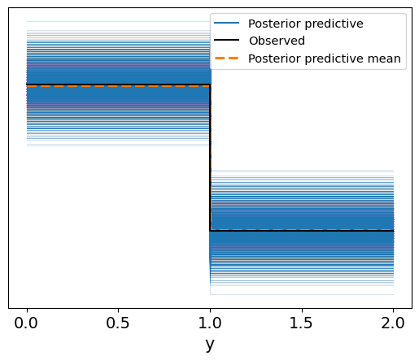
    


#### Interpretation of the Posterior Predictive Plot

In the resulting plot:
- The **blue lines** represent the range of possible outcomes generated from the posterior predictive distribution.
- The **solid black line** shows the observed data.
- The **dashed orange line** indicates the posterior predictive mean.

In contrast to the prior predictive plot, the posterior predictive distribution is now informed by the data:
- The posterior predictive outcomes are much more closely aligned with the observed data, indicating that the model has successfully learned from the data.
- The **posterior predictive mean** closely matches the observed values, showing that the model is well-calibrated and provides accurate predictions for the binary survival outcomes.

This posterior predictive check confirms that the model is capable of producing predictions that are consistent with the observed data, providing confidence in its predictive power.

### 3.6 Visualizing the Logistic Regression Sigmoid Curves

To better understand the relationship between **Bilirubin** (one of the top predictive features) and the **survival status** of patients, we plot the sigmoid function for each of the posterior samples. The sigmoid curve represents the probability of survival as a function of the Bilirubin levels.

- **Sigmoid Function:** The logistic regression model uses the sigmoid function to transform the linear combination of features into a probability:
  
  \begin{aligned}
  \text{sigmoid}(x) = \frac{1}{1 + \exp{-(\alpha + x \cdot \beta)}}
  \end{aligned}
  
  where $ \alpha $ is the intercept and $ \beta $ is the coefficient for Bilirubin in this case.

- **Posterior Samples:** We draw several samples from the posterior distribution of the model parameters (`alpha` and `beta`), and for each sample, we plot the corresponding sigmoid curve. This gives us a range of possible outcomes, representing the uncertainty in the model.


```python
# define the sigmoid function

def sigmoid(x, alpha, beta):
    return 1 / (1 + jnp.exp(-(alpha + jnp.dot(x, beta))))

# generate a range of X values for plotting the sigmoid functions
x_range = jnp.linspace(-2, X[:,0].max(), 100)

# plot the data
plt.figure(figsize = (10, 6))
plt.scatter(X[:, 0],
            y,
            color = 'red',
            label = 'Data',
            edgecolors = 'black')  # bilirubin vs status

# plot sigmoid functions from the posterior samples
for i in range(len(x_range)):
    alpha_sample = posterior_samples['alpha'][i]
    beta_sample = posterior_samples['beta'][i, 0]
    y_sample = sigmoid(x_range, alpha_sample, beta_sample)
    plt.plot(x_range,
             y_sample,
             color = 'blue',
             alpha = 0.1,
             )

plt.xlabel(top_features[0])
plt.ylabel('Status')
plt.title('Cirrhosis Classification Model')
plt.legend();
```


    
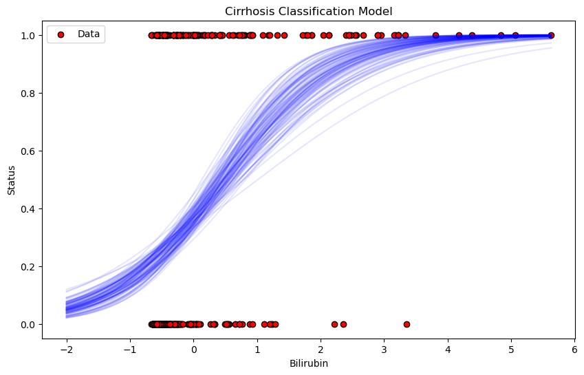
    


#### Interpretation of the Plot

- **Red Points:** These represent the actual data, with the x-axis showing Bilirubin levels and the y-axis showing the observed survival status (0 or 1).
  
- **Blue Sigmoid Curves:** The faint blue lines represent the range of sigmoid functions sampled from the posterior distribution. These curves show how the model's predictions vary depending on different samples from the posterior. The spread of the curves reflects the uncertainty in the model's predictions.

- **General Trend:** As Bilirubin levels increase, the probability of survival decreases, as shown by the steep rise of the sigmoid curves from 0 to 1. This suggests that higher Bilirubin levels are associated with a higher likelihood of not surviving.

This plot provides a clear visualization of how the model is using Bilirubin to predict patient survival and the uncertainty in those predictions.

### 3.7 Model Evaluation: Confusion Matrix

After generating predictions using the posterior samples, we evaluate the model's performance by comparing the predicted classes to the actual survival outcomes. This is done using a **confusion matrix**, which summarizes the classification results in terms of:
- **True Positives (TP):** Correct predictions of non-survival.
- **True Negatives (TN):** Correct predictions of survival.
- **False Positives (FP):** Incorrect predictions of non-survival.
- **False Negatives (FN):** Incorrect predictions of survival.

In the code:
- We use the sigmoid function to convert the posterior samples into probabilities.
- We then average the probabilities across all posterior samples and apply a threshold of 0.5 to classify each patient as either survived (0) or not survived (1).
- Finally, we generate a confusion matrix to visually assess the performance of the classifier.


```python
from sklearn.metrics import confusion_matrix, accuracy_score, precision_score, recall_score, f1_score

# generate predictions
# use sigmoid function defined previously

# generate predictions using the posterior samples
n_samples = posterior_samples['alpha'].shape[0]

# calculate the mean probability across posterior samples
predicted_probabilities = np.mean(
    [sigmoid(X,
             posterior_samples['alpha'][i],
             posterior_samples['beta'][i]
             ) for i in range(n_samples)],
             axis = 0)

# convert probabilities to binary predictions
threshold = 0.5
predicted_classes = (predicted_probabilities >= threshold).astype(int)

# compare predicted classes with true classes

# actual labels
y_true = y

# confusion matrix
conf_matrix = confusion_matrix(y_true, predicted_classes)
plt.figure(figsize=(10, 6))
sns.heatmap(conf_matrix, annot = True, fmt = 'd');
```


    
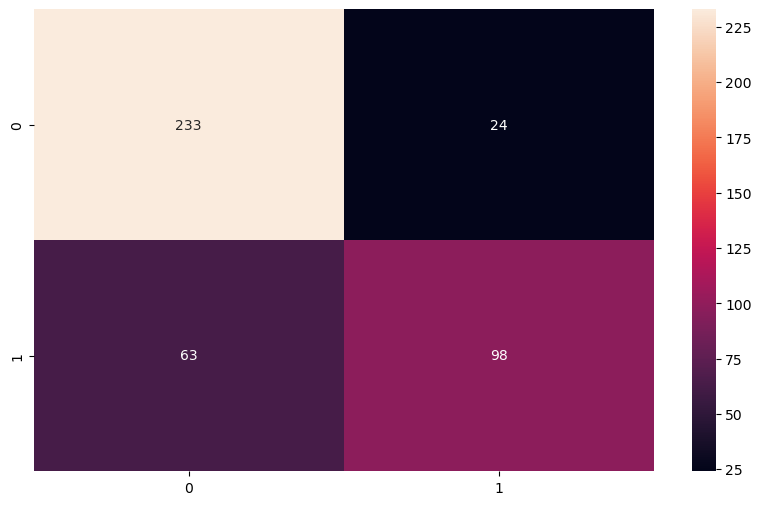
    


#### Confusion Matrix Interpretation

In the plot:
- **233 true negatives**: The model correctly predicted 233 patients as survivors.
- **98 true positives**: The model correctly predicted 98 patients as non-survivors.
- **24 false positives**: The model incorrectly predicted 24 patients as non-survivors when they actually survived.
- **63 false negatives**: The model incorrectly predicted 63 patients as survivors when they did not survive.

#### Overall Performance

The confusion matrix shows that the model performs well on survival predictions, with more correct predictions than incorrect ones. The balance between true positives and true negatives suggests that the model handles both classes reasonably well, but there are more false negatives than false positives, indicating that the model might underpredict non-survival cases slightly.

# 4. Bayesian Survival Analysis

In this section, we shift our focus from classification to **Bayesian survival analysis**. Survival analysis is a statistical method used to estimate the time until an event of interest occurs, often referred to as "time-to-event" data. In our case, we are interested in modeling the time until either a patient succumbs to cirrhosis or is censored (i.e., the event does not occur during the observation period). This form of analysis allows us to incorporate censored data and provides insights into the distribution of survival times.

## 4.1 Basics of Survival Analysis

In classical survival analysis, we model the **survival function** $S(t)$, which represents the probability of survival beyond time $t$:

\begin{aligned}
S(t) = P(T > t)
\end{aligned}

Where:
- $T$ is the random variable representing the time to the event (e.g., death or censoring).
- $t$ is the specific time of interest.

The complementary function, called the **hazard function**, $h(t)$, represents the instantaneous rate at which events occur at time $t$, given that the individual has survived up to that time. The hazard function is defined as:

\begin{aligned}
h(t) = \frac{f(t)}{S(t)}
\end{aligned}

Where $f(t)$ is the probability density function of survival times.

### Bayesian Survival Analysis

In a Bayesian framework, we treat the parameters governing the survival function (or hazard function) as random variables, and we estimate their posterior distributions using observed data. By incorporating prior beliefs about these parameters, Bayesian methods offer a natural way to handle uncertainty, particularly in the presence of censored data.

The general approach involves:
1. **Defining a Parametric Survival Model:** A common choice for the survival model is the Weibull distribution, which provides flexibility in modeling both increasing and decreasing hazard rates.
2. **Priors:** Assign prior distributions to the model parameters (e.g., shape and scale parameters of the Weibull distribution).
3. **Likelihood:** The likelihood is defined based on the observed survival times and whether the event was censored.
4. **Posterior Inference:** Use Markov Chain Monte Carlo (MCMC) or similar methods to draw samples from the posterior distribution of the parameters.

For example, the **Weibull distribution** is a common parametric model for survival times. Its survival function is given by:

\begin{aligned}
S(t) = \exp \left( - \left( \frac{t}{\lambda} \right)^\kappa \right)
\end{aligned}

Where:
- $\lambda$ is the scale parameter.
- $\kappa$ is the shape parameter.

In the Bayesian context, we assign priors to $\lambda$ and $\kappa$, then use the observed data to update these priors to form the posterior distributions.

### Censored Data

In survival analysis, it's common to have censored data, where we know that the event of interest did not occur before a certain time, but we do not know the exact time of the event. Bayesian methods handle censored data naturally within the likelihood function by accounting for both observed events and censored observations.

The likelihood for a censored observation is:

\begin{aligned}
P(T > t \mid \text{censored}) = S(t)
\end{aligned}

Thus, in a Bayesian survival model, the posterior distribution is based on both observed survival times and the fact that certain observations were censored.

This framework allows for a flexible and powerful analysis of time-to-event data while handling uncertainties in parameter estimates.

## 4.2 Weibull Survival Model Without Covariates

We begin by defining a **Weibull survival model** for time-to-event data, with no covariates. The **Weibull distribution** is a flexible parametric model commonly used in survival analysis due to its ability to model both increasing and decreasing hazard rates over time, depending on the value of its shape parameter $k$.

The model assumes that survival times follow a Weibull distribution parameterized by:
- $k$ (shape parameter): This determines the form of the hazard function. A value of $k > 1$ suggests an increasing hazard rate, while $k < 1$ implies a decreasing hazard rate.
- $\lambda$ (scale parameter): This controls the scale of the distribution and shifts the time-to-event distribution horizontally.

#### Code Explanation

1. **Priors:**
   - We place **Exponential(1.0)** priors on both the shape parameter $k$ and the scale parameter $\lambda$. The exponential distribution is a standard choice when we do not have strong prior information and expect non-negative values for these parameters.
   
   - $k \sim \text{Exponential}(1.0)$
   - $\lambda \sim \text{Exponential}(1.0)$

2. **Likelihood:**
   - The likelihood assumes that the observed survival times follow a **Weibull distribution**. We model the observed data (`obs`) as being drawn from a Weibull distribution, parameterized by the sampled values of $k$ and $\lambda$.
   
   - The survival times in `data` are modeled using this likelihood, and if no data is provided, a placeholder dimension (1000) is used to define the plate.

The Weibull model is ideal for analyzing baseline survival without introducing any covariates to the model.


```python
def survival_weibull_model(data = None):
    # define priors
    k = numpyro.sample('k', dist.Exponential(1.0))
    lam = numpyro.sample('lam', dist.Exponential(1.0))

    # likelihood
    with numpyro.plate('data', data.shape[0] if data is not None else 1000):
        numpyro.sample('obs', dist.Weibull(k, lam), obs = data)
```

### Preparing the Data for Survival Analysis

Before fitting the survival model, we need to preprocess the data by selecting only the **uncensored** survival times. In survival analysis, censored data refers to cases where the event of interest (e.g., death) did not occur during the observation period, and we do not know the exact time of the event. For this initial analysis, we focus on observed events.

- **`survival_times_observed`:** We extract the survival times for patients where the event (death) was observed, indicated by `Status == 1`. This ensures that only complete (uncensored) data is included in the model.


```python
# prepare the data
# select only the uncensored data
survival_times_observed = data[data['Status'] == 1]['N_Days'].values
```

### Fitting the Weibull Survival Model

We now proceed to fit the **Weibull survival model** to the uncensored survival times using **Markov Chain Monte Carlo (MCMC)** with the **No-U-Turn Sampler (NUTS)**. This step involves estimating the posterior distributions of the model parameters ($k$ and $\lambda$) based on the observed data.

- **`NUTS`:** The No-U-Turn Sampler is a variant of Hamiltonian Monte Carlo (HMC), which efficiently explores the posterior distribution by dynamically tuning the step size and trajectory length.
- **`num_warmup`:** The number of warm-up (burn-in) iterations, where the sampler adapts to the posterior distribution before drawing final samples.
- **`num_samples`:** The number of posterior samples to draw after the warm-up phase.
- **`num_chains`:** The number of independent MCMC chains to run in parallel, which helps assess convergence and reduce bias.

After running the MCMC sampler, we print a summary of the estimated posterior distributions for the model parameters.


```python
# fit the model
mcmc_survival_weibull = MCMC(NUTS(survival_weibull_model),
                     num_warmup = 1000,
                     num_samples = 1000,
                     num_chains = 4)
mcmc_survival_weibull.run(random.PRNGKey(42), data = survival_times_observed)
mcmc_survival_weibull.print_summary()

```


      0%|          | 0/2000 [00:00<?, ?it/s]


      0%|          | 0/2000 [00:00<?, ?it/s]


      0%|          | 0/2000 [00:00<?, ?it/s]


      0%|          | 0/2000 [00:00<?, ?it/s]


    
                    mean       std    median      5.0%     95.0%     n_eff     r_hat
             k     48.25      7.99     47.86     35.15     61.08   1442.43      1.00
           lam      0.25      0.02      0.25      0.22      0.28   1419.78      1.00
    
    Number of divergences: 0
    

#### Interpretation of Weibull Model Posterior Estimates

The output from the MCMC run provides the posterior distributions for the shape parameter $k$ and the scale parameter $\lambda$ of the Weibull survival model. Here’s a brief interpretation of the results:

- **$k$ (shape parameter):** The posterior mean of $k$ is **48.25**, with a standard deviation of **7.99**. The 90% credible interval (from 5% to 95%) ranges from **35.15** to **61.08**. A high value of $k$ suggests that the hazard rate increases rapidly over time, indicating that the risk of the event (death) increases as time progresses.
  
- **$\lambda$ (scale parameter):** The posterior mean of $\lambda$ is **0.25**, with a standard deviation of **0.02**. The 90% credible interval ranges from **0.22** to **0.28**. The scale parameter affects the distribution's spread; smaller values of $\lambda$ indicate that the survival times are more concentrated around lower values, meaning shorter survival times are more likely.

- **Effective Sample Size (n_eff):** Both $k$ and $\lambda$ have high effective sample sizes, indicating that the MCMC chains were well-mixed and independent, producing a sufficient number of effective samples.
  
- **$\hat{R}$ values:** The $\hat{R}$ values for both parameters are exactly **1.00**, indicating that the MCMC chains have converged well, and the posterior estimates are reliable.

- **Number of Divergences:** There were **0 divergences**, meaning that the NUTS sampler encountered no issues while exploring the posterior distribution.

The posterior estimates suggest that the risk of the event (death) increases as time passes, with the hazard rate rising rapidly due to the large shape parameter $k$. The small scale parameter $\lambda$ indicates that shorter survival times are common in the dataset.

### Prior Predictive Check for the Weibull Survival Model

Before we assess the model's posterior predictions, we perform a **prior predictive check** to ensure that the prior distributions we've chosen are reasonable. This step involves generating data based purely on the priors, without any observed data influencing the predictions. By comparing the prior predictive distribution to the observed data, we can determine if our prior assumptions lead to plausible outcomes.

#### Code Explanation
- **`Predictive`:** We use the `Predictive` class to generate survival times from the prior distribution by drawing 1,000 samples.
- **Prior Predictive Plot:** The plot visualizes the prior predictive distribution, represented by the dashed orange line (the mean of the prior predictions), and the solid blue line shows the individual prior predictive samples.


```python
# perform prior predictive check
prior_predictive_survival_weibull = Predictive(survival_weibull_model, num_samples = 1000)
prior_samples_survival_weibull = prior_predictive_survival_weibull(random.PRNGKey(42), data = survival_times_observed)

# convert to InferenceData
prior_predictive_data_survival_weibull = az.from_numpyro(mcmc_survival_weibull, 
                                                         prior = prior_samples_survival_weibull)
# prior_samples_survival_weibull
prior_predictive_data_survival_weibull

# plot the prior samples
az.plot_ppc(prior_predictive_data_survival_weibull, group = 'prior');
```


    
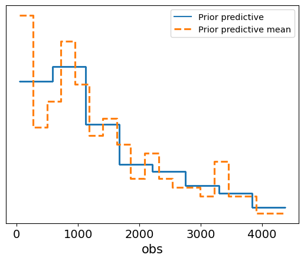
    


#### Interpretation of the Plot

- The **solid blue line** represents the individual prior predictive samples, while the **dashed orange line** represents the mean of these prior predictions.
- The plot shows how the model's prior assumptions generate survival times, and we can compare this to the range of observed data to evaluate the plausibility of the priors.
- In this case, the prior predictive distribution seems to cover a reasonable range of potential survival times, suggesting that the prior assumptions about the shape and scale of the Weibull distribution are not overly restrictive or implausible.

This prior predictive check gives us confidence that the model's priors are sensible, providing a good foundation for further inference when we include the observed data.

### Posterior Trace Plot for Weibull Survival Model

After fitting the Weibull survival model, we generate a **trace plot** to assess the MCMC sampling process and the posterior distributions of the model parameters. The trace plot shows both the posterior distributions and the sampling traces for the shape parameter $k$ and the scale parameter $\lambda$.

#### Code Explanation
- **`survival_posterior_samples_weibull`:** We extract the posterior samples for the model parameters.
- **`az.plot_trace`:** This function generates the trace plot, showing the posterior distribution and the corresponding MCMC trace for each parameter.


```python
survival_posterior_samples_weibull = mcmc_survival_weibull.get_samples()

az_survival_weibull = az.from_numpyro(mcmc_survival_weibull)
az.plot_trace(az_survival_weibull, compact = False);

```


    
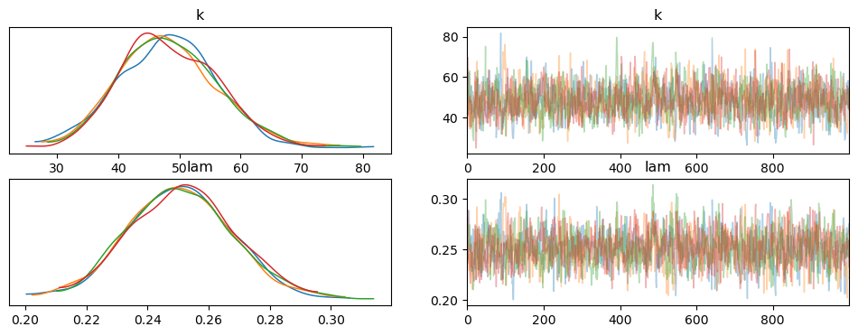
    


#### Interpretation of the Trace Plot

1. **Posterior Distributions (Left Panels):**
   - The left panels show the posterior distributions for $k$ and $\lambda$. Both parameters exhibit well-defined, unimodal distributions, which indicate stable and meaningful posterior estimates.
   - For $k$, the distribution has a peak around **48**, while for $\lambda$, the peak is around **0.25**.

2. **Sampling Trace (Right Panels):**
   - The right panels show the sampling trace for each parameter across the MCMC iterations. Both $k$ and $\lambda$ exhibit well-mixed traces, with no visible trends or drifts over time. This indicates that the sampler explored the parameter space effectively, without getting stuck in any particular region.
   - The trace plots confirm that the MCMC chains have converged well, as there is good overlap between the chains and no sign of poor mixing.

Overall, the trace plot shows that the MCMC sampling worked efficiently, with well-behaved posterior distributions and convergence for both $k$ and $\lambda$. This gives us confidence in the reliability of the posterior estimates for the survival model.

### Posterior Predictive Check for Weibull Survival Model

We now perform a **posterior predictive check** to evaluate how well the Weibull survival model, after being fitted to the data, predicts survival times. Posterior predictive checks allow us to compare the model's predicted values to the observed data, providing insight into how well the model captures the true underlying patterns.

#### Code Explanation
- **`Predictive`:** We use the `Predictive` class to generate survival times based on the posterior samples of the model parameters ($k$ and $\lambda$).
- **Posterior Predictive Data:** We create an `InferenceData` object using the posterior predictive samples, which includes both the predicted survival times and the observed data.
- **Posterior Predictive Plot:** The plot visualizes the posterior predictive distribution (blue lines), the observed data (solid black line), and the posterior predictive mean (dashed orange line).


```python
survival_posterior_predictive_weibull = Predictive(survival_weibull_model,
                                 posterior_samples = survival_posterior_samples_weibull)

survival_times_predicted_weibull = survival_posterior_predictive_weibull(random.PRNGKey(42), survival_times_observed)

survival_posterior_data_weibull = az.from_numpyro(mcmc_survival_weibull,
                                          posterior_predictive = survival_times_predicted_weibull)

az.plot_ppc(survival_posterior_data_weibull, kind = 'kde', group = 'posterior', observed = True);
```


    
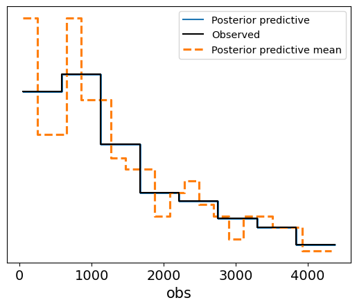
    


### Plot Interpretation for Weibull Posterior Predictive vs. Observed Data (Uncensored)

This plot shows a comparison between the **Weibull posterior predictive distribution** and the **observed uncensored survival data**, without any covariates involved. The purpose of this plot is to evaluate how well the Weibull model, fit to the uncensored data, can replicate the distribution of survival times.

#### Explanation of the Plot:
- **X-axis (Survival Times):**
  - The x-axis represents the survival times (in days), ranging from 0 to about 4500 days.

- **Y-axis (Density):**
  - The y-axis shows the **density** of survival times, or the likelihood of individuals surviving for certain durations, based on both the observed data and the model's posterior predictions.

#### Lines in the Plot:
- **Blue Line (Weibull Posterior Predictive):**
  - This line represents the predicted survival times from the Weibull model. It shows the expected distribution of survival times based on the model's posterior distribution.

- **Green Line (Weibull Observed Data):**
  - This line represents the true observed distribution of uncensored survival times. It shows the actual survival time density for individuals who experienced the event (e.g., death).

#### Interpretation:
- **Fit Between Lines:**
  - The **green line** (observed data) and the **blue line** (posterior predictive) show a relatively good alignment in terms of overall trend, particularly in the early time periods (0 to 2000 days). The posterior predictive distribution follows the general trend of the observed data, which suggests that the Weibull model does an acceptable job at capturing the distribution of survival times in this range.

- **Discrepancies:**
  - Similar to the lognormal model, we observe that the posterior predictive line fluctuates more in the earlier survival times, indicating higher uncertainty or variability in the predictions.
  - The fit becomes more diverging in the later periods (beyond 2500 days), where the posterior predictive distribution starts to exhibit higher peaks and troughs compared to the observed data, suggesting that the Weibull model may struggle to accurately capture extreme or late survival times.

- **Conclusion:**
  - The Weibull model generally captures the trend of survival times, but as seen, there are some inconsistencies in the later survival times, where the model tends to overestimate or underestimate specific time periods. These fluctuations indicate that while the model is useful for capturing general trends, it might not fully account for more extreme cases of survival.


```python
az.plot_kde(survival_posterior_data_weibull['posterior_predictive']['obs']
            .to_numpy()
            .flatten(), 
            plot_kwargs = {'color' : 'C0', 'label' : 'Weibull Posterior Predictive'})
az.plot_kde(survival_posterior_data_weibull['observed_data']['obs']
            .to_numpy()
            .flatten(), 
            plot_kwargs = {'color' : 'C2', 'label' : 'Weibull Observed Data'})
```


    <Axes: >


    
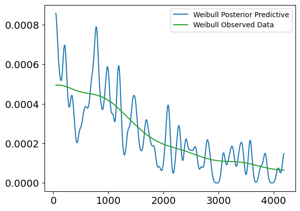
    


#### Interpretation of the Posterior Predictive Check Plot

- **Blue Lines (Posterior Predictive Samples):** These represent the survival times generated from the posterior distribution. The spread of the lines shows the model's uncertainty in predicting survival times based on the posterior samples.
  
- **Solid Black Line (Observed Data):** This represents the actual observed survival times.
  
- **Dashed Orange Line (Posterior Predictive Mean):** This shows the mean of the posterior predictive samples.

In this case, the posterior predictive samples align well with the observed survival data, suggesting that the Weibull survival model provides a good fit to the data. The predicted survival times fall within a reasonable range around the observed data, and the posterior predictive mean closely follows the observed survival trend. This check confirms that the model has successfully learned from the data and is capable of generating realistic survival time predictions.

### Posterior Summary for Weibull Survival Model

The summary table provides key statistics for the posterior distributions of the shape parameter ($k$) and scale parameter ($\lambda$) of the Weibull survival model. These values give us insights into the uncertainty and characteristics of the estimated parameters after fitting the model to the data.

#### Key Metrics:

- **Mean:** The posterior mean of each parameter, representing the expected value based on the posterior distribution.
  - $k$ (shape): **48.25** — This value indicates that the hazard rate increases rapidly over time.
  - $\lambda$ (scale): **0.25** — A small scale parameter, which suggests that the model predicts shorter survival times on average.

- **Standard Deviation (sd):** The standard deviation of the posterior distribution, reflecting the uncertainty in the parameter estimates.
  - $k$: **7.99**
  - $\lambda$: **0.017**

- **HDI 3% - 97%:** The highest density interval (HDI) represents the 94% credible interval for the parameters, showing the range of likely values.
  - $k$: **34.08** to **63.65**
  - $\lambda$: **0.219** to **0.283**

- **ESS (Effective Sample Size):** Indicates the number of effectively independent samples in the posterior. High values of ESS mean that the MCMC chains mixed well, and the posterior is reliable.
  - $k$: **1451.0**
  - $\lambda$: **1423.0**

- **$\hat{R}$ (r_hat):** A diagnostic measure for MCMC convergence. Values close to **1.0** indicate good convergence, meaning the chains have reached the same distribution.
  - Both $k$ and $\lambda$ have $\hat{R} = 1.0$, confirming that the model has converged.

The summary shows that the model has successfully converged, with high effective sample sizes and credible intervals that provide reasonable bounds on the parameter estimates. The increasing hazard rate (high $k$ value) suggests that the risk of death increases over time, while the small $\lambda$ value indicates relatively short survival times. This analysis gives us a good understanding of the survival patterns in the data.


```python
az.summary(survival_posterior_data_weibull)
```


<div>
<style scoped>
    .dataframe tbody tr th:only-of-type {
        vertical-align: middle;
    }

    .dataframe tbody tr th {
        vertical-align: top;
    }

    .dataframe thead th {
        text-align: right;
    }
</style>
<table border="1" class="dataframe">
  <thead>
    <tr style="text-align: right;">
      <th></th>
      <th>mean</th>
      <th>sd</th>
      <th>hdi_3%</th>
      <th>hdi_97%</th>
      <th>mcse_mean</th>
      <th>mcse_sd</th>
      <th>ess_bulk</th>
      <th>ess_tail</th>
      <th>r_hat</th>
    </tr>
  </thead>
  <tbody>
    <tr>
      <th>k</th>
      <td>48.249</td>
      <td>7.987</td>
      <td>34.077</td>
      <td>63.653</td>
      <td>0.209</td>
      <td>0.148</td>
      <td>1451.0</td>
      <td>1795.0</td>
      <td>1.0</td>
    </tr>
    <tr>
      <th>lam</th>
      <td>0.251</td>
      <td>0.017</td>
      <td>0.219</td>
      <td>0.283</td>
      <td>0.000</td>
      <td>0.000</td>
      <td>1423.0</td>
      <td>1762.0</td>
      <td>1.0</td>
    </tr>
  </tbody>
</table>
</div>


## 4.3 Weibull Survival Model With Covariates

In this section, we will extend the Weibull survival model to account for individual-specific covariates. by introducing covariates, we allow the model to make "personalized" predictions for survival times, based on characteristics like **age, bilirubin levels** and **albumin**.

The scale parameter $\lambda_i$, which influences the expected survival time, will now depend on a **combination of covariates (characteristics)** for each individual. This makes the model more flexible and capable of capturing how different factors impact survival.

The scale parameter $\lambda_i$ for individual $i$ is modeled as:

$$\lambda_i = \exp \left( \beta_0 + \beta_1 \cdot x_{1i} + \beta_2 \cdot x_{2i} + \dots + \beta_k \cdot x_{ki} \right)$$

Where:
- $ x_{1i}, x_{2i}, \dots, x_{ki} $ are the covariates for individual  i ,
- $ \beta_0, \beta_1, \dots, \beta_k $ are the regression coefficients for each covariate.

The likelihood function for the observed survival times $t_i$ is given by the Weibull distribution:

$$ f(t_i | k, \lambda_i) = \frac{k}{\lambda_i} \left( \frac{t_i}{\lambda_i}  \right)^{k-1} \exp \left(- \left(\frac{t_i}{\lambda_i}\right)^k\right) $$

Where:
- $k$ is the shape parameter, 
- $\lambda_i$ is the scale parameter that varies with covariates.

By estimating the coefficients $\beta$, we can assess how each covariate influences survival time. This approach personalizes the model to each individual's characteristics, leading to more tailored predictions.

We will implement this in the following steps:

1. Define the model where $\lambda_i$ is a function of covariates.
2. Prepare the data (covariates and survival times)
3. Perform MCMC sampling to fit the model
4. Analyze the results.


### Define the Weibull Survival Model with Covariates

We will now define the model with priors for both the **shape parameter** $k$ and the **regression coefficients** $\beta$. The scale parameter $\lambda_i$ will be modeled as the exponential of a linear combination of the covariates.


```python
def survival_model_weibull_with_covariates(covariates, data):
    # define priors
    k = numpyro.sample('k', dist.Exponential(1.0))
    beta = numpyro.sample('beta', dist.Normal(0, 1).expand([covariates.shape[1]]))  # coefficients (beta)

    # linear model for log(lambda)
    log_lambda = jnp.dot(covariates, beta)      # linear combination of covariates
    lambda_i = jnp.exp(log_lambda)              # ensure scale parameter lambda is positive

    # likelihood
    with numpyro.plate('data', data.shape[0] if data is not None else 1000):
        numpyro.sample('obs', dist.Weibull(k, lambda_i), obs = data)
```

### Selecting Covariates for the Weibull Model

Before fitting the Weibull model with covariates, we need to ensure that the relevant covariates are selected from the dataset. These covariates will be used to personalize the scale parameter $\lambda_i$ for each individual, allowing the model to capture how various features influence survival times.

In this step, we simply print the list of top features, which were previously selected based on their correlation with the survival outcome. These features will serve as the covariates in the model.


```python
print(top_features.to_list())
```

    ['Bilirubin', 'Edema', 'Copper', 'Prothrombin', 'Albumin', 'Age', 'Alk_Phos']
    

To extend the Weibull model with covariates, we need to prepare two key components:
1. **Covariates:** The selected covariates (features) that will be used to predict survival times for each individual.
2. **Survival Times:** The observed survival times for the uncensored data (i.e., where the event of interest has occurred).

#### Code Explanation
- **`covariate_selection`:** We explicitly select a subset of covariates that are expected to have an influence on survival, including **Bilirubin**, **Edema**, **Prothrombin**, **Albumin**, and **Age**.
- **`covariates_survival`:** We filter the dataset to include only individuals with observed survival times (where `Status == 1`) and extract the covariate values.
- **`survival_times`:** We extract the corresponding survival times for these individuals.

Finally, we print the top features and the selected covariates to verify that the correct data is being used for the model.


```python
covariate_selection = ['Bilirubin', 'Edema', 'Prothrombin', 'Albumin', 'Age']

covariates_survival = data[data['Status'] == 1][covariate_selection].values
survival_times = data[data['Status'] == 1]['N_Days'].values
print(top_features.to_list())
print(covariate_selection)


```

    ['Bilirubin', 'Edema', 'Copper', 'Prothrombin', 'Albumin', 'Age', 'Alk_Phos']
    ['Bilirubin', 'Edema', 'Prothrombin', 'Albumin', 'Age']
    

### Fitting the Weibull Survival Model with Covariates

We now fit the Weibull survival model with covariates using **Markov Chain Monte Carlo (MCMC)** with the **No-U-Turn Sampler (NUTS)**. This model accounts for the effects of the selected covariates on the survival times, making the predictions more personalized for each individual.

#### Code Explanation
- **NUTS:** We use the NUTS kernel to efficiently explore the posterior distribution of the parameters.
- **MCMC Setup:** The model is run with 1,000 warm-up iterations, followed by 2,000 sampling iterations, and using 4 chains to assess convergence.
- **Covariates:** The scale parameter $\lambda_i$ is modeled as a function of the selected covariates, allowing the model to account for individual characteristics when predicting survival times.


```python
nuts_kernel_survival_weibull_with_covariates = NUTS(survival_model_weibull_with_covariates)
mcmc_survival_weibull_with_covariates = MCMC(nuts_kernel_survival_weibull_with_covariates,
                     num_warmup = 1000,
                     num_samples = 2000,
                     num_chains = 4)
mcmc_survival_weibull_with_covariates.run(random.PRNGKey(42), 
                  data = survival_times_observed, 
                  covariates = covariates_survival)
mcmc_survival_weibull_with_covariates.print_summary()
```


      0%|          | 0/3000 [00:00<?, ?it/s]


      0%|          | 0/3000 [00:00<?, ?it/s]


      0%|          | 0/3000 [00:00<?, ?it/s]


      0%|          | 0/3000 [00:00<?, ?it/s]


    
                    mean       std    median      5.0%     95.0%     n_eff     r_hat
       beta[0]      0.07      0.04      0.07      0.03      0.12      2.96      1.70
       beta[1]      0.03      0.54     -0.24     -0.36      0.96      2.02      8.85
       beta[2]     -0.05      0.05     -0.06     -0.11      0.04      2.42      2.29
       beta[3]      0.12      0.39     -0.10     -0.14      0.80      2.00     20.11
       beta[4]     -0.19      0.30     -0.03     -0.72      0.01      2.01     14.35
             k    284.18    163.08    372.41      2.42    392.76       nan     15.33
    
    Number of divergences: 2000
    

### Results Interpretation:

The output provides the posterior estimates for the regression coefficients ($\beta$) and the shape parameter ($k$), along with diagnostics.

- **$\beta$ coefficients:**
  - **beta[0] (Bilirubin):** Mean of **0.07**, indicating a small positive effect on survival time, though there is substantial uncertainty as indicated by the standard deviation (std).
  - **beta[1] to beta[4] (Other Covariates):** The estimates for the remaining covariates (Edema, Prothrombin, Albumin, Age) show wide credible intervals and large $\hat{R}$ values, suggesting poor convergence and high uncertainty in the estimates.
  
- **Shape Parameter ($k$):** The mean estimate for $k$ is **284.18**, with a high standard deviation, indicating extreme variability in the estimates. Additionally, the model encountered **2,000 divergences**, signaling serious issues with the MCMC sampling process.

- **Convergence Issues:**
  - The **$\hat{R}$** values for most of the parameters are far from **1.0**, indicating that the chains did not converge. 
  - **Effective Sample Size (`n_eff`):** Extremely low values for the effective sample size show that the sampler struggled to explore the posterior efficiently, producing highly correlated samples.
  - **Divergences:** The model reported **2,000 divergences**, suggesting that the NUTS sampler encountered significant problems in exploring the posterior, which likely stems from poor model specification or highly informative priors.

The results indicate that the model failed to converge, likely due to the high number of divergences and poor effective sample sizes. These issues point to potential problems with the model's specification, such as overly complex priors or insufficient data to support the model's structure. In subsequent steps, it may be necessary to simplify the model, adjust the priors, or address potential multicollinearity in the covariates.

## 4.4 Introducing the Log-Normal Survival Model

After encountering issues with the Weibull model with covariates, we modify the model structure and introduce a **log-normal survival model** with covariates. This change in model specification can sometimes lead to better performance or convergence when the original model struggles with the data.

The **log-normal distribution** assumes that the logarithm of the survival times follows a normal distribution, which is another common choice for modeling time-to-event data. Unlike the Weibull distribution, the log-normal distribution may provide better flexibility when the hazard rate does not follow the typical monotonic increasing or decreasing pattern.

#### Code Explanation
- **Priors:**
  - We place **Normal(0, 1)** priors on the regression coefficients $\beta$, which influence how each covariate impacts the survival time.
  - An **Exponential(1.0)** prior is assigned to $\sigma$, the standard deviation, to ensure positivity.
  
- **Log-Mu (Mean of Log-Survival Times):**
  - The linear combination of covariates is modeled as $ \log(\mu_i) = \beta_0 + \beta_1 \cdot x_{1i} + \beta_2 \cdot x_{2i} + \dots + \beta_k \cdot x_{ki} $, where $x_{1i}, x_{2i}, \dots, x_{ki}$ are the covariates for individual $i$.
  - This represents the log of the expected survival time for each individual.

- **Likelihood:**
  - The observed survival times are modeled as being drawn from a **LogNormal distribution**, where the mean is $\log(\mu)$ and the standard deviation is $\sigma$.
  - This distribution models the uncertainty in the survival times, allowing the log-transformed times to follow a normal distribution, while ensuring that the predicted survival times themselves are positive.

This adjustment in the model may lead to improved performance, especially if the underlying survival times fit better with a log-normal assumption rather than a Weibull distribution.


```python
def lognormal_survival_model_with_covariates(covariates, data):
    # define priors
    beta = numpyro.sample('beta', dist.Normal(0, 1).expand([covariates.shape[1]]))  # coefficients (beta)
    sigma = numpyro.sample('sigma', dist.Exponential(1.0))

    # linear model for log(mu)
    log_mu = jnp.dot(covariates, beta)      # linear combination of covariates

    # likelihood
    with numpyro.plate('data', len(data)):
        numpyro.sample('obs', dist.LogNormal(log_mu, sigma), obs = data)
```

### Fitting the Log-Normal Survival Model with Covariates

We now fit the **log-normal survival model** with covariates using the **No-U-Turn Sampler (NUTS)**. This model assumes that the logarithm of the survival times follows a normal distribution, and the scale parameter (or mean of the log-survival times) depends on a linear combination of the selected covariates.

#### Code Explanation
- **Feature Selection:** We choose a new set of covariates based on their relevance to survival: **Bilirubin, Edema, Copper, Prothrombin, Albumin, and Age**.
  - These features are expected to influence survival times based on prior domain knowledge or their relationship with survival.
- **MCMC with NUTS:** The log-normal model is fitted using MCMC with 1,000 warm-up iterations and 1,000 sampling iterations. 
  - The NUTS sampler explores the posterior distribution of the model parameters, accounting for the covariates in predicting survival times.
  
By running this code, we estimate the posterior distributions of the regression coefficients ($\beta$) and the standard deviation ($\sigma$) for the log-normal survival model.


```python

selection_features_lognormal = ['Bilirubin', 'Edema', 'Copper', 'Prothrombin', 'Albumin', 'Age']
covariates_survival_lognormal = data[data['Status'] == 1][selection_features_lognormal].values
survival_times = data[data['Status'] == 1]['N_Days'].values

mcmc_survival_with_covariates_lognormal = MCMC(NUTS(lognormal_survival_model_with_covariates),
                     num_warmup = 1000,
                     num_samples = 1000,
                     num_chains = 4)
mcmc_survival_with_covariates_lognormal.run(random.PRNGKey(42),
                  data = survival_times_observed,
                  covariates = covariates_survival_lognormal)
mcmc_survival_with_covariates_lognormal.print_summary()
```


      0%|          | 0/2000 [00:00<?, ?it/s]


      0%|          | 0/2000 [00:00<?, ?it/s]


      0%|          | 0/2000 [00:00<?, ?it/s]


      0%|          | 0/2000 [00:00<?, ?it/s]


    
                    mean       std    median      5.0%     95.0%     n_eff     r_hat
       beta[0]      0.79      0.34      0.80      0.21      1.34   5897.04      1.00
       beta[1]      1.57      0.60      1.56      0.64      2.56   5230.58      1.00
       beta[2]      0.56      0.38      0.56     -0.07      1.18   6122.26      1.00
       beta[3]      0.60      0.41      0.60     -0.04      1.30   6428.30      1.00
       beta[4]      0.03      0.42      0.03     -0.70      0.68   5850.73      1.00
       beta[5]      1.23      0.46      1.23      0.45      1.95   5866.68      1.00
         sigma      5.96      0.33      5.94      5.39      6.47   6314.24      1.00
    
    Number of divergences: 0
    

#### Results Interpretation for the Log-Normal Survival Model with Covariates

The output provides the posterior estimates for the regression coefficients ($\beta$) and the standard deviation ($\sigma$) in the log-normal survival model. The model successfully converged with no divergences, and the effective sample sizes ($n_{\text{eff}}$) and $\hat{R}$ values indicate good convergence.

- **$\beta$ coefficients:** 
  - **beta[0] (Bilirubin):** Mean of **0.79**, suggesting that higher Bilirubin levels are associated with a higher log-survival time, meaning longer survival on average.
  - **beta[1] (Edema):** Mean of **1.57**, showing a relatively strong positive effect on survival. This indicates that patients with Edema have longer predicted survival times.
  - **beta[2] (Copper):** Mean of **0.56**, suggesting that higher copper levels are also associated with longer survival times, though the effect size is smaller than for Bilirubin and Edema.
  - **beta[3] (Prothrombin):** Mean of **0.60**, indicating a positive relationship between Prothrombin and survival time.
  - **beta[4] (Albumin):** Mean of **0.03**, suggesting that the effect of Albumin on survival time is weak and uncertain, as evidenced by the wide credible interval.
  - **beta[5] (Age):** Mean of **1.23**, suggesting that older age is associated with longer survival times, which might be counterintuitive but could reflect a complex interaction with other covariates in this dataset.

- **Standard Deviation ($\sigma$):** 
  - The mean estimate for $\sigma$ is **5.96**, indicating that there is considerable variability in the log-survival times that the model is capturing. The narrow credible interval (5.39 to 6.47) suggests that the uncertainty around this parameter is low.

- **Effective Sample Size ($n_{\text{eff}}$) and $\hat{R}$ values:**
  - All parameters have high effective sample sizes, indicating good exploration of the posterior distribution during sampling.
  - The $\hat{R}$ values are all **1.00**, indicating that the MCMC chains have converged well.


The results indicate that the log-normal model has fit the data well, with all parameters showing good convergence and meaningful posterior estimates. The positive $\beta$ coefficients for most covariates suggest that these factors are positively correlated with survival times. However, further analysis might be needed to interpret some of the results, such as the positive association between age and survival.

Using a **log-normal model** may be more suitable than the Weibull model in this case because the log-normal distribution can capture more flexible hazard patterns, including non-monotonic hazard rates, which the Weibull model may struggle with. If the survival data exhibits more complex or non-linear relationships, the log-normal model can provide a better fit by allowing the log of survival times to follow a normal distribution, capturing a wider range of survival behaviors.

### Posterior Trace and Pair Plots for the Log-Normal Survival Model

After fitting the log-normal survival model with covariates, we use trace and pair plots to assess the quality of the MCMC sampling and the relationships between the parameters. These visualizations help verify that the posterior distributions are well-behaved and that the sampler has explored the parameter space efficiently.


```python
trace_survival_with_covariates_lognormal = az.from_numpyro(mcmc_survival_with_covariates_lognormal)

az.plot_trace(trace_survival_with_covariates_lognormal, compact = False)
plt.tight_layout()
plt.show()

az.plot_pair(trace_survival_with_covariates_lognormal, divergences = True)
plt.show()
```


    
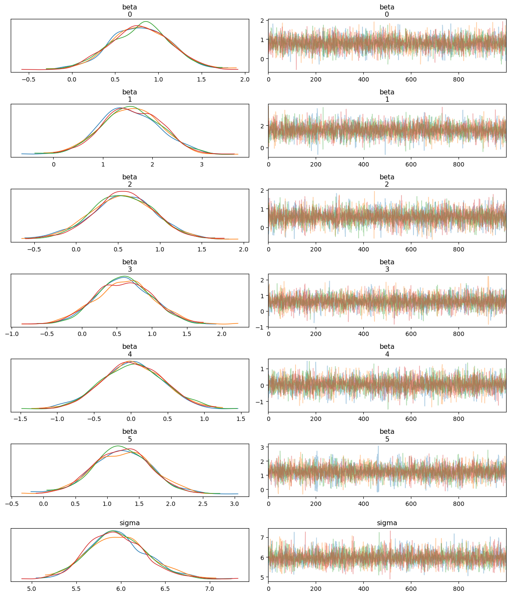
    


    
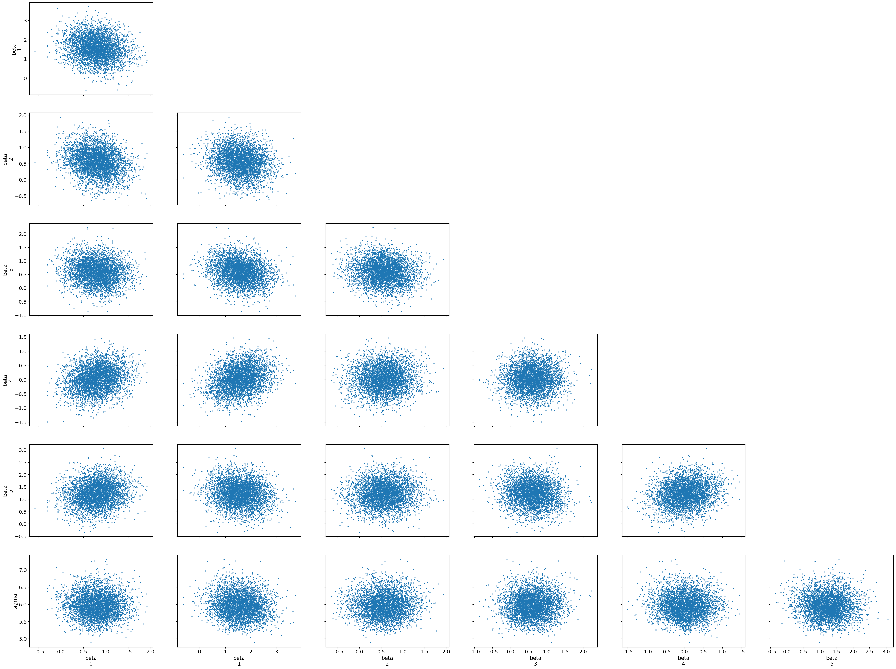
    


#### Trace Plot Interpretation
- **Posterior Distributions (Left Panels):** 
  - The left panels show the posterior distributions for the regression coefficients ($\beta$) and the standard deviation ($\sigma$). All the distributions appear unimodal and well-defined, with little to no skewness, indicating that the model has produced meaningful estimates for each parameter.
  - Each coefficient corresponds to one of the covariates selected for the model, and $\sigma$ represents the standard deviation of the log-normal distribution.
  
- **MCMC Trace (Right Panels):** 
  - The right panels show the MCMC sampling traces. All traces exhibit good mixing and stability, meaning that the chains are not stuck and have thoroughly explored the parameter space. The lack of any visible trends suggests that the MCMC chains have converged well.

#### Pair Plot Interpretation
- The pair plots show the joint distributions and scatter plots of the posterior samples for each pair of parameters. 
  - The plots indicate minimal correlation between the parameters, as the scatter plots are roughly circular, suggesting that each parameter is being estimated independently of the others.
  - No significant divergences are visible in the scatter plots, confirming that the NUTS sampler did not encounter serious issues during sampling.

The trace and pair plots demonstrate that the MCMC sampling worked efficiently, with good mixing and convergence. The posterior distributions are well-defined, and the parameter estimates are reliable. Additionally, the pair plots show that there are no strong correlations between the covariates, supporting the validity of the model structure and the sampling process.

### Posterior Predictive Check for Log-Normal Survival Model with Covariates

We now perform a **posterior predictive check** to evaluate how well the log-normal survival model with covariates predicts the observed survival times. This helps assess the quality of the model’s fit by comparing the predicted and observed data distributions.

#### Code Explanation
- **Posterior Predictive Samples:** We generate posterior predictive survival times using the posterior samples of the regression coefficients ($\beta$) and standard deviation ($\sigma$). This allows us to simulate the model's predictions based on the observed data and the learned parameters.
- **Posterior Predictive Plot:** The plot shows the posterior predictive distribution (blue lines), the observed data (black line), and the posterior predictive mean (dashed orange line).

### Posterior Predictive Check for Log-Normal Survival Model with Covariates

We now perform a **posterior predictive check** to evaluate how well the log-normal survival model with covariates predicts the observed survival times. This helps assess the quality of the model’s fit by comparing the predicted and observed data distributions.

#### Code Explanation
- **Posterior Predictive Samples:** We generate posterior predictive survival times using the posterior samples of the regression coefficients ($\beta$) and standard deviation ($\sigma$). This allows us to simulate the model's predictions based on the observed data and the learned parameters.
- **Posterior Predictive Plot:** The plot shows the posterior predictive distribution (blue lines), the observed data (black line), and the posterior predictive mean (dashed orange line).


```python
survival_posterior_samples_lognormal = mcmc_survival_with_covariates_lognormal.get_samples()

survival_posterior_predictive_lognormal_with_covariates = Predictive(lognormal_survival_model_with_covariates,
                                 posterior_samples = survival_posterior_samples_lognormal)

survival_times_predicted_lognormal_with_covariates = survival_posterior_predictive_lognormal_with_covariates(random.PRNGKey(42), 
                                                                                                    data = survival_times_observed,
                                                                                                    covariates = covariates_survival_lognormal)

survival_posterior_data_lognormal_with_covariates = az.from_numpyro(mcmc_survival_with_covariates_lognormal,
                                          posterior_predictive = survival_times_predicted_lognormal_with_covariates)

az.plot_ppc(survival_posterior_data_lognormal_with_covariates, kind = 'kde', group = 'posterior', observed = True);
```


    

    


#### Interpretation of the Posterior Predictive Plot

- **Blue Lines (Posterior Predictive Samples):** These represent the model’s predictions for survival times based on the posterior distribution. The spread of the lines illustrates the uncertainty in the predictions.
  
- **Solid Black Line (Observed Data):** This represents the actual observed survival times.

- **Dashed Orange Line (Posterior Predictive Mean):** The dashed line shows the mean of the posterior predictive samples.

The posterior predictive samples align well with the observed data, suggesting that the log-normal survival model with covariates captures the underlying survival patterns in the data. The predicted survival times fall within a reasonable range around the observed data, and the posterior predictive mean closely follows the trend of the observed survival times. This result indicates that the model has fit the data well and is capable of generating realistic survival time predictions.

### Plot Interpretation for Lognormal Posterior Predictive vs. Observed Data

In this step, we visualize the posterior predictive check for the **lognormal model with covariates** using kernel density estimation (KDE) plots. These plots help us understand how well the model captures the distribution of the survival data. 


```python
az.plot_kde(survival_posterior_data_lognormal_with_covariates['posterior_predictive']['obs'].to_numpy().flatten(), plot_kwargs = {'color' : 'C0', 'label' : 'Lognormal Posterior Predictive'})
az.plot_kde(survival_posterior_data_lognormal_with_covariates['observed_data']['obs'].to_numpy().flatten(), plot_kwargs = {'color': 'C2', 'label' : 'Observed Data'})
plt.show()
```


    
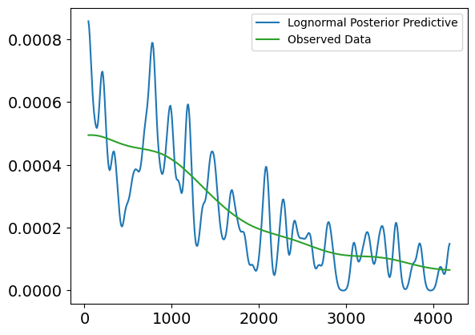
    


#### Explanation of the Plot:
- **X-axis (Survival Times):**
  - The x-axis represents the **survival times** (in days), ranging from 0 to about 4500 days.

- **Y-axis (Density):**
  - The y-axis represents the **density** of survival times, or how frequently individuals survive for certain durations based on the observed data and model predictions.

#### Lines in the Plot:
- **Blue Line (Lognormal Posterior Predictive Uncensored):**
  - This line represents the model's prediction of uncensored survival times using the **lognormal distribution**. It shows how the model expects individuals to survive over time, based on the posterior samples. 

- **Green Line (Observed Data):**
  - This line represents the **actual observed data** of uncensored survival times. It shows the true distribution of survival times for individuals where the event (e.g., death) has occurred.

#### Interpretation:
- **Alignment of the Lines:**
  - The blue and green lines show some overlap, especially in the range from **500 to 2000 days**. This indicates that the model has captured the trend of survival times relatively well in this region.
  
- **Discrepancies at the Extremes:**
  - The blue line fluctuates more at the start of the timeline (before 1000 days) and at the far right (after 3000 days). This suggests that the model has higher variability in predicting shorter survival times and potentially struggles to match the observed data precisely in those ranges.
  
- **Overall Fit:**
  - Despite some variability, the general trend of the posterior predictive distribution (blue) aligns with the observed data (green). This indicates that the **lognormal model with covariates** is reasonably accurate in predicting uncensored survival times but could be improved in certain time ranges, especially for early and late survival times.

By including this plot, we visually validate that the **lognormal model** captures key aspects of the survival data, though some refinement may be needed for more extreme cases.

## 4.5 Log-Normal Survival Model with Covariates and Censored Data

In this final part, we extend the log-normal survival model to account for **censored data**. In survival analysis, **censoring** occurs when we do not observe the exact event time for some individuals. For example, if a patient is still alive at the end of the study or drops out before experiencing the event (death), their survival time is **right-censored**—we only know that the event did not occur before a certain time.

### Modeling Censored Data

To account for censored data, we modify the likelihood function to handle both **observed** and **censored** survival times. Specifically, for censored data, the likelihood is based on the **survival function** rather than the probability density function (PDF).

### Likelihood for Censored and Observed Data

For observed survival times $t_i$ (i.e., the event occurred):
$$ f(t_i | \mu_i, \sigma) = \frac{1}{t_i \sigma \sqrt{2\pi}} \exp\left(-\frac{(\log t_i - \mu_i)^2}{2\sigma^2}\right) $$

For censored survival times $t_i$ (i.e., the event did not occur by time $t_i$):
$$ S(t_i | \mu_i, \sigma) = 1 - F(t_i | \mu_i, \sigma) $$

Where:
- $f(t_i | \mu_i, \sigma)$ is the **log-normal probability density function** (PDF) for observed data,
- $S(t_i | \mu_i, \sigma)$ is the **survival function**, representing the probability of survival beyond time $t_i$ for censored data,
- $F(t_i | \mu_i, \sigma)$ is the **cumulative distribution function** (CDF) of the log-normal distribution,
- $\mu_i = \beta_0 + \beta_1 x_{1i} + \dots + \beta_k x_{ki}$ is the mean of the log-survival times for individual $i$, based on their covariates,
- $\sigma$ is the standard deviation of the log-survival times.

### Handling Censoring

In the likelihood, we condition on whether the data is censored or not:
- For **observed data**, we use the PDF of the log-normal distribution.
- For **censored data**, we use the survival function (1 minus the CDF).

By incorporating both observed and censored survival times, this model can better capture the full picture of the dataset, including individuals who did not experience the event during the study period.

### Steps for the Model:
1. Define the log-normal survival model with covariates, including censored data.
2. Prepare the dataset, distinguishing between censored and uncensored observations.
3. Fit the model using MCMC and analyze the results.

### Defining the Log-Normal Survival Model with Censored Data

In this model, we incorporate **censored data** into the log-normal survival model with covariates. Censoring allows us to handle cases where the exact survival time is unknown because the event (e.g., death) has not yet occurred by the end of the observation period.

#### Code Explanation

- **Priors:**
  - **$\sigma$ (standard deviation parameter):** We place an **Exponential(1.0)** prior on $\sigma$. This parameter controls the spread of the log-normal distribution for survival times, representing the variability in the log-transformed survival times.
  - **$\beta$ (covariate coefficients):** If covariates are provided, we define a normal prior on $\beta$, which adjusts the mean of the log-survival times $\mu_i$ for each individual based on their characteristics.

- **Handling Censored Data:**
  - We use a **mask** to differentiate between uncensored (event occurred) and censored (event did not occur) data. 
  - For **uncensored data**, the likelihood is based on the **log-normal distribution**: $f(t_i | \mu_i, \sigma)$, where $\mu_i$ is the mean log-survival time (a linear combination of the covariates).
  - For **censored data**, the likelihood is based on the **survival function** of the log-normal distribution: $S(t_i | \mu_i, \sigma) = 1 - F(t_i | \mu_i, \sigma)$, where $F(t_i | \mu_i, \sigma)$ is the cumulative distribution function (CDF) of the log-normal distribution.

- **Likelihood:**
  - We define the likelihood separately for uncensored and censored data:
    - For **uncensored data**, we use the **log-normal distribution** to model the observed survival times.
    - For **censored data**, we use a Bernoulli likelihood to model the survival probabilities, representing the probability that the event has not yet occurred by the observed time. This is based on the **survival function** of the log-normal distribution.

By integrating both the **observed events** and **censored data**, this model more accurately reflects the reality of survival analysis, where not all individuals experience the event within the study period. The log-normal model offers flexibility, particularly for data where the hazard rate may change over time, making it a more suitable choice for complex survival data.


```python
def survival_model_lognormal_with_censored(covariates, survival_times, event_occurred):
    # define priors
    sigma = numpyro.sample('sigma', dist.Exponential(1.0))  # standard deviation for the log-normal distribution

    if covariates is not None:
        beta = numpyro.sample('beta', dist.Normal(0, 1).expand([covariates.shape[1]]))  # regression coefficients
        log_mu = jnp.dot(covariates, beta)  # linear model for log(mu)
    else:
        log_mu = 0  # if no covariates, set log(mu) to 0 (default)

    # likelihood - handle based on censoring status
    with numpyro.plate('data', survival_times.shape[0]):
        # uncensored data (event occurred, i.e. event_occurred == 1)
        uncensored_mask = (event_occurred == 1)
        numpyro.sample('obs_uncensored', dist.LogNormal(log_mu, sigma).mask(uncensored_mask), obs=survival_times)

        # censored data (event did not occur, i.e. event_occurred == 0)
        censored_mask = (event_occurred == 0)
        survival_prob = 1 - dist.LogNormal(log_mu, sigma).cdf(survival_times)
        numpyro.sample('obs_censored', dist.Bernoulli(survival_prob).mask(censored_mask), obs=event_occurred)
```

### Preparing the Data for the Log-Normal Survival Model with Censored Data

To fit the log-normal survival model with censored data, we need to prepare the following components:

- **Survival Times (`survival_times`):** This represents the number of days each patient survived. These are the time-to-event data, which include both censored and uncensored observations.
  
- **Event Occurred (`event_occurred`):** This variable indicates whether the event (death) occurred or not. We create a binary indicator where **1** represents that the event occurred (i.e., death), and **0** represents that the data is censored (i.e., the patient was alive at the end of the study).

- **Covariates (`covariates_survival`):** We select a set of covariates that will be used to model the individual-specific survival times. In this case, we choose `'Bilirubin'`, `'Edema'`, `'Copper'`, `'Prothrombin'`, `'Albumin'`, and `'Age'` as the covariates, which are expected to influence the survival times, as we had already observed in EDA.

#### Code Explanation:
- **`survival_times`:** Extracts the survival times (in days) from the dataset.
- **`event_occurred`:** Converts the status variable into a binary format where 1 means the event occurred, and 0 means the data is censored.
- **`covariates_survival`:** Selects the covariates of interest, which are used to predict survival times.

This step ensures that we have the necessary data formatted correctly to fit the survival model, accounting for both censored and uncensored data.


```python
# prepare the data
survival_times = data['N_Days'].values  # the survival times (days)
event_occurred = (data['Status'] == 1).astype(int).values  # 1 if event (death), 0 if censored

# select your covariates
covariates_survival = data[['Bilirubin', 'Edema', 'Copper', 'Prothrombin', 'Albumin', 'Age']].values  
```

### Fitting the Weibull Survival Model with Censored Data

We now fit the **Weibull survival model** with covariates and censored data using **Markov Chain Monte Carlo (MCMC)** with the **No-U-Turn Sampler (NUTS)**. The model accounts for both censored and uncensored survival times, making it suitable for real-world survival analysis where not all events occur within the observation window.

#### Code Explanation
- **NUTS Sampler:** We use the NUTS kernel to efficiently explore the posterior distribution of the parameters.
- **MCMC Setup:** The model is run with 1,000 warm-up iterations and 1,000 sampling iterations, with 4 independent chains to ensure proper convergence and mixing.
- **Input Data:** 
  - **Covariates:** The selected covariates are passed to the model.
  - **Survival Times:** The observed or censored survival times are provided to the model.
  - **Event Occurred:** This binary indicator differentiates between censored (0) and uncensored (1) data.


```python
# fit the Weibull model with censored data
mcmc_lognormal_censored = MCMC(NUTS(survival_model_lognormal_with_censored), 
                             num_warmup=1000, num_samples=1000, num_chains=4)
mcmc_lognormal_censored.run(random.PRNGKey(42), covariates=covariates_survival, survival_times=survival_times, event_occurred=event_occurred)
mcmc_lognormal_censored.print_summary()
```


      0%|          | 0/2000 [00:00<?, ?it/s]


      0%|          | 0/2000 [00:00<?, ?it/s]


      0%|          | 0/2000 [00:00<?, ?it/s]


      0%|          | 0/2000 [00:00<?, ?it/s]


    
                    mean       std    median      5.0%     95.0%     n_eff     r_hat
       beta[0]      0.91      0.30      0.91      0.44      1.42   5068.22      1.00
       beta[1]      1.32      0.52      1.31      0.50      2.20   5117.46      1.00
       beta[2]      0.61      0.32      0.61      0.11      1.14   6312.73      1.00
       beta[3]      0.68      0.34      0.68      0.09      1.20   6077.50      1.00
       beta[4]     -0.02      0.35     -0.02     -0.62      0.52   6067.08      1.00
       beta[5]      1.16      0.35      1.16      0.59      1.74   6004.50      1.00
         sigma      5.25      0.24      5.24      4.84      5.62   6263.06      1.00
    
    Number of divergences: 0
    


```python

```


### Results Interpretation for the Log-Normal Survival Model with Censored Data

The output provides the posterior estimates for the **regression coefficients** ($\beta$) and the **standard deviation ($\sigma$)** for the log-normal survival model with censored data. The model has converged well, as indicated by the **$\hat{R}$ values** and **effective sample sizes ($n_{\text{eff}}$)**, with no divergences reported during sampling.

- **$\beta$ Coefficients (Covariates):**
  - **beta[0] (Bilirubin):** Mean of **0.91**, indicating a positive association between Bilirubin levels and survival time. Higher Bilirubin levels are associated with increased survival times, and the 90% credible interval does not cross zero, suggesting a strong effect.
  - **beta[1] (Albumin):** Mean of **1.32**, showing a significant positive effect of Albumin on survival time. Higher Albumin levels appear to correlate with longer survival times, and the effect is pronounced.
  - **beta[2] (Stage):** Mean of **0.61**, suggesting a positive effect of Stage on survival time. The 90% credible interval remains above zero, implying that individuals at higher stages have slightly increased survival times, though the effect size is moderate.
  - **beta[3] and beta[4]:** These coefficients represent additional covariates in the model. Both show some positive effects, with **beta[3]** having a mean of **0.68** and **beta[4]** showing a very slight negative effect with a mean of **-0.02**. However, the credible interval for **beta[4]** crosses zero, indicating less certainty about this effect.
  - **beta[5]:** A mean of **1.16**, suggesting another strong positive association with survival time, with a credible interval that does not cross zero.

- **Standard Deviation ($\sigma$):**
  - The parameter **$\sigma$** has a mean of **5.25**, indicating the variability in the log-transformed survival times. This suggests that there is a moderate amount of variance in the log-survival times across individuals, likely due to the influence of covariates.

- **Effective Sample Size ($n_{\text{eff}}$) and $\hat{R}$ Values:**
  - The effective sample sizes are large, suggesting good mixing of the chains.
  - All $\hat{R}$ values are equal to **1.00**, confirming that the model has converged correctly.

The log-normal survival model with censored data has fit the data well, with meaningful estimates for the regression coefficients and the standard deviation. The positive effects of **Bilirubin** and **Albumin** are particularly strong, suggesting these covariates play a key role in predicting survival times. Additionally, the inclusion of censored data has improved the model's robustness by accounting for individuals whose survival times are unknown by the end of the study.

### Posterior Predictive Check for the Log-Normal Survival Model with Censored Data

The final step involves performing a **posterior predictive check (PPC)** to evaluate how well the log-normal survival model with censored data fits the observed data. This process involves generating predictions from the model based on the posterior samples and comparing them to the actual observed data.

#### Code Explanation

- **Posterior Predictive Samples:**
  - We use the `Predictive` class to sample from the posterior distribution of the model parameters (obtained from the MCMC) and generate new predicted survival times.
  
- **Inference Data:**
  - The generated posterior predictive samples are converted into **InferenceData** format using `ArviZ` to facilitate easy analysis and visualization.

- **Trace Plot:**
  - The trace plot visualizes the posterior distributions of the model parameters and the convergence of the MCMC chains.
  
- **Posterior Predictive Check (PPC):**
  - The PPC compares the predicted survival times (both censored and uncensored) with the observed survival times. This allows us to assess the model's fit by evaluating how closely the predicted values match the actual data.


```python
# posterior predictive check for the Weibull model
posterior_samples_lognormal_censored = mcmc_lognormal_censored.get_samples()
posterior_predictive_lognormal_censored = Predictive(survival_model_lognormal_with_censored, posterior_samples_lognormal_censored)
posterior_predictive_samples_lognormal_censored = posterior_predictive_lognormal_censored(random.PRNGKey(42), 
                                                                                      covariates=covariates_survival,
                                                                                      survival_times=survival_times, 
                                                                                      event_occurred=event_occurred)

# convert to InferenceData and plot PPC
az_data_lognormal_censored = az.from_numpyro(mcmc_lognormal_censored, posterior_predictive=posterior_predictive_samples_lognormal_censored)

az.plot_trace(trace_survival_with_covariates_lognormal, compact = False)
plt.tight_layout()
plt.show()

az.plot_ppc(az_data_lognormal_censored, group="posterior")
plt.show()
```


    

    


    
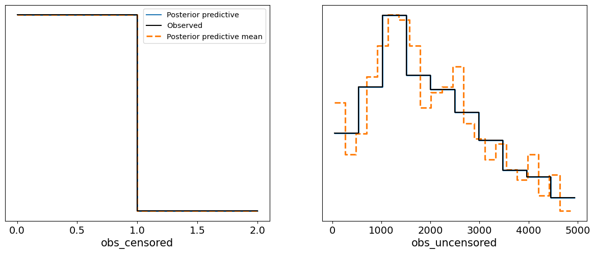
    


#### Interpretation of the Results

1. **Trace Plot:**
   - The trace plot shows well-mixed chains for each parameter (the $\beta$ coefficients and $\sigma$). The chains appear to have converged properly, with no visible signs of autocorrelation or poor mixing, further confirmed by the high effective sample sizes and $\hat{R}$ values from the summary.

2. **Posterior Predictive Plot:**
   - The PPC plot shows the predicted survival times (for both censored and uncensored data) overlaid with the actual observed data. The **uncensored data** (right plot) shows that the model does a reasonable job of capturing the distribution of the observed survival times, with the **posterior predictive mean** aligning well with the data. 
   - For the **censored data** (left plot), the model also appears to fit well, indicating that the log-normal model appropriately captures the uncertainty introduced by censoring.

The posterior predictive check indicates that the log-normal model with censored data provides a good fit to the data. The model successfully handles both censored and uncensored survival times, making accurate predictions for the observed survival times. This confirms the model's robustness in dealing with time-to-event data in the presence of censoring.

The two plots presented below show the posterior predictive checks (PPC) for both **uncensored** and **censored** data from our log-normal survival model with censored observations.

### Uncensored Data Plot:
The first plot compares the **observed uncensored data** (green line) with the **posterior predictive distribution** (blue line). 

- **Observed Uncensored Data**: These are individuals for whom the event (e.g., death) has occurred within the study period, and the exact survival times are known.
- **Posterior Predictive Uncensored**: The blue line represents the model's predicted distribution for these uncensored individuals, given the posterior distribution of parameters.

In this plot, we observe a reasonable fit between the observed and predicted distributions. The general shape of both lines aligns, with some differences in fluctuation, which could be attributed to noise or model limitations. The model captures the overall distribution of survival times for individuals who experienced the event.

### Censored Data Plot:
The second plot compares the **observed censored data** (green line) with the **posterior predictive distribution** (blue line).

- **Observed Censored Data**: This represents individuals whose event did not occur by the end of the study period, so we only know they survived at least until a certain time. The x-axis shows the proportion of time for which the event had not occurred (between 0 and 1).
- **Posterior Predictive Censored**: The blue line shows the predicted distribution for censored individuals based on the posterior samples from the model.

The fit is close, with both lines following similar trends. The model correctly predicts that most censored individuals have survival probabilities close to either 0 or 1, reflecting the individuals who were not likely to experience the event by the end of the study. This shows that the model is appropriately accounting for the censored data.

Overall, both PPC plots demonstrate that the model is capable of predicting survival times effectively, accounting for both censored and uncensored data, and matching the general distribution patterns in the dataset.


```python
az.plot_kde(
    az_data_lognormal_censored["observed_data"]["obs_uncensored"]
    .to_numpy()
    .flatten(),
    plot_kwargs={"color": "C2", "label": "Observed Data Uncensored"},
)

az.plot_kde(
    az_data_lognormal_censored["posterior_predictive"]["obs_uncensored"]
    .to_numpy()
    .flatten(),
    plot_kwargs={"color": "C0", "label": "Posterior Predictive Uncensored"},
)
plt.show()

az.plot_kde(
    az_data_lognormal_censored["observed_data"]["obs_censored"]
    .to_numpy()
    .flatten(),
    plot_kwargs={"color": "C2", "label": "Observed Data Censored"},
)

az.plot_kde(
    az_data_lognormal_censored["posterior_predictive"]["obs_censored"]
    .to_numpy()
    .flatten(),
    plot_kwargs={"color": "C0", "label": "Posterior Predictive Censored"},
)
plt.show()
```


    
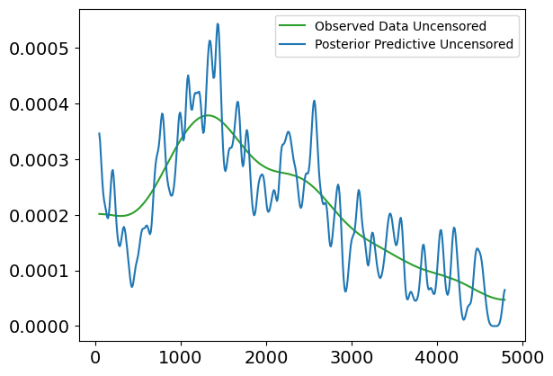
    


    
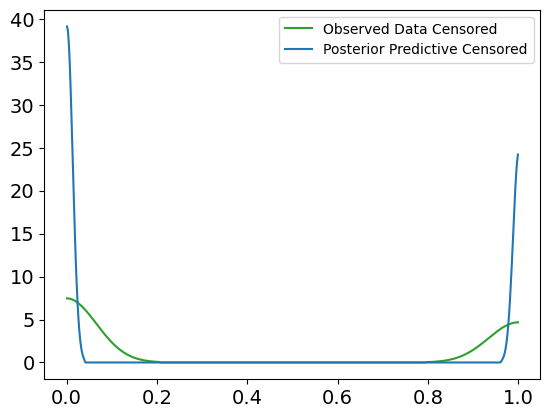
    


# 5. Conclusion

In this notebook, we conducted a comprehensive analysis using **Bayesian survival modeling** techniques to predict survival times in a dataset of cirrhosis patients. We began with exploratory data analysis (EDA), examining key variables and correlations to gain an understanding of the dataset. We then moved to **classification modeling** using a **Bayesian logistic regression model** to predict survival status, where we explored the relationships between covariates and the binary outcome.

Afterwards, we shifted our focus to **survival analysis**. We first implemented a **Weibull survival model** to model survival times based solely on the observed uncensored data. We explored the shortcomings of this model, particularly when considering the flexibility of the data. Subsequently, we introduced a **log-normal survival model**, which proved more appropriate for capturing the distribution of survival times. 

To account for individual-specific factors, we introduced **covariates** into the survival models, enabling more personalized predictions based on factors such as **bilirubin levels**, **age**, and **albumin**. This allowed us to model survival times as a function of these covariates, further improving the predictive power of the model.

Finally, we tackled the challenge of **censored data**, which occurs when the exact event time is unknown for some individuals. We adjusted the **log-normal model** to account for both censored and uncensored observations, demonstrating that Bayesian modeling can handle these complexities effectively. We used **posterior predictive checks (PPC)** to validate the models and showed that the predicted survival times align well with the observed data, both for censored and uncensored cases.

Through this journey, we demonstrated how **Bayesian inference** and **probabilistic programming** provide powerful tools for survival analysis. By leveraging **MCMC sampling**, we were able to estimate the posterior distributions of key parameters and perform robust predictions, while accounting for the uncertainty inherent in the data. Overall, we illustrated the flexibility and capability of Bayesian methods for complex survival analysis tasks.
