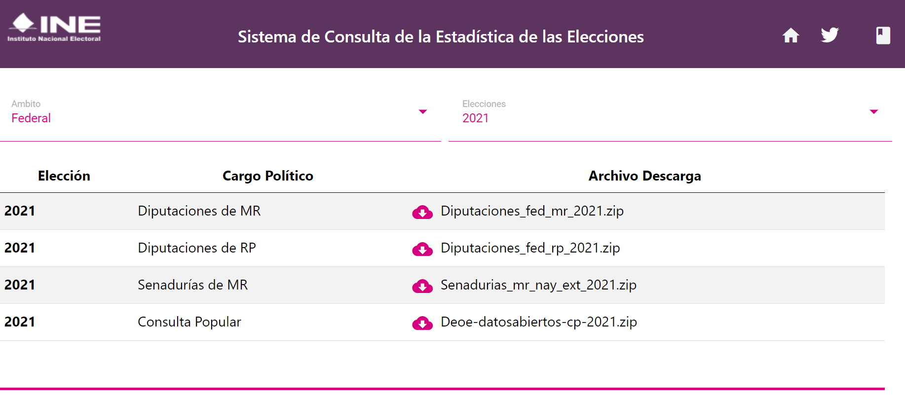

# Local Elections in Mexico
---

## Part 1: Collecting and Cleaning the Data


```python
import pandas as pd
import numpy as np
import matplotlib.pyplot as plt
import plotly.graph_objects as go
import plotly.express as px
import json
```

Importing the excel files. These files come from the INE (Electoral Institute in Mexico). Then, we can do some data wrangling to filter the relevant data. 

The data comes from these two sources:

1. The voter registration data: [The Open Data page](https://www.ine.mx/transparencia/datos-abiertos/#/archivo/datos-por-rangos-de-edad-entidad-de-origen-y-sexo-del-padron-electoral-y-lista-nominal-2024)



2. The elections results data: [Election Results](https://siceen21.ine.mx/downloadzip)


Let's explore the data as it comes.

(Note that, unfortunately, the dataframe output did not export correctly to the file displayed here).

```python
df_sx = pd.read_excel('data/padron_y_ln_sexo.xlsx')
print(len(df_sx.columns))
df_sx.head()
```

    15
    


<div>
<style scoped>
    .dataframe tbody tr th:only-of-type {
        vertical-align: middle;
    }

    .dataframe tbody tr th {
        vertical-align: top;
    }

    .dataframe thead th {
        text-align: right;
    }
</style>
<table border="1" class="dataframe">
  <thead>
    <tr style="text-align: right;">
      <th></th>
      <th>CLAVE\nENTIDAD</th>
      <th>NOMBRE\nENTIDAD</th>
      <th>CLAVE\nDISTRITO</th>
      <th>NOMBRE\nDISTRITO</th>
      <th>CLAVE\nMUNICIPIO</th>
      <th>NOMBRE\nMUNICIPIO</th>
      <th>SECCION</th>
      <th>PADRON\nHOMBRES</th>
      <th>PADRON\nMUJERES</th>
      <th>PADRON\nNO BINARIO</th>
      <th>PADRON\nELECTORAL</th>
      <th>LISTA\nHOMBRES</th>
      <th>LISTA\nMUJERES</th>
      <th>LISTA\nNO BINARIO</th>
      <th>LISTA\nNOMINAL</th>
    </tr>
  </thead>
  <tbody>
    <tr>
      <th>0</th>
      <td>1</td>
      <td>RESIDENTES EXTRANJERO</td>
      <td>0.0</td>
      <td>0</td>
      <td>0.0</td>
      <td>0</td>
      <td>0.0</td>
      <td>8444</td>
      <td>5756</td>
      <td>0</td>
      <td>14200</td>
      <td>3452</td>
      <td>2577</td>
      <td>0</td>
      <td>6029</td>
    </tr>
    <tr>
      <th>1</th>
      <td>1</td>
      <td>AGUASCALIENTES</td>
      <td>1.0</td>
      <td>JESUS MARIA                                   ...</td>
      <td>2.0</td>
      <td>ASIENTOS</td>
      <td>338.0</td>
      <td>973</td>
      <td>1013</td>
      <td>0</td>
      <td>1986</td>
      <td>970</td>
      <td>1011</td>
      <td>0</td>
      <td>1981</td>
    </tr>
    <tr>
      <th>2</th>
      <td>1</td>
      <td>AGUASCALIENTES</td>
      <td>1.0</td>
      <td>JESUS MARIA                                   ...</td>
      <td>2.0</td>
      <td>ASIENTOS</td>
      <td>339.0</td>
      <td>895</td>
      <td>954</td>
      <td>0</td>
      <td>1849</td>
      <td>893</td>
      <td>953</td>
      <td>0</td>
      <td>1846</td>
    </tr>
    <tr>
      <th>3</th>
      <td>1</td>
      <td>AGUASCALIENTES</td>
      <td>1.0</td>
      <td>JESUS MARIA                                   ...</td>
      <td>2.0</td>
      <td>ASIENTOS</td>
      <td>340.0</td>
      <td>951</td>
      <td>1001</td>
      <td>0</td>
      <td>1952</td>
      <td>949</td>
      <td>998</td>
      <td>0</td>
      <td>1947</td>
    </tr>
    <tr>
      <th>4</th>
      <td>1</td>
      <td>AGUASCALIENTES</td>
      <td>1.0</td>
      <td>JESUS MARIA                                   ...</td>
      <td>2.0</td>
      <td>ASIENTOS</td>
      <td>341.0</td>
      <td>1174</td>
      <td>1184</td>
      <td>0</td>
      <td>2358</td>
      <td>1172</td>
      <td>1184</td>
      <td>0</td>
      <td>2356</td>
    </tr>
  </tbody>
</table>
</div>


We start by changing the names of the columns for readability.


```python
# change column names
col_names_sx = ['Clave Entidad', 'Nombre Entidad', 'Clave Distrito', 'Nombre Distrito',
             'Clave Municipio', 'Nombre Municipio', 'Seccion', 'Padron Hombre',
             'Padron Mujeres', 'Padron No Binario', 'Padron Electoral', 'Lista Hombres',
             'Lista Mujeres', 'Lista No Binario', 'Lista Nominal']
df_sx.columns = col_names_sx

df_sx.head()
```


<div>
<style scoped>
    .dataframe tbody tr th:only-of-type {
        vertical-align: middle;
    }

    .dataframe tbody tr th {
        vertical-align: top;
    }

    .dataframe thead th {
        text-align: right;
    }
</style>
<table border="1" class="dataframe">
  <thead>
    <tr style="text-align: right;">
      <th></th>
      <th>Clave Entidad</th>
      <th>Nombre Entidad</th>
      <th>Clave Distrito</th>
      <th>Nombre Distrito</th>
      <th>Clave Municipio</th>
      <th>Nombre Municipio</th>
      <th>Seccion</th>
      <th>Padron Hombre</th>
      <th>Padron Mujeres</th>
      <th>Padron No Binario</th>
      <th>Padron Electoral</th>
      <th>Lista Hombres</th>
      <th>Lista Mujeres</th>
      <th>Lista No Binario</th>
      <th>Lista Nominal</th>
    </tr>
  </thead>
  <tbody>
    <tr>
      <th>0</th>
      <td>1</td>
      <td>RESIDENTES EXTRANJERO</td>
      <td>0.0</td>
      <td>0</td>
      <td>0.0</td>
      <td>0</td>
      <td>0.0</td>
      <td>8444</td>
      <td>5756</td>
      <td>0</td>
      <td>14200</td>
      <td>3452</td>
      <td>2577</td>
      <td>0</td>
      <td>6029</td>
    </tr>
    <tr>
      <th>1</th>
      <td>1</td>
      <td>AGUASCALIENTES</td>
      <td>1.0</td>
      <td>JESUS MARIA                                   ...</td>
      <td>2.0</td>
      <td>ASIENTOS</td>
      <td>338.0</td>
      <td>973</td>
      <td>1013</td>
      <td>0</td>
      <td>1986</td>
      <td>970</td>
      <td>1011</td>
      <td>0</td>
      <td>1981</td>
    </tr>
    <tr>
      <th>2</th>
      <td>1</td>
      <td>AGUASCALIENTES</td>
      <td>1.0</td>
      <td>JESUS MARIA                                   ...</td>
      <td>2.0</td>
      <td>ASIENTOS</td>
      <td>339.0</td>
      <td>895</td>
      <td>954</td>
      <td>0</td>
      <td>1849</td>
      <td>893</td>
      <td>953</td>
      <td>0</td>
      <td>1846</td>
    </tr>
    <tr>
      <th>3</th>
      <td>1</td>
      <td>AGUASCALIENTES</td>
      <td>1.0</td>
      <td>JESUS MARIA                                   ...</td>
      <td>2.0</td>
      <td>ASIENTOS</td>
      <td>340.0</td>
      <td>951</td>
      <td>1001</td>
      <td>0</td>
      <td>1952</td>
      <td>949</td>
      <td>998</td>
      <td>0</td>
      <td>1947</td>
    </tr>
    <tr>
      <th>4</th>
      <td>1</td>
      <td>AGUASCALIENTES</td>
      <td>1.0</td>
      <td>JESUS MARIA                                   ...</td>
      <td>2.0</td>
      <td>ASIENTOS</td>
      <td>341.0</td>
      <td>1174</td>
      <td>1184</td>
      <td>0</td>
      <td>2358</td>
      <td>1172</td>
      <td>1184</td>
      <td>0</td>
      <td>2356</td>
    </tr>
  </tbody>
</table>
</div>


Verify the data types in the dataframe and whether there are null values


```python
print(df_sx.dtypes)
print(df_sx.isnull().sum())
```

    Clave Entidad         object
    Nombre Entidad        object
    Clave Distrito       float64
    Nombre Distrito       object
    Clave Municipio      float64
    Nombre Municipio      object
    Seccion              float64
    Padron Hombre          int64
    Padron Mujeres         int64
    Padron No Binario      int64
    Padron Electoral       int64
    Lista Hombres          int64
    Lista Mujeres          int64
    Lista No Binario       int64
    Lista Nominal          int64
    dtype: object
    Clave Entidad        0
    Nombre Entidad       1
    Clave Distrito       1
    Nombre Distrito      1
    Clave Municipio      1
    Nombre Municipio     1
    Seccion              1
    Padron Hombre        0
    Padron Mujeres       0
    Padron No Binario    0
    Padron Electoral     0
    Lista Hombres        0
    Lista Mujeres        0
    Lista No Binario     0
    Lista Nominal        0
    dtype: int64
    

There are indeed some null values in some of the columns. Since the null values live in rows that we will not need, i.e. we will filter the rows to include only the values for the State of "Quintana Roo", we don't need to bother in removing or doing any data gymnastics to those null values.

Let's filter the data we need now.


```python
# filter rows by state quintana roo
df_sx_qroo = df_sx[df_sx['Nombre Entidad'] == 'QUINTANA ROO']

# select columns for padron electoral
df_pe_sx_qroo = df_sx_qroo.iloc[:,:11]

# select columns for lista nominal
cols_to_drop = df_sx_qroo.columns[7:11]
df_ln_sx_qroo = df_sx_qroo.drop(columns = cols_to_drop)
df_ln_sx_qroo.head()
```


<div>
<style scoped>
    .dataframe tbody tr th:only-of-type {
        vertical-align: middle;
    }

    .dataframe tbody tr th {
        vertical-align: top;
    }

    .dataframe thead th {
        text-align: right;
    }
</style>
<table border="1" class="dataframe">
  <thead>
    <tr style="text-align: right;">
      <th></th>
      <th>Clave Entidad</th>
      <th>Nombre Entidad</th>
      <th>Clave Distrito</th>
      <th>Nombre Distrito</th>
      <th>Clave Municipio</th>
      <th>Nombre Municipio</th>
      <th>Seccion</th>
      <th>Lista Hombres</th>
      <th>Lista Mujeres</th>
      <th>Lista No Binario</th>
      <th>Lista Nominal</th>
    </tr>
  </thead>
  <tbody>
    <tr>
      <th>50685</th>
      <td>23</td>
      <td>QUINTANA ROO</td>
      <td>1.0</td>
      <td>SOLIDARIDAD                                   ...</td>
      <td>2.0</td>
      <td>COZUMEL</td>
      <td>182.0</td>
      <td>1046</td>
      <td>1015</td>
      <td>0</td>
      <td>2061</td>
    </tr>
    <tr>
      <th>50686</th>
      <td>23</td>
      <td>QUINTANA ROO</td>
      <td>1.0</td>
      <td>SOLIDARIDAD                                   ...</td>
      <td>2.0</td>
      <td>COZUMEL</td>
      <td>183.0</td>
      <td>1056</td>
      <td>1085</td>
      <td>0</td>
      <td>2141</td>
    </tr>
    <tr>
      <th>50687</th>
      <td>23</td>
      <td>QUINTANA ROO</td>
      <td>1.0</td>
      <td>SOLIDARIDAD                                   ...</td>
      <td>2.0</td>
      <td>COZUMEL</td>
      <td>184.0</td>
      <td>982</td>
      <td>981</td>
      <td>0</td>
      <td>1963</td>
    </tr>
    <tr>
      <th>50688</th>
      <td>23</td>
      <td>QUINTANA ROO</td>
      <td>1.0</td>
      <td>SOLIDARIDAD                                   ...</td>
      <td>2.0</td>
      <td>COZUMEL</td>
      <td>185.0</td>
      <td>1228</td>
      <td>1198</td>
      <td>0</td>
      <td>2426</td>
    </tr>
    <tr>
      <th>50689</th>
      <td>23</td>
      <td>QUINTANA ROO</td>
      <td>1.0</td>
      <td>SOLIDARIDAD                                   ...</td>
      <td>2.0</td>
      <td>COZUMEL</td>
      <td>186.0</td>
      <td>525</td>
      <td>465</td>
      <td>0</td>
      <td>990</td>
    </tr>
  </tbody>
</table>
</div>


## Election Results.

First, we will work with the data related to the election results.

Let's load all the files separately (as they were available from the source).


```python
# load the files
df_re_2009 = pd.read_csv('data/DIPUTACIONES_FED_MR_2009/2009_SEE_DIP_FED_MR_NAL_SEC.csv')
df_re_2012 = pd.read_csv('data/DIPUTACIONES_FED_MR_2012/2012_SEE_DIP_FED_MR_NAL_SEC.csv')
df_re_2015 = pd.read_csv('data/DIPUTACIONES_FED_MR_2015/2015_SEE_DIP_FED_MR_NAL_SEC.csv')
df_re_2018 = pd.read_csv('data/DIPUTACIONES_FED_MR_2018/2018_SEE_DIP_FED_MR_NAL_SEC.csv')
df_re_2021 = pd.read_csv('data/DIPUTACIONES_FED_MR_2021/2021_SEE_DIP_FED_MR_NAL_SEC.csv')

# filter rows by state quintana roo
df_re_2009_qroo = df_re_2009[df_re_2009['NOMBRE_ESTADO'] == 'QUINTANA ROO']
df_re_2012_qroo = df_re_2012[df_re_2012['NOMBRE_ESTADO'] == 'QUINTANA ROO']
df_re_2015_qroo = df_re_2015[df_re_2015['NOMBRE_ESTADO'] == 'QUINTANA ROO']
df_re_2018_qroo = df_re_2018[df_re_2018['NOMBRE_ESTADO'] == 'QUINTANA ROO']
df_re_2021_qroo = df_re_2021[df_re_2021['NOMBRE_ESTADO'] == 'QUINTANA ROO']


df_re_2021_qroo.head()
```


<div>
<style scoped>
    .dataframe tbody tr th:only-of-type {
        vertical-align: middle;
    }

    .dataframe tbody tr th {
        vertical-align: top;
    }

    .dataframe thead th {
        text-align: right;
    }
</style>
<table border="1" class="dataframe">
  <thead>
    <tr style="text-align: right;">
      <th></th>
      <th>CIRCUNSCRIPCION</th>
      <th>ID_ESTADO</th>
      <th>NOMBRE_ESTADO</th>
      <th>ID_DISTRITO_FEDERAL</th>
      <th>CABECERA_DISTRITAL_FEDERAL</th>
      <th>ID_MUNICIPIO</th>
      <th>MUNICIPIO</th>
      <th>SECCION</th>
      <th>CASILLAS</th>
      <th>PAN</th>
      <th>...</th>
      <th>PVEM_PT</th>
      <th>PVEM_MORENA</th>
      <th>PT_MORENA</th>
      <th>CAND_IND1</th>
      <th>CAND_IND2</th>
      <th>CAND_IND3</th>
      <th>NUM_VOTOS_CAN_NREG</th>
      <th>NUM_VOTOS_NULOS</th>
      <th>TOTAL_VOTOS</th>
      <th>LISTA_NOMINAL</th>
    </tr>
  </thead>
  <tbody>
    <tr>
      <th>49016</th>
      <td>3</td>
      <td>23</td>
      <td>QUINTANA ROO</td>
      <td>1</td>
      <td>PLAYA DEL CARMEN</td>
      <td>0</td>
      <td>NaN</td>
      <td>0</td>
      <td>NaN</td>
      <td>0.0</td>
      <td>...</td>
      <td>0.0</td>
      <td>0.0</td>
      <td>0.0</td>
      <td>NaN</td>
      <td>NaN</td>
      <td>NaN</td>
      <td>0.0</td>
      <td>0.0</td>
      <td>2.0</td>
      <td>2</td>
    </tr>
    <tr>
      <th>49017</th>
      <td>3</td>
      <td>23</td>
      <td>QUINTANA ROO</td>
      <td>1</td>
      <td>PLAYA DEL CARMEN</td>
      <td>2</td>
      <td>COZUMEL</td>
      <td>182</td>
      <td>3.0</td>
      <td>180.0</td>
      <td>...</td>
      <td>0.0</td>
      <td>3.0</td>
      <td>2.0</td>
      <td>NaN</td>
      <td>NaN</td>
      <td>NaN</td>
      <td>0.0</td>
      <td>29.0</td>
      <td>1097.0</td>
      <td>2160</td>
    </tr>
    <tr>
      <th>49018</th>
      <td>3</td>
      <td>23</td>
      <td>QUINTANA ROO</td>
      <td>1</td>
      <td>PLAYA DEL CARMEN</td>
      <td>2</td>
      <td>COZUMEL</td>
      <td>183</td>
      <td>3.0</td>
      <td>103.0</td>
      <td>...</td>
      <td>0.0</td>
      <td>5.0</td>
      <td>3.0</td>
      <td>NaN</td>
      <td>NaN</td>
      <td>NaN</td>
      <td>3.0</td>
      <td>30.0</td>
      <td>1083.0</td>
      <td>2159</td>
    </tr>
    <tr>
      <th>49019</th>
      <td>3</td>
      <td>23</td>
      <td>QUINTANA ROO</td>
      <td>1</td>
      <td>PLAYA DEL CARMEN</td>
      <td>2</td>
      <td>COZUMEL</td>
      <td>184</td>
      <td>3.0</td>
      <td>91.0</td>
      <td>...</td>
      <td>0.0</td>
      <td>10.0</td>
      <td>6.0</td>
      <td>NaN</td>
      <td>NaN</td>
      <td>NaN</td>
      <td>1.0</td>
      <td>46.0</td>
      <td>1169.0</td>
      <td>1981</td>
    </tr>
    <tr>
      <th>49020</th>
      <td>3</td>
      <td>23</td>
      <td>QUINTANA ROO</td>
      <td>1</td>
      <td>PLAYA DEL CARMEN</td>
      <td>2</td>
      <td>COZUMEL</td>
      <td>185</td>
      <td>4.0</td>
      <td>113.0</td>
      <td>...</td>
      <td>0.0</td>
      <td>3.0</td>
      <td>6.0</td>
      <td>NaN</td>
      <td>NaN</td>
      <td>NaN</td>
      <td>1.0</td>
      <td>38.0</td>
      <td>1377.0</td>
      <td>2371</td>
    </tr>
  </tbody>
</table>
<p>5 rows × 34 columns</p>
</div>


We can already see that there are some columns that are not needed. These columns, in particular, are the independent candidate columns, and they are effectively empty. These columns' names all begin with `CAND`. We can use that to quickly drop all of them. 

We can also drop the null value included in the municipality (`MUNICIPIO`) columns, which leaked after filtering by the State before. We need to drop this one too.


```python
# define a list of all the dataframes to loop over them below
df_re_all_years = [df_re_2009_qroo, df_re_2012_qroo, df_re_2015_qroo, df_re_2018_qroo, df_re_2021_qroo]

# drop independent candidates and any rows with NaN in the MUNICIPIO columns
for df in df_re_all_years:
    # drop rows where 'MUNICIPIO' is NaN
    df.dropna(subset=['MUNICIPIO'], inplace = True)

    # select columns that begin with "CAND"
    cols_cand_ind = df.columns[df.columns.str.startswith('CAND')]
    
    # drop the identified columns
    df.drop(columns=cols_cand_ind, inplace = True)

df_re_all_years[-1].head()
```

<div>
<style scoped>
    .dataframe tbody tr th:only-of-type {
        vertical-align: middle;
    }

    .dataframe tbody tr th {
        vertical-align: top;
    }

    .dataframe thead th {
        text-align: right;
    }
</style>
<table border="1" class="dataframe">
  <thead>
    <tr style="text-align: right;">
      <th></th>
      <th>CIRCUNSCRIPCION</th>
      <th>ID_ESTADO</th>
      <th>NOMBRE_ESTADO</th>
      <th>ID_DISTRITO_FEDERAL</th>
      <th>CABECERA_DISTRITAL_FEDERAL</th>
      <th>ID_MUNICIPIO</th>
      <th>MUNICIPIO</th>
      <th>SECCION</th>
      <th>CASILLAS</th>
      <th>PAN</th>
      <th>...</th>
      <th>PAN_PRD</th>
      <th>PRI_PRD</th>
      <th>PVEM_PT_MORENA</th>
      <th>PVEM_PT</th>
      <th>PVEM_MORENA</th>
      <th>PT_MORENA</th>
      <th>NUM_VOTOS_CAN_NREG</th>
      <th>NUM_VOTOS_NULOS</th>
      <th>TOTAL_VOTOS</th>
      <th>LISTA_NOMINAL</th>
    </tr>
  </thead>
  <tbody>
    <tr>
      <th>49017</th>
      <td>3</td>
      <td>23</td>
      <td>QUINTANA ROO</td>
      <td>1</td>
      <td>PLAYA DEL CARMEN</td>
      <td>2</td>
      <td>COZUMEL</td>
      <td>182</td>
      <td>3.0</td>
      <td>180.0</td>
      <td>...</td>
      <td>0.0</td>
      <td>2.0</td>
      <td>5.0</td>
      <td>0.0</td>
      <td>3.0</td>
      <td>2.0</td>
      <td>0.0</td>
      <td>29.0</td>
      <td>1097.0</td>
      <td>2160</td>
    </tr>
    <tr>
      <th>49018</th>
      <td>3</td>
      <td>23</td>
      <td>QUINTANA ROO</td>
      <td>1</td>
      <td>PLAYA DEL CARMEN</td>
      <td>2</td>
      <td>COZUMEL</td>
      <td>183</td>
      <td>3.0</td>
      <td>103.0</td>
      <td>...</td>
      <td>0.0</td>
      <td>2.0</td>
      <td>5.0</td>
      <td>0.0</td>
      <td>5.0</td>
      <td>3.0</td>
      <td>3.0</td>
      <td>30.0</td>
      <td>1083.0</td>
      <td>2159</td>
    </tr>
    <tr>
      <th>49019</th>
      <td>3</td>
      <td>23</td>
      <td>QUINTANA ROO</td>
      <td>1</td>
      <td>PLAYA DEL CARMEN</td>
      <td>2</td>
      <td>COZUMEL</td>
      <td>184</td>
      <td>3.0</td>
      <td>91.0</td>
      <td>...</td>
      <td>0.0</td>
      <td>2.0</td>
      <td>12.0</td>
      <td>0.0</td>
      <td>10.0</td>
      <td>6.0</td>
      <td>1.0</td>
      <td>46.0</td>
      <td>1169.0</td>
      <td>1981</td>
    </tr>
    <tr>
      <th>49020</th>
      <td>3</td>
      <td>23</td>
      <td>QUINTANA ROO</td>
      <td>1</td>
      <td>PLAYA DEL CARMEN</td>
      <td>2</td>
      <td>COZUMEL</td>
      <td>185</td>
      <td>4.0</td>
      <td>113.0</td>
      <td>...</td>
      <td>0.0</td>
      <td>1.0</td>
      <td>15.0</td>
      <td>0.0</td>
      <td>3.0</td>
      <td>6.0</td>
      <td>1.0</td>
      <td>38.0</td>
      <td>1377.0</td>
      <td>2371</td>
    </tr>
    <tr>
      <th>49021</th>
      <td>3</td>
      <td>23</td>
      <td>QUINTANA ROO</td>
      <td>1</td>
      <td>PLAYA DEL CARMEN</td>
      <td>2</td>
      <td>COZUMEL</td>
      <td>186</td>
      <td>2.0</td>
      <td>37.0</td>
      <td>...</td>
      <td>0.0</td>
      <td>0.0</td>
      <td>3.0</td>
      <td>0.0</td>
      <td>11.0</td>
      <td>7.0</td>
      <td>0.0</td>
      <td>23.0</td>
      <td>650.0</td>
      <td>972</td>
    </tr>
  </tbody>
</table>
<p>5 rows × 31 columns</p>
</div>


Now we can extract the political party names from each of the dataframes. At each election year, the parties may be different, and also there are alliances which make this somewhat more complicated.


```python
# List to store party names lists for each DataFrame
party_names_per_df = []

for df in df_re_all_years:
    party_names = []  # Empty list to store party names for current DataFrame

    # Get a list of column names
    column_names = list(df.columns)

    try:
        # Find the indices of "CASILLAS" and "NUM_VOTOS_CAN_NREG" (handle potential errors)
        casillas_index = column_names.index('CASILLAS')
        num_votos_index = column_names.index('NUM_VOTOS_CAN_NREG')

        # Extract party names between the indices (avoid out-of-bounds)
        party_names = column_names[casillas_index + 1:min(num_votos_index, len(column_names))]

    except ValueError:
        # Handle cases where "CASILLAS" or "NUM_VOTOS_CAN_NREG" might not exist
        print(f"\nWARNING: 'CASILLAS' or 'NUM_VOTOS_CAN_NREG' not found in DataFrame")

    # Append the party names list for this DataFrame
    party_names_per_df.append(party_names)

party_names_per_df
```


    [['PAN',
      'PRI',
      'PRD',
      'PVEM',
      'PT',
      'CONV',
      'NVA_ALIANZA',
      'PSD',
      'PRIMERO_MEXICO',
      'SALVEMOS_MEXICO'],
     ['PAN',
      'PRI',
      'PRD',
      'PVEM',
      'PT',
      'MC',
      'NVA_ALIANZA',
      'PRI_PVEM',
      'PRD_PT_MC',
      'PRD_PT',
      'PRD_MC',
      'PT_MC'],
     ['PAN',
      'PRI',
      'PRD',
      'PVEM',
      'PT',
      'MC',
      'NVA_ALIANZA',
      'MORENA',
      'PH',
      'ES',
      'PAN_NVA_ALIANZA',
      'PRI_PVEM',
      'PRD_PT'],
     ['PAN',
      'PRI',
      'PRD',
      'PVEM',
      'PT',
      'MC',
      'NA',
      'MORENA',
      'ES',
      'PAN_PRD_MC',
      'PAN_PRD',
      'PAN_MC',
      'PRD_MC',
      'PRI_PVEM_NA',
      'PRI_PVEM',
      'PRI_NA',
      'PVEM_NA',
      'PT_MORENA_ES',
      'PT_MORENA',
      'PT_ES',
      'MORENA_ES'],
     ['PAN',
      'PRI',
      'PRD',
      'PVEM',
      'PT',
      'MC',
      'MORENA',
      'PES',
      'RSP',
      'FXM',
      'PAN_PRI_PRD',
      'PAN_PRI',
      'PAN_PRD',
      'PRI_PRD',
      'PVEM_PT_MORENA',
      'PVEM_PT',
      'PVEM_MORENA',
      'PT_MORENA']]


Just to get a feel of the data, we can see how many rows there are in each of the dataframes.


```python
print('Number of lines in the 2009 election dataframe: ', len(df_re_2009_qroo) )
print('Number of lines in the 2012 election dataframe: ', len(df_re_2012_qroo) )
print('Number of lines in the 2015 election dataframe: ', len(df_re_2015_qroo) )
print('Number of lines in the 2018 election dataframe: ', len(df_re_2018_qroo) )
print('Number of lines in the 2021 election dataframe: ', len(df_re_2021_qroo) )
```

    Number of lines in the 2009 election dataframe:  729
    Number of lines in the 2012 election dataframe:  831
    Number of lines in the 2015 election dataframe:  938
    Number of lines in the 2018 election dataframe:  939
    Number of lines in the 2021 election dataframe:  1033
    

### Preliminary Visualization

Visualizaremos la informacion agregando los datos por año. De esta manera, tendremos un historial de tiempo _por cada municipio_, en el cual podemos ver el historial de los resultados de cada partido politico en cada municipio.

Here we visualize the information by aggregating the data per year. In this way, we will have a time history _per municipality (municipio)_, where we can see the history of the results for each political party in each municipality.

### Group by Political Party

Para un analisis mas compacto, podemos agrupar los partidos politicos incluyendo sus alianzas. De este modo, por ejemplo, tendriamos que:

For a more compact analysis, we can group the political parties including the alliances. In this we, we would have, for example:

```
'PAN': ['PAN', 'PAN_NVA_ALIANZA', 'PAN_PRD_MC', 'PAN_PRD', 'PAN_MC', 'PAN_PRI_PRD', 'PAN_PRI']
```

Which means that the party `PAN` would also include the alliances with the other parties named `Nueva Alianza`, an alliance with `PRD` named `PAN_PRD`, etc.

##### NOTE


```python
# write a dictionary with the alliances per party
alliance_mapping = {
    'PAN': ['PAN', 'PAN_NVA_ALIANZA', 'PAN_PRD'],
    'PRI': ['PRI', 'PRI_PVEM', 'PRI_NA', 'PRI_PVEM_NA', 'PAN_PRI_PRD', 'PAN_PRI', 'PRI_PRD'],
    'PRD': ['PRD', 'PRD_PT', 'PAN_PRI_PRD'],
    'PVEM': ['PVEM', 'PVEM_NA', 'PVEM_PT'],
    'PT': ['PT', 'PT_ES'],
    'MC': ['MC', 'PRD_PT_MC', 'PRD_MC', 'PT_MC', 'PAN_PRD_MC', 'PAN_MC'],
    'MORENA': ['MORENA', 'PT_MORENA_ES', 'PT_MORENA', 'MORENA_ES', 'PVEM_PT_MORENA', 'PVEM_MORENA'],
    'NVA_ALIANZA': ['NVA_ALIANZA'],
    'PSD': ['PSD'],
    'PRIMERO_MEXICO': ['PRIMERO_MEXICO'],
    'SALVEMOS_MEXICO': ['SALVEMOS_MEXICO'],
    'PH': ['PH'],
    'ES': ['ES'],
    'NA': ['NA'],
    'PES': ['PES'],
    'RSP': ['RSP'],
    'FXM': ['FXM'],
}

main_parties = {
    'PAN': 'PAN',
    'PRI': 'PRI',
    'PRD': 'PRD',
    'PVEM': 'PVEM',
    'PT': 'PT',
    'MC': 'MC',
    'MORENA': 'MORENA',
    'NVA_ALIANZA': 'NVA_ALIANZA',
    'PSD': ['PSD'],
    'PRIMERO_MEXICO': ['PRIMERO_MEXICO'],
    'SALVEMOS_MEXICO': ['SALVEMOS_MEXICO'],
    'PH': ['PH'],
    'ES': ['ES'],
    'NA': ['NA'],
    'PES': ['PES'],
    'RSP': ['RSP'],
    'FXM': ['FXM'],
    # Add more as needed for each unique party or alliance...
}


```

### Vote Distribution Among Alliances

The way this works is that the votes for any alliance are equally divided amongs the parties that conform the alliance.


```python
df_re_2018_qroo.head()
```


<div>
<style scoped>
    .dataframe tbody tr th:only-of-type {
        vertical-align: middle;
    }

    .dataframe tbody tr th {
        vertical-align: top;
    }

    .dataframe thead th {
        text-align: right;
    }
</style>
<table border="1" class="dataframe">
  <thead>
    <tr style="text-align: right;">
      <th></th>
      <th>CIRCUNSCRIPCION</th>
      <th>ID_ESTADO</th>
      <th>NOMBRE_ESTADO</th>
      <th>ID_DISTRITO</th>
      <th>CABECERA_DISTRITAL</th>
      <th>ID_MUNICIPIO</th>
      <th>MUNICIPIO</th>
      <th>SECCION</th>
      <th>CASILLAS</th>
      <th>PAN</th>
      <th>...</th>
      <th>PRI_NA</th>
      <th>PVEM_NA</th>
      <th>PT_MORENA_ES</th>
      <th>PT_MORENA</th>
      <th>PT_ES</th>
      <th>MORENA_ES</th>
      <th>NUM_VOTOS_CAN_NREG</th>
      <th>NUM_VOTOS_NULOS</th>
      <th>TOTAL_VOTOS</th>
      <th>LISTA_NOMINAL</th>
    </tr>
  </thead>
  <tbody>
    <tr>
      <th>48293</th>
      <td>3</td>
      <td>23</td>
      <td>QUINTANA ROO</td>
      <td>1</td>
      <td>PLAYA DEL CARMEN</td>
      <td>1</td>
      <td>BENITO JUAREZ</td>
      <td>962</td>
      <td>3</td>
      <td>79.0</td>
      <td>...</td>
      <td>3.0</td>
      <td>0.0</td>
      <td>18.0</td>
      <td>10.0</td>
      <td>0.0</td>
      <td>7.0</td>
      <td>9.0</td>
      <td>25.0</td>
      <td>879.0</td>
      <td>1574</td>
    </tr>
    <tr>
      <th>48294</th>
      <td>3</td>
      <td>23</td>
      <td>QUINTANA ROO</td>
      <td>1</td>
      <td>PLAYA DEL CARMEN</td>
      <td>2</td>
      <td>COZUMEL</td>
      <td>182</td>
      <td>3</td>
      <td>279.0</td>
      <td>...</td>
      <td>0.0</td>
      <td>0.0</td>
      <td>4.0</td>
      <td>5.0</td>
      <td>3.0</td>
      <td>5.0</td>
      <td>4.0</td>
      <td>50.0</td>
      <td>1275.0</td>
      <td>2116</td>
    </tr>
    <tr>
      <th>48295</th>
      <td>3</td>
      <td>23</td>
      <td>QUINTANA ROO</td>
      <td>1</td>
      <td>PLAYA DEL CARMEN</td>
      <td>2</td>
      <td>COZUMEL</td>
      <td>183</td>
      <td>3</td>
      <td>190.0</td>
      <td>...</td>
      <td>1.0</td>
      <td>0.0</td>
      <td>4.0</td>
      <td>1.0</td>
      <td>0.0</td>
      <td>0.0</td>
      <td>1.0</td>
      <td>30.0</td>
      <td>1171.0</td>
      <td>2117</td>
    </tr>
    <tr>
      <th>48296</th>
      <td>3</td>
      <td>23</td>
      <td>QUINTANA ROO</td>
      <td>1</td>
      <td>PLAYA DEL CARMEN</td>
      <td>2</td>
      <td>COZUMEL</td>
      <td>184</td>
      <td>3</td>
      <td>237.0</td>
      <td>...</td>
      <td>6.0</td>
      <td>3.0</td>
      <td>4.0</td>
      <td>5.0</td>
      <td>0.0</td>
      <td>0.0</td>
      <td>0.0</td>
      <td>64.0</td>
      <td>1227.0</td>
      <td>1919</td>
    </tr>
    <tr>
      <th>48297</th>
      <td>3</td>
      <td>23</td>
      <td>QUINTANA ROO</td>
      <td>1</td>
      <td>PLAYA DEL CARMEN</td>
      <td>2</td>
      <td>COZUMEL</td>
      <td>185</td>
      <td>4</td>
      <td>229.0</td>
      <td>...</td>
      <td>2.0</td>
      <td>1.0</td>
      <td>7.0</td>
      <td>5.0</td>
      <td>1.0</td>
      <td>3.0</td>
      <td>0.0</td>
      <td>52.0</td>
      <td>1446.0</td>
      <td>2308</td>
    </tr>
  </tbody>
</table>
<p>5 rows × 34 columns</p>
</div>


```python
alliance_votes_mapping = {
    'PAN_NVA_ALIANZA': ['PAN', 'NVA_ALIANZA'],
    'PAN_PRD': ['PAN', 'PRD'],
    'PRI_PVEM': ['PRI', 'PVEM'],
    'PRI_NA': ['PRI', 'NA'],
    'PRI_PVEM_NA': ['PRI', 'PVEM', 'NA'],
    'PAN_PRI_PRD': ['PAN', 'PRI', 'PRD'],
    'PAN_PRI': ['PAN', 'PRI'],
    'PRI_PRD': ['PRI', 'PRD'],
    'PRD_PT': ['PRD', 'PT'],
    'PVEM_NA': ['PVEM', 'NA'],
    'PVEM_PT': ['PVEM', 'PT'],
    'PT_ES': ['PT', 'ES'],
    'PRD_PT_MC': ['PRD', 'PT', 'MC'],
    'PRD_MC': ['PRD', 'MC'],
    'PT_MC': ['PT', 'MC'],
    'PAN_PRD_MC': ['PAN', 'PRD', 'MC'],
    'PAN_MC': ['PAN', 'MC'],
    'MORENA_ES': ['MORENA', 'ES'],
    'PT_MORENA_ES': ['PT', 'MORENA', 'ES'],
    'PT_MORENA': ['PT', 'MORENA'],
    'PVEM_PT_MORENA': ['PVEM', 'PT', 'MORENA'],
    'PVEM_MORENA': ['PVEM', 'MORENA'],
}

def distribute_alliance_votes(df, alliances):
    # ensure that party columns exist in the dataframe, add them if the do not
    all_parties = set(party for parties in alliances.values() for party in parties)
    for party in all_parties:
        if party not in df.columns:
            df[party] = 0

    # distribute the votes from each alliance to the respective parties
    for alliance, parties in alliances.items():
        if alliance in df.columns:
            split_votes = df[alliance] / len(parties)
            for party in parties:
                df[party] += split_votes

    # optionally remove the alliance columns
    df.drop(columns = list(alliances.keys()), inplace = True, errors = 'ignore')

    return df

# apply the vote split function to all the dataframes:

df_re_2009_qroo = distribute_alliance_votes(df_re_2009_qroo, alliance_votes_mapping)
df_re_2012_qroo = distribute_alliance_votes(df_re_2012_qroo, alliance_votes_mapping)
df_re_2015_qroo = distribute_alliance_votes(df_re_2015_qroo, alliance_votes_mapping)
df_re_2018_qroo = distribute_alliance_votes(df_re_2018_qroo, alliance_votes_mapping)
df_re_2021_qroo = distribute_alliance_votes(df_re_2021_qroo, alliance_votes_mapping)
   
```


```python
df_re_2018_qroo.head()
```


<div>
<style scoped>
    .dataframe tbody tr th:only-of-type {
        vertical-align: middle;
    }

    .dataframe tbody tr th {
        vertical-align: top;
    }

    .dataframe thead th {
        text-align: right;
    }
</style>
<table border="1" class="dataframe">
  <thead>
    <tr style="text-align: right;">
      <th></th>
      <th>CIRCUNSCRIPCION</th>
      <th>ID_ESTADO</th>
      <th>NOMBRE_ESTADO</th>
      <th>ID_DISTRITO</th>
      <th>CABECERA_DISTRITAL</th>
      <th>ID_MUNICIPIO</th>
      <th>MUNICIPIO</th>
      <th>SECCION</th>
      <th>CASILLAS</th>
      <th>PAN</th>
      <th>...</th>
      <th>PT</th>
      <th>MC</th>
      <th>NA</th>
      <th>MORENA</th>
      <th>ES</th>
      <th>NUM_VOTOS_CAN_NREG</th>
      <th>NUM_VOTOS_NULOS</th>
      <th>TOTAL_VOTOS</th>
      <th>LISTA_NOMINAL</th>
      <th>NVA_ALIANZA</th>
    </tr>
  </thead>
  <tbody>
    <tr>
      <th>48293</th>
      <td>3</td>
      <td>23</td>
      <td>QUINTANA ROO</td>
      <td>1</td>
      <td>PLAYA DEL CARMEN</td>
      <td>1</td>
      <td>BENITO JUAREZ</td>
      <td>962</td>
      <td>3</td>
      <td>80.166667</td>
      <td>...</td>
      <td>64.000000</td>
      <td>26.166667</td>
      <td>14.166667</td>
      <td>525.500000</td>
      <td>39.500000</td>
      <td>9.0</td>
      <td>25.0</td>
      <td>879.0</td>
      <td>1574</td>
      <td>0</td>
    </tr>
    <tr>
      <th>48294</th>
      <td>3</td>
      <td>23</td>
      <td>QUINTANA ROO</td>
      <td>1</td>
      <td>PLAYA DEL CARMEN</td>
      <td>2</td>
      <td>COZUMEL</td>
      <td>182</td>
      <td>3</td>
      <td>281.000000</td>
      <td>...</td>
      <td>42.333333</td>
      <td>48.500000</td>
      <td>14.666667</td>
      <td>405.333333</td>
      <td>26.333333</td>
      <td>4.0</td>
      <td>50.0</td>
      <td>1275.0</td>
      <td>2116</td>
      <td>0</td>
    </tr>
    <tr>
      <th>48295</th>
      <td>3</td>
      <td>23</td>
      <td>QUINTANA ROO</td>
      <td>1</td>
      <td>PLAYA DEL CARMEN</td>
      <td>2</td>
      <td>COZUMEL</td>
      <td>183</td>
      <td>3</td>
      <td>192.000000</td>
      <td>...</td>
      <td>44.833333</td>
      <td>61.000000</td>
      <td>14.166667</td>
      <td>445.833333</td>
      <td>24.333333</td>
      <td>1.0</td>
      <td>30.0</td>
      <td>1171.0</td>
      <td>2117</td>
      <td>0</td>
    </tr>
    <tr>
      <th>48296</th>
      <td>3</td>
      <td>23</td>
      <td>QUINTANA ROO</td>
      <td>1</td>
      <td>PLAYA DEL CARMEN</td>
      <td>2</td>
      <td>COZUMEL</td>
      <td>184</td>
      <td>3</td>
      <td>240.000000</td>
      <td>...</td>
      <td>45.833333</td>
      <td>52.500000</td>
      <td>24.166667</td>
      <td>444.833333</td>
      <td>19.333333</td>
      <td>0.0</td>
      <td>64.0</td>
      <td>1227.0</td>
      <td>1919</td>
      <td>0</td>
    </tr>
    <tr>
      <th>48297</th>
      <td>3</td>
      <td>23</td>
      <td>QUINTANA ROO</td>
      <td>1</td>
      <td>PLAYA DEL CARMEN</td>
      <td>2</td>
      <td>COZUMEL</td>
      <td>185</td>
      <td>4</td>
      <td>231.500000</td>
      <td>...</td>
      <td>43.333333</td>
      <td>62.000000</td>
      <td>19.500000</td>
      <td>502.333333</td>
      <td>24.333333</td>
      <td>0.0</td>
      <td>52.0</td>
      <td>1446.0</td>
      <td>2308</td>
      <td>0</td>
    </tr>
  </tbody>
</table>
<p>5 rows × 23 columns</p>
</div>


```python
# list to store party names lists for each DataFrame
party_names_per_df = []

for df in df_re_all_years:
    party_names = []  # empty list to store party names for current DataFrame

    # get a list of column names
    column_names = list(df.columns)

    try:
        # find the indices of "CASILLAS" and "NUM_VOTOS_CAN_NREG" (handle potential errors)
        casillas_index = column_names.index('CASILLAS')
        num_votos_index = column_names.index('NUM_VOTOS_CAN_NREG')

        # extract party names between the indices (avoid out-of-bounds)
        party_names = column_names[casillas_index + 1:min(num_votos_index, len(column_names))]

    except ValueError:
        # handle cases where "CASILLAS" or "NUM_VOTOS_CAN_NREG" might not exist
        print(f"\nWARNING: 'CASILLAS' or 'NUM_VOTOS_CAN_NREG' not found in DataFrame")

    # append the party names list for this DataFrame
    party_names_per_df.append(party_names)

party_names_per_df
```


    [['PAN',
      'PRI',
      'PRD',
      'PVEM',
      'PT',
      'CONV',
      'NVA_ALIANZA',
      'PSD',
      'PRIMERO_MEXICO',
      'SALVEMOS_MEXICO'],
     ['PAN', 'PRI', 'PRD', 'PVEM', 'PT', 'MC', 'NVA_ALIANZA'],
     ['PAN',
      'PRI',
      'PRD',
      'PVEM',
      'PT',
      'MC',
      'NVA_ALIANZA',
      'MORENA',
      'PH',
      'ES'],
     ['PAN', 'PRI', 'PRD', 'PVEM', 'PT', 'MC', 'NA', 'MORENA', 'ES'],
     ['PAN', 'PRI', 'PRD', 'PVEM', 'PT', 'MC', 'MORENA', 'PES', 'RSP', 'FXM']]


## Visualizations

### Time History

Here we develop a function to plot the historical number of votes per party. Each plot will show the data for a selected municipality. The idea is to have an interactive dashboard where one could easily select these parameters and access the plot.


```python
# function for plotting the time history, given a eyar, and a municipality
def plot_aggregated_votes_by_main_party_px(df_list, main_parties, selected_municipality, election_years):
    """
    Plots an interactive line plot with filled areas to zero for each main party and its alliances,
    in a selected municipality across elections using Plotly Express. This approximates the non-stacked
    area plot behavior of the original function.
    """
    # initialize dictionary to hold vote totals for main parties
    votes_by_main_party = {main_party: [0] * len(election_years) for main_party in main_parties}

    # loop through each DataFrame and year
    for i, (df, year) in enumerate(zip(df_list, election_years)):
        # filter the DataFrame for the selected municipality
        if selected_municipality in df['MUNICIPIO'].values:
            filtered_df = df[df['MUNICIPIO'] == selected_municipality]
            
            # loop through each main party and its alliances
            for party in main_parties:
                # aggregate votes for each party in the alliance, adding to the main party's total
                if party in filtered_df.columns:
                    votes_by_main_party[party][i] += filtered_df[party].sum()

    # prepare the data for plotting
    data_for_plotting = []
    for main_party, votes in votes_by_main_party.items():
        for year, vote in zip(election_years, votes):
            data_for_plotting.append({'Election Year': year, 'Total Votes': vote, 'Party': main_party})
    df_plot = pd.DataFrame(data_for_plotting)

    # create the plot
    fig = px.line(df_plot, x='Election Year', y='Total Votes', color='Party',
                  line_shape='linear', title=f'Total Votes per Party (Including Alliances), in {selected_municipality}')
    
    # customize the layout
    fig.update_traces(mode='lines', line=dict(width=2.5), fill='tozeroy')
    fig.update_layout(xaxis_title='Election Year',
                      yaxis_title='Total Votes',
                      legend_title='Party',
                      font=dict(family="Arial, sans-serif", size=12, color="#333"),
                      hovermode='x unified',
                      legend = dict(
                          orientation = 'h',
                          yanchor = 'bottom',
                          y = -0.6, # adjuist to fit layout
                          xanchor = 'center',
                          x = 0.5
                      ))
    
    return fig

```

Let's look at an example, by calling the municipality called `Benito Juarez`.


```python
municipality = 'BENITO JUAREZ'   # as an example
election_years = [year for year in range(2009, 2022, 3)]
plot_aggregated_votes_by_main_party_px(df_re_all_years, main_parties, municipality, election_years)
```


### Pie Chart


```python
def plot_election_pie_chart(selected_year, selected_municipality, df_re_all_years, main_parties):

    # mapping years to their indices in the list of dataframes
    year_to_index = {2009: 0, 2012: 1, 2015:2, 2018: 3, 2021: 4}

    selected_year_index = year_to_index.get(selected_year)

    if selected_year_index is None:
        print(f"No data available for the year {selected_year}.")
        return
    
    # extract the dataframe for the selected year
    df_selected_year = df_re_all_years[selected_year_index]

    # filtering the df for the selected municipality
    df_municipality = df_selected_year[df_selected_year['MUNICIPIO'] == selected_municipality]
    if df_municipality.empty:
        print(f'No data available for {selected_municipality}.')
        return
    
    # aggregating votes for each main party
    votes_by_party = {main_party: 0 for main_party in main_parties}
    for party in main_parties:
        if party in df_municipality.columns:
            votes_by_party[party] += df_municipality[party].sum()

    # create the pie chart
    df_votes = pd.DataFrame(list(votes_by_party.items()), columns = ['Party', 'Votes'])
    fig = px.pie(df_votes, values = 'Votes', names = 'Party', 
                 title = f'Vote Distribution in {selected_municipality}, {selected_year}')
    
    # Update the traces to remove the text labels
    fig.update_traces(textinfo='none', hoverinfo='label+percent')

    return fig

plot_election_pie_chart(2012, municipality, df_re_all_years, main_parties)      

```


## Choropleth

Now we can build some choropleths. To do this, we collected a `geojson` file for the municipalities in the State of Quintana Roo, Mexico.

The file can be found [in this GitHub repository](https://github.com/PhantomInsights/mexico-geojson).


```python
# define some colors for each party
party_colors = {
    'PAN': '#0052CC',        # Blue
    'PRI': '#013369',        # Dark Blue
    'PRD': '#FFD700',        # Gold
    'PVEM': '#00A550',       # Green
    'PT': '#E00000',         # Red
    'MC': '#FF7F00',         # Orange
    'MORENA': '#6813D5',     # Purple
    'NVA_ALIANZA': '#00AAAA', # Teal
    'PSD': '#555555',        # Dark Gray
    'PRIMERO_MEXICO': '#9C2AA0',  # Magenta
    'SALVEMOS_MEXICO': '#6CACE4', # Light Blue
    'PH': '#F0A3A3',         # Pink
    'ES': '#2AD2C9',         # Cyan
    'NA': '#F68B1F',         # Amber
    'PES': '#93C572',        # Lime
    'RSP': '#CC317C',        # Rose
    'FXM': '#8B4513',        # SaddleBrown
    # Add more entries for each party as needed...
}
```

Now, for this map to work, we need the data in the `geojson` file to coincide exactly with the names of the municipalities in the dataframes. 

First, we explore the names of the municipalities in the dataframe for the recent elections, since this is the dataframe that contains all of the municipalities, including the most recently incorporated (i.e. in earlier elections, some of these municipalities did not exist).


```python
# from aggregate df, we pull the latest one, and see the unique names for the column 'MUNICIPIO'
df_re_all_years[-1]['MUNICIPIO'].unique()
```


    array(['COZUMEL', 'SOLIDARIDAD', 'TULUM', 'ISLA MUJERES',
           'LAZARO CARDENAS', 'BENITO JUAREZ', 'FELIPE CARRILLO PUERTO',
           'JOSE MARIA MORELOS', 'OTHON P. BLANCO', 'BACALAR',
           'PUERTO MORELOS'], dtype=object)


Likewise, we explore the `goejson` to see how the municipalities are named. Let's explore the `geojson` file.


```python
# Load the GeoJSON file
geojson_file_path = 'utils/mexico-geojson/2022/states/Quintana Roo.json'
with open(geojson_file_path, 'r', encoding='utf-8') as file:
    geojson_data = json.load(file)

# Extract "NOM_MUN" values
nom_mun_list = [feature['properties']['NOMGEO'] for feature in geojson_data['features']]

# Print the list to see what values are stored
print(nom_mun_list)
```

    ['Felipe Carrillo Puerto', 'Cozumel', 'Isla Mujeres', 'Othón P. Blanco', 'Solidaridad', 'Puerto Morelos', 'Benito Juárez', 'José María Morelos', 'Lázaro Cárdenas', 'Tulum', 'Bacalar']
    

##### NOTE

After trying a few things out, the `geojson` was not working as intended. This was due to a difference in the name encoding. To fix this, we adjusted the `geojson` file in the property `properties.NOMGEO`/

We will do this programmatically, and save a new file with the new names.


```python
# Define a mapping of GeoJSON names to desired names, based on your DataFrame
# This is a manual step but only needs to be done once
name_mapping = {
    'Felipe Carrillo Puerto': 'FELIPE CARRILLO PUERTO',
    'Cozumel': 'COZUMEL',
    'Isla Mujeres': 'ISLA MUJERES',
    'Othón P. Blanco': 'OTHON P. BLANCO',
    'Solidaridad': 'SOLIDARIDAD',
    'Puerto Morelos': 'PUERTO MORELOS',
    'Benito Juárez': 'BENITO JUAREZ',
    'José María Morelos': 'JOSE MARIA MORELOS',
    'Lázaro Cárdenas': 'LAZARO CARDENAS',
    'Tulum': 'TULUM',
    'Bacalar': 'BACALAR'
}

# Iterate over each feature and adjust the names
for feature in geojson_data['features']:
    original_name = feature['properties']['NOMGEO']
    if original_name in name_mapping:
        feature['properties']['NOMGEO'] = name_mapping[original_name]

#------------------------------------------------------------------------------#
#--------------------- Save the modified GeoJSON to a new file ----------------#
#------------------------------------------------------------------------------#
# modified_geojson_file_path = 'qroo_geojson_2022.json'
# with open(modified_geojson_file_path, 'w', encoding='utf-8') as file:
#     json.dump(geojson_data, file, ensure_ascii=False, indent=4)

# create year mapping dictionary

# Mapping each election year to its corresponding dataframe
df_dict = {
    2009: df_re_2009_qroo,
    2012: df_re_2012_qroo,
    2015: df_re_2015_qroo,
    2018: df_re_2018_qroo,
    2021: df_re_2021_qroo,
}

```


```python
# load the new geojson file here
election_years = [year for year in range(2009, 2022, 3)]
geojson_file_path = 'data/shapefiles/qroo_geojson_2022.json'
with open(geojson_file_path, 'r', encoding='utf-8') as file:
    geojson_data = json.load(file)

```

### Choropleth for Winning Party per Municipality
Now let's create a function to generate the choropleth. We note that for each election year, there will be a different municipality map. Therefore, in some years, some municipalities will be missing altogether.

This choropleth will show the winning party per municipality, at a given year.


```python
def create_winning_party_per_year_choropleth(selected_year, geojson, main_parties, df_dict):
    # This function now handles a single year's DataFrame and generates a choropleth map for that year.
    
    df_year = df_dict[selected_year]

    winning_party_by_municipality = {}
    
    for municipality in df_year['MUNICIPIO'].unique():
        votes_by_party = {main_party: 0 for main_party in main_parties}
        # for main_party, parties in alliance_mapping.items():
        #     for party in parties:
        #         if party in df_year.columns:
        #             votes_by_party[main_party] += df_year.loc[df_year['MUNICIPIO'] == municipality, party].sum()

        for party in main_parties:
            if party in df_year.columns:
                votes_by_party[party] += df_year.loc[df_year['MUNICIPIO'] == municipality, party].sum()

    
        winning_party = max(votes_by_party, key=votes_by_party.get)
        winning_party_by_municipality[municipality] = winning_party

    df_map = pd.DataFrame(list(winning_party_by_municipality.items()), columns=['MUNICIPIO', 'Partido Ganador'])
    df_map['Year'] = selected_year

    fig = px.choropleth(
        df_map, 
        geojson=geojson, 
        locations='MUNICIPIO', 
        color='Partido Ganador',
        featureidkey="properties.NOMGEO",  
        color_discrete_map=party_colors,
        projection="mercator",
    )
    fig.update_geos(fitbounds="locations", visible=False)
    fig.update_layout(title=f"Winning Party per Municipality, {selected_year}")
    
    return fig  # Return the figure for this specific year

```


```python

# Example of how to call the function for a single year
year = 2021
df_year = df_dict[year]  # Assuming df_dict is defined with years as keys
fig = create_winning_party_per_year_choropleth(year, geojson_data, main_parties, df_dict)
fig.show()

```


### Maps Showing the Gender Proportion per Municipality

For this choropleth, we will need the voter registration dataframe, so we call it again.


```python
print(df_ln_sx_qroo.columns)
df_ln_sx_qroo.head()
```

    Index(['Clave Entidad', 'Nombre Entidad', 'Clave Distrito', 'Nombre Distrito',
           'Clave Municipio', 'Nombre Municipio', 'Seccion', 'Lista Hombres',
           'Lista Mujeres', 'Lista No Binario', 'Lista Nominal'],
          dtype='object')
    


<div>
<style scoped>
    .dataframe tbody tr th:only-of-type {
        vertical-align: middle;
    }

    .dataframe tbody tr th {
        vertical-align: top;
    }

    .dataframe thead th {
        text-align: right;
    }
</style>
<table border="1" class="dataframe">
  <thead>
    <tr style="text-align: right;">
      <th></th>
      <th>Clave Entidad</th>
      <th>Nombre Entidad</th>
      <th>Clave Distrito</th>
      <th>Nombre Distrito</th>
      <th>Clave Municipio</th>
      <th>Nombre Municipio</th>
      <th>Seccion</th>
      <th>Lista Hombres</th>
      <th>Lista Mujeres</th>
      <th>Lista No Binario</th>
      <th>Lista Nominal</th>
    </tr>
  </thead>
  <tbody>
    <tr>
      <th>50685</th>
      <td>23</td>
      <td>QUINTANA ROO</td>
      <td>1.0</td>
      <td>SOLIDARIDAD                                   ...</td>
      <td>2.0</td>
      <td>COZUMEL</td>
      <td>182.0</td>
      <td>1046</td>
      <td>1015</td>
      <td>0</td>
      <td>2061</td>
    </tr>
    <tr>
      <th>50686</th>
      <td>23</td>
      <td>QUINTANA ROO</td>
      <td>1.0</td>
      <td>SOLIDARIDAD                                   ...</td>
      <td>2.0</td>
      <td>COZUMEL</td>
      <td>183.0</td>
      <td>1056</td>
      <td>1085</td>
      <td>0</td>
      <td>2141</td>
    </tr>
    <tr>
      <th>50687</th>
      <td>23</td>
      <td>QUINTANA ROO</td>
      <td>1.0</td>
      <td>SOLIDARIDAD                                   ...</td>
      <td>2.0</td>
      <td>COZUMEL</td>
      <td>184.0</td>
      <td>982</td>
      <td>981</td>
      <td>0</td>
      <td>1963</td>
    </tr>
    <tr>
      <th>50688</th>
      <td>23</td>
      <td>QUINTANA ROO</td>
      <td>1.0</td>
      <td>SOLIDARIDAD                                   ...</td>
      <td>2.0</td>
      <td>COZUMEL</td>
      <td>185.0</td>
      <td>1228</td>
      <td>1198</td>
      <td>0</td>
      <td>2426</td>
    </tr>
    <tr>
      <th>50689</th>
      <td>23</td>
      <td>QUINTANA ROO</td>
      <td>1.0</td>
      <td>SOLIDARIDAD                                   ...</td>
      <td>2.0</td>
      <td>COZUMEL</td>
      <td>186.0</td>
      <td>525</td>
      <td>465</td>
      <td>0</td>
      <td>990</td>
    </tr>
  </tbody>
</table>
</div>


```python
def create_gender_proportion_choropleth(df, geojson_data):
    # Aggregate data by MUNICIPIO if not already aggregated
    df_grouped = df.groupby('Nombre Municipio').sum().reset_index()

    # Calculate the percentage of women registered voters
    df_grouped['Porcentaje Mujeres'] = (df_grouped['Lista Mujeres'] / df_grouped['Lista Nominal']) * 100

    # Assuming `geojson` is your GeoJSON object for the municipalities
    fig = px.choropleth(
        df_grouped,
        geojson=geojson_data,
        locations='Nombre Municipio',
        color='Porcentaje Mujeres',
        featureidkey="properties.NOMGEO",
        color_continuous_scale=px.colors.sequential.Plasma,
        projection="mercator",
        title="Percentage of Women in Voter Registration"
    )

    fig.update_geos(fitbounds="locations", visible=False)

    # Update layout for colorbar position
    fig.update_layout(
    coloraxis_colorbar=dict(
        title='Women Percentage',
        orientation='h',
        x=0.5,
        xanchor='center',
        y=-0.2,
        thickness=10,  # Adjust the thickness of the colorbar
        len=0.65       # Set the length as a fraction of the plot area width
        )
    )
    return fig
```


```python
create_gender_proportion_choropleth(df_ln_sx_qroo, geojson_data)
```


## Map Grouped by Age Range


```python
df_age = pd.read_excel('data/padron_y_ln_rango_edad.xlsx')
print(len(df_age.columns))
df_age.head()
```

    87
    


<div>
<style scoped>
    .dataframe tbody tr th:only-of-type {
        vertical-align: middle;
    }

    .dataframe tbody tr th {
        vertical-align: top;
    }

    .dataframe thead th {
        text-align: right;
    }
</style>
<table border="1" class="dataframe">
  <thead>
    <tr style="text-align: right;">
      <th></th>
      <th>CLAVE\nENTIDAD</th>
      <th>NOMBRE\nENTIDAD</th>
      <th>CLAVE\nDISTRITO</th>
      <th>NOMBRE\nDISTRITO</th>
      <th>CLAVE\nMUNICIPIO</th>
      <th>NOMBRE\nMUNICIPIO</th>
      <th>SECCION</th>
      <th>PADRON\nHOMBRES</th>
      <th>PADRON\nMUJERES</th>
      <th>PADRON\nNO BINARIO</th>
      <th>...</th>
      <th>LISTA_50_54_NOBINARIO</th>
      <th>LISTA_55_59_HOMBRES</th>
      <th>LISTA_55_59_MUJERES</th>
      <th>LISTA_55_59_NOBINARIO</th>
      <th>LISTA_60_64_HOMBRES</th>
      <th>LISTA_60_64_MUJERES</th>
      <th>LISTA_60_64_NOBINARIO</th>
      <th>LISTA_65_Y_MAS_HOMBRES</th>
      <th>LISTA_65_Y_MAS_MUJERES</th>
      <th>LISTA_65_Y_MAS_NOBINARIO</th>
    </tr>
  </thead>
  <tbody>
    <tr>
      <th>0</th>
      <td>1</td>
      <td>RESIDENTES EXTRANJERO</td>
      <td>0.0</td>
      <td>0</td>
      <td>0.0</td>
      <td>0</td>
      <td>0.0</td>
      <td>8444</td>
      <td>5756</td>
      <td>0</td>
      <td>...</td>
      <td>0.0</td>
      <td>355.0</td>
      <td>234.0</td>
      <td>0.0</td>
      <td>180.0</td>
      <td>149.0</td>
      <td>0.0</td>
      <td>206.0</td>
      <td>139.0</td>
      <td>0.0</td>
    </tr>
    <tr>
      <th>1</th>
      <td>1</td>
      <td>AGUASCALIENTES</td>
      <td>1.0</td>
      <td>JESUS MARIA                                   ...</td>
      <td>2.0</td>
      <td>ASIENTOS</td>
      <td>338.0</td>
      <td>973</td>
      <td>1013</td>
      <td>0</td>
      <td>...</td>
      <td>0.0</td>
      <td>56.0</td>
      <td>72.0</td>
      <td>0.0</td>
      <td>39.0</td>
      <td>37.0</td>
      <td>0.0</td>
      <td>88.0</td>
      <td>109.0</td>
      <td>0.0</td>
    </tr>
    <tr>
      <th>2</th>
      <td>1</td>
      <td>AGUASCALIENTES</td>
      <td>1.0</td>
      <td>JESUS MARIA                                   ...</td>
      <td>2.0</td>
      <td>ASIENTOS</td>
      <td>339.0</td>
      <td>895</td>
      <td>954</td>
      <td>0</td>
      <td>...</td>
      <td>0.0</td>
      <td>55.0</td>
      <td>60.0</td>
      <td>0.0</td>
      <td>38.0</td>
      <td>43.0</td>
      <td>0.0</td>
      <td>88.0</td>
      <td>97.0</td>
      <td>0.0</td>
    </tr>
    <tr>
      <th>3</th>
      <td>1</td>
      <td>AGUASCALIENTES</td>
      <td>1.0</td>
      <td>JESUS MARIA                                   ...</td>
      <td>2.0</td>
      <td>ASIENTOS</td>
      <td>340.0</td>
      <td>951</td>
      <td>1001</td>
      <td>0</td>
      <td>...</td>
      <td>0.0</td>
      <td>56.0</td>
      <td>66.0</td>
      <td>0.0</td>
      <td>46.0</td>
      <td>48.0</td>
      <td>0.0</td>
      <td>103.0</td>
      <td>83.0</td>
      <td>0.0</td>
    </tr>
    <tr>
      <th>4</th>
      <td>1</td>
      <td>AGUASCALIENTES</td>
      <td>1.0</td>
      <td>JESUS MARIA                                   ...</td>
      <td>2.0</td>
      <td>ASIENTOS</td>
      <td>341.0</td>
      <td>1174</td>
      <td>1184</td>
      <td>0</td>
      <td>...</td>
      <td>0.0</td>
      <td>59.0</td>
      <td>60.0</td>
      <td>0.0</td>
      <td>50.0</td>
      <td>62.0</td>
      <td>0.0</td>
      <td>110.0</td>
      <td>105.0</td>
      <td>0.0</td>
    </tr>
  </tbody>
</table>
<p>5 rows × 87 columns</p>
</div>


```python
df_age.columns
```


    Index(['CLAVE\nENTIDAD', 'NOMBRE\nENTIDAD', 'CLAVE\nDISTRITO',
           'NOMBRE\nDISTRITO', 'CLAVE\nMUNICIPIO', 'NOMBRE\nMUNICIPIO', 'SECCION',
           'PADRON\nHOMBRES', 'PADRON\nMUJERES', 'PADRON\nNO BINARIO',
           'PADRON\nELECTORAL', 'LISTA\nHOMBRES', 'LISTA\nMUJERES',
           'LISTA\nNO BINARIO', 'LISTA\nNOMINAL', 'PADRON_18_HOMBRES',
           'PADRON_18_MUJERES', 'PADRON_18_NOBINARIO', 'PADRON_19_HOMBRES',
           'PADRON_19_MUJERES', 'PADRON_19_NOBINARIO', 'PADRON_20_24_HOMBRES',
           'PADRON_20_24_MUJERES', 'PADRON_20_24_NOBINARIO',
           'PADRON_25_29_HOMBRES', 'PADRON_25_29_MUJERES',
           'PADRON_25_29_NOBINARIO', 'PADRON_30_34_HOMBRES',
           'PADRON_30_34_MUJERES', 'PADRON_30_34_NOBINARIO',
           'PADRON_35_39_HOMBRES', 'PADRON_35_39_MUJERES',
           'PADRON_35_39_NOBINARIO', 'PADRON_40_44_HOMBRES',
           'PADRON_40_44_MUJERES', 'PADRON_40_44_NOBINARIO',
           'PADRON_45_49_HOMBRES', 'PADRON_45_49_MUJERES',
           'PADRON_45_49_NOBINARIO', 'PADRON_50_54_HOMBRES',
           'PADRON_50_54_MUJERES', 'PADRON_50_54_NOBINARIO',
           'PADRON_55_59_HOMBRES', 'PADRON_55_59_MUJERES',
           'PADRON_55_59_NOBINARIO', 'PADRON_60_64_HOMBRES',
           'PADRON_60_64_MUJERES', 'PADRON_60_64_NOBINARIO',
           'PADRON_65_Y_MAS_HOMBRES', 'PADRON_65_Y_MAS_MUJERES',
           'PADRON_65_Y_MAS_NOBINARIO', 'LISTA_18_HOMBRES', 'LISTA_18_MUJERES',
           'LISTA_18_NOBINARIO', 'LISTA_19_HOMBRES', 'LISTA_19_MUJERES',
           'LISTA_19_NOBINARIO', 'LISTA_20_24_HOMBRES', 'LISTA_20_24_MUJERES',
           'LISTA_20_24_NOBINARIO', 'LISTA_25_29_HOMBRES', 'LISTA_25_29_MUJERES',
           'LISTA_25_29_NOBINARIO', 'LISTA_30_34_HOMBRES', 'LISTA_30_34_MUJERES',
           'LISTA_30_34_NOBINARIO', 'LISTA_35_39_HOMBRES', 'LISTA_35_39_MUJERES',
           'LISTA_35_39_NOBINARIO', 'LISTA_40_44_HOMBRES', 'LISTA_40_44_MUJERES',
           'LISTA_40_44_NOBINARIO', 'LISTA_45_49_HOMBRES', 'LISTA_45_49_MUJERES',
           'LISTA_45_49_NOBINARIO', 'LISTA_50_54_HOMBRES', 'LISTA_50_54_MUJERES',
           'LISTA_50_54_NOBINARIO', 'LISTA_55_59_HOMBRES', 'LISTA_55_59_MUJERES',
           'LISTA_55_59_NOBINARIO', 'LISTA_60_64_HOMBRES', 'LISTA_60_64_MUJERES',
           'LISTA_60_64_NOBINARIO', 'LISTA_65_Y_MAS_HOMBRES',
           'LISTA_65_Y_MAS_MUJERES', 'LISTA_65_Y_MAS_NOBINARIO'],
          dtype='object')


```python
# Select columns by their positions: 1-7, 12-15, and the last 36
cols_to_keep = list(range(0, 7)) + list(range(11, 15)) + list(range(-36, 0))

# Now, select these columns from the DataFrame
df_ln_age = df_age.iloc[:, cols_to_keep]


# filter rows by state quintana roo
df_ln_age_qroo = df_ln_age[df_ln_age['NOMBRE\nENTIDAD'] == 'QUINTANA ROO']

# select columns for padron electoral
# df_ln_age_qroo = df_age_qroo.iloc[:,:11]
print(df_ln_age_qroo.columns)
df_ln_age_qroo.head()
```

    Index(['CLAVE\nENTIDAD', 'NOMBRE\nENTIDAD', 'CLAVE\nDISTRITO',
           'NOMBRE\nDISTRITO', 'CLAVE\nMUNICIPIO', 'NOMBRE\nMUNICIPIO', 'SECCION',
           'LISTA\nHOMBRES', 'LISTA\nMUJERES', 'LISTA\nNO BINARIO',
           'LISTA\nNOMINAL', 'LISTA_18_HOMBRES', 'LISTA_18_MUJERES',
           'LISTA_18_NOBINARIO', 'LISTA_19_HOMBRES', 'LISTA_19_MUJERES',
           'LISTA_19_NOBINARIO', 'LISTA_20_24_HOMBRES', 'LISTA_20_24_MUJERES',
           'LISTA_20_24_NOBINARIO', 'LISTA_25_29_HOMBRES', 'LISTA_25_29_MUJERES',
           'LISTA_25_29_NOBINARIO', 'LISTA_30_34_HOMBRES', 'LISTA_30_34_MUJERES',
           'LISTA_30_34_NOBINARIO', 'LISTA_35_39_HOMBRES', 'LISTA_35_39_MUJERES',
           'LISTA_35_39_NOBINARIO', 'LISTA_40_44_HOMBRES', 'LISTA_40_44_MUJERES',
           'LISTA_40_44_NOBINARIO', 'LISTA_45_49_HOMBRES', 'LISTA_45_49_MUJERES',
           'LISTA_45_49_NOBINARIO', 'LISTA_50_54_HOMBRES', 'LISTA_50_54_MUJERES',
           'LISTA_50_54_NOBINARIO', 'LISTA_55_59_HOMBRES', 'LISTA_55_59_MUJERES',
           'LISTA_55_59_NOBINARIO', 'LISTA_60_64_HOMBRES', 'LISTA_60_64_MUJERES',
           'LISTA_60_64_NOBINARIO', 'LISTA_65_Y_MAS_HOMBRES',
           'LISTA_65_Y_MAS_MUJERES', 'LISTA_65_Y_MAS_NOBINARIO'],
          dtype='object')
    


<div>
<style scoped>
    .dataframe tbody tr th:only-of-type {
        vertical-align: middle;
    }

    .dataframe tbody tr th {
        vertical-align: top;
    }

    .dataframe thead th {
        text-align: right;
    }
</style>
<table border="1" class="dataframe">
  <thead>
    <tr style="text-align: right;">
      <th></th>
      <th>CLAVE\nENTIDAD</th>
      <th>NOMBRE\nENTIDAD</th>
      <th>CLAVE\nDISTRITO</th>
      <th>NOMBRE\nDISTRITO</th>
      <th>CLAVE\nMUNICIPIO</th>
      <th>NOMBRE\nMUNICIPIO</th>
      <th>SECCION</th>
      <th>LISTA\nHOMBRES</th>
      <th>LISTA\nMUJERES</th>
      <th>LISTA\nNO BINARIO</th>
      <th>...</th>
      <th>LISTA_50_54_NOBINARIO</th>
      <th>LISTA_55_59_HOMBRES</th>
      <th>LISTA_55_59_MUJERES</th>
      <th>LISTA_55_59_NOBINARIO</th>
      <th>LISTA_60_64_HOMBRES</th>
      <th>LISTA_60_64_MUJERES</th>
      <th>LISTA_60_64_NOBINARIO</th>
      <th>LISTA_65_Y_MAS_HOMBRES</th>
      <th>LISTA_65_Y_MAS_MUJERES</th>
      <th>LISTA_65_Y_MAS_NOBINARIO</th>
    </tr>
  </thead>
  <tbody>
    <tr>
      <th>50685</th>
      <td>23</td>
      <td>QUINTANA ROO</td>
      <td>1.0</td>
      <td>SOLIDARIDAD                                   ...</td>
      <td>2.0</td>
      <td>COZUMEL</td>
      <td>182.0</td>
      <td>1046</td>
      <td>1015</td>
      <td>0</td>
      <td>...</td>
      <td>0.0</td>
      <td>77.0</td>
      <td>77.0</td>
      <td>0.0</td>
      <td>69.0</td>
      <td>57.0</td>
      <td>0.0</td>
      <td>99.0</td>
      <td>111.0</td>
      <td>0.0</td>
    </tr>
    <tr>
      <th>50686</th>
      <td>23</td>
      <td>QUINTANA ROO</td>
      <td>1.0</td>
      <td>SOLIDARIDAD                                   ...</td>
      <td>2.0</td>
      <td>COZUMEL</td>
      <td>183.0</td>
      <td>1056</td>
      <td>1085</td>
      <td>0</td>
      <td>...</td>
      <td>0.0</td>
      <td>65.0</td>
      <td>68.0</td>
      <td>0.0</td>
      <td>50.0</td>
      <td>62.0</td>
      <td>0.0</td>
      <td>100.0</td>
      <td>97.0</td>
      <td>0.0</td>
    </tr>
    <tr>
      <th>50687</th>
      <td>23</td>
      <td>QUINTANA ROO</td>
      <td>1.0</td>
      <td>SOLIDARIDAD                                   ...</td>
      <td>2.0</td>
      <td>COZUMEL</td>
      <td>184.0</td>
      <td>982</td>
      <td>981</td>
      <td>0</td>
      <td>...</td>
      <td>0.0</td>
      <td>75.0</td>
      <td>65.0</td>
      <td>0.0</td>
      <td>43.0</td>
      <td>36.0</td>
      <td>0.0</td>
      <td>105.0</td>
      <td>112.0</td>
      <td>0.0</td>
    </tr>
    <tr>
      <th>50688</th>
      <td>23</td>
      <td>QUINTANA ROO</td>
      <td>1.0</td>
      <td>SOLIDARIDAD                                   ...</td>
      <td>2.0</td>
      <td>COZUMEL</td>
      <td>185.0</td>
      <td>1228</td>
      <td>1198</td>
      <td>0</td>
      <td>...</td>
      <td>0.0</td>
      <td>76.0</td>
      <td>83.0</td>
      <td>0.0</td>
      <td>50.0</td>
      <td>56.0</td>
      <td>0.0</td>
      <td>119.0</td>
      <td>113.0</td>
      <td>0.0</td>
    </tr>
    <tr>
      <th>50689</th>
      <td>23</td>
      <td>QUINTANA ROO</td>
      <td>1.0</td>
      <td>SOLIDARIDAD                                   ...</td>
      <td>2.0</td>
      <td>COZUMEL</td>
      <td>186.0</td>
      <td>525</td>
      <td>465</td>
      <td>0</td>
      <td>...</td>
      <td>0.0</td>
      <td>21.0</td>
      <td>30.0</td>
      <td>0.0</td>
      <td>29.0</td>
      <td>34.0</td>
      <td>0.0</td>
      <td>56.0</td>
      <td>40.0</td>
      <td>0.0</td>
    </tr>
  </tbody>
</table>
<p>5 rows × 47 columns</p>
</div>


```python

df_ln_age_qroo.dtypes
```


    CLAVE\nENTIDAD               object
    NOMBRE\nENTIDAD              object
    CLAVE\nDISTRITO             float64
    NOMBRE\nDISTRITO             object
    CLAVE\nMUNICIPIO            float64
    NOMBRE\nMUNICIPIO            object
    SECCION                     float64
    LISTA\nHOMBRES                int64
    LISTA\nMUJERES                int64
    LISTA\nNO BINARIO             int64
    LISTA\nNOMINAL                int64
    LISTA_18_HOMBRES            float64
    LISTA_18_MUJERES            float64
    LISTA_18_NOBINARIO          float64
    LISTA_19_HOMBRES            float64
    LISTA_19_MUJERES            float64
    LISTA_19_NOBINARIO          float64
    LISTA_20_24_HOMBRES         float64
    LISTA_20_24_MUJERES         float64
    LISTA_20_24_NOBINARIO       float64
    LISTA_25_29_HOMBRES         float64
    LISTA_25_29_MUJERES         float64
    LISTA_25_29_NOBINARIO       float64
    LISTA_30_34_HOMBRES         float64
    LISTA_30_34_MUJERES         float64
    LISTA_30_34_NOBINARIO       float64
    LISTA_35_39_HOMBRES         float64
    LISTA_35_39_MUJERES         float64
    LISTA_35_39_NOBINARIO       float64
    LISTA_40_44_HOMBRES         float64
    LISTA_40_44_MUJERES         float64
    LISTA_40_44_NOBINARIO       float64
    LISTA_45_49_HOMBRES         float64
    LISTA_45_49_MUJERES         float64
    LISTA_45_49_NOBINARIO       float64
    LISTA_50_54_HOMBRES         float64
    LISTA_50_54_MUJERES         float64
    LISTA_50_54_NOBINARIO       float64
    LISTA_55_59_HOMBRES         float64
    LISTA_55_59_MUJERES         float64
    LISTA_55_59_NOBINARIO       float64
    LISTA_60_64_HOMBRES         float64
    LISTA_60_64_MUJERES         float64
    LISTA_60_64_NOBINARIO       float64
    LISTA_65_Y_MAS_HOMBRES      float64
    LISTA_65_Y_MAS_MUJERES      float64
    LISTA_65_Y_MAS_NOBINARIO    float64
    dtype: object


#### Change the Column Names to Avoid Special Characters


```python
ln_age_col_names = ['CLAVE ENTIDAD', 'NOMBRE ENTIDAD', 'CLAVE DISTRITO',
       'NOMBRE DISTRITO', 'CLAVE MUNICIPIO', 'MUNICIPIO', 'SECCION',
       'LISTA HOMBRES', 'LISTA MUJERES', 'LISTA NO BINARIO',
       'LISTA NOMINAL', 'LISTA_18_HOMBRES', 'LISTA_18_MUJERES',
       'LISTA_18_NOBINARIO', 'LISTA_19_HOMBRES', 'LISTA_19_MUJERES',
       'LISTA_19_NOBINARIO', 'LISTA_20_24_HOMBRES', 'LISTA_20_24_MUJERES',
       'LISTA_20_24_NOBINARIO', 'LISTA_25_29_HOMBRES', 'LISTA_25_29_MUJERES',
       'LISTA_25_29_NOBINARIO', 'LISTA_30_34_HOMBRES', 'LISTA_30_34_MUJERES',
       'LISTA_30_34_NOBINARIO', 'LISTA_35_39_HOMBRES', 'LISTA_35_39_MUJERES',
       'LISTA_35_39_NOBINARIO', 'LISTA_40_44_HOMBRES', 'LISTA_40_44_MUJERES',
       'LISTA_40_44_NOBINARIO', 'LISTA_45_49_HOMBRES', 'LISTA_45_49_MUJERES',
       'LISTA_45_49_NOBINARIO', 'LISTA_50_54_HOMBRES', 'LISTA_50_54_MUJERES',
       'LISTA_50_54_NOBINARIO', 'LISTA_55_59_HOMBRES', 'LISTA_55_59_MUJERES',
       'LISTA_55_59_NOBINARIO', 'LISTA_60_64_HOMBRES', 'LISTA_60_64_MUJERES',
       'LISTA_60_64_NOBINARIO', 'LISTA_65_Y_MAS_HOMBRES',
       'LISTA_65_Y_MAS_MUJERES', 'LISTA_65_Y_MAS_NOBINARIO']

df_ln_age_qroo.columns = ln_age_col_names

df_ln_age_qroo[['CLAVE ENTIDAD', 'NOMBRE ENTIDAD', 'NOMBRE DISTRITO']].astype(str)

df_ln_age_qroo.head()
```


<div>
<style scoped>
    .dataframe tbody tr th:only-of-type {
        vertical-align: middle;
    }

    .dataframe tbody tr th {
        vertical-align: top;
    }

    .dataframe thead th {
        text-align: right;
    }
</style>
<table border="1" class="dataframe">
  <thead>
    <tr style="text-align: right;">
      <th></th>
      <th>CLAVE ENTIDAD</th>
      <th>NOMBRE ENTIDAD</th>
      <th>CLAVE DISTRITO</th>
      <th>NOMBRE DISTRITO</th>
      <th>CLAVE MUNICIPIO</th>
      <th>MUNICIPIO</th>
      <th>SECCION</th>
      <th>LISTA HOMBRES</th>
      <th>LISTA MUJERES</th>
      <th>LISTA NO BINARIO</th>
      <th>...</th>
      <th>LISTA_50_54_NOBINARIO</th>
      <th>LISTA_55_59_HOMBRES</th>
      <th>LISTA_55_59_MUJERES</th>
      <th>LISTA_55_59_NOBINARIO</th>
      <th>LISTA_60_64_HOMBRES</th>
      <th>LISTA_60_64_MUJERES</th>
      <th>LISTA_60_64_NOBINARIO</th>
      <th>LISTA_65_Y_MAS_HOMBRES</th>
      <th>LISTA_65_Y_MAS_MUJERES</th>
      <th>LISTA_65_Y_MAS_NOBINARIO</th>
    </tr>
  </thead>
  <tbody>
    <tr>
      <th>50685</th>
      <td>23</td>
      <td>QUINTANA ROO</td>
      <td>1.0</td>
      <td>SOLIDARIDAD                                   ...</td>
      <td>2.0</td>
      <td>COZUMEL</td>
      <td>182.0</td>
      <td>1046</td>
      <td>1015</td>
      <td>0</td>
      <td>...</td>
      <td>0.0</td>
      <td>77.0</td>
      <td>77.0</td>
      <td>0.0</td>
      <td>69.0</td>
      <td>57.0</td>
      <td>0.0</td>
      <td>99.0</td>
      <td>111.0</td>
      <td>0.0</td>
    </tr>
    <tr>
      <th>50686</th>
      <td>23</td>
      <td>QUINTANA ROO</td>
      <td>1.0</td>
      <td>SOLIDARIDAD                                   ...</td>
      <td>2.0</td>
      <td>COZUMEL</td>
      <td>183.0</td>
      <td>1056</td>
      <td>1085</td>
      <td>0</td>
      <td>...</td>
      <td>0.0</td>
      <td>65.0</td>
      <td>68.0</td>
      <td>0.0</td>
      <td>50.0</td>
      <td>62.0</td>
      <td>0.0</td>
      <td>100.0</td>
      <td>97.0</td>
      <td>0.0</td>
    </tr>
    <tr>
      <th>50687</th>
      <td>23</td>
      <td>QUINTANA ROO</td>
      <td>1.0</td>
      <td>SOLIDARIDAD                                   ...</td>
      <td>2.0</td>
      <td>COZUMEL</td>
      <td>184.0</td>
      <td>982</td>
      <td>981</td>
      <td>0</td>
      <td>...</td>
      <td>0.0</td>
      <td>75.0</td>
      <td>65.0</td>
      <td>0.0</td>
      <td>43.0</td>
      <td>36.0</td>
      <td>0.0</td>
      <td>105.0</td>
      <td>112.0</td>
      <td>0.0</td>
    </tr>
    <tr>
      <th>50688</th>
      <td>23</td>
      <td>QUINTANA ROO</td>
      <td>1.0</td>
      <td>SOLIDARIDAD                                   ...</td>
      <td>2.0</td>
      <td>COZUMEL</td>
      <td>185.0</td>
      <td>1228</td>
      <td>1198</td>
      <td>0</td>
      <td>...</td>
      <td>0.0</td>
      <td>76.0</td>
      <td>83.0</td>
      <td>0.0</td>
      <td>50.0</td>
      <td>56.0</td>
      <td>0.0</td>
      <td>119.0</td>
      <td>113.0</td>
      <td>0.0</td>
    </tr>
    <tr>
      <th>50689</th>
      <td>23</td>
      <td>QUINTANA ROO</td>
      <td>1.0</td>
      <td>SOLIDARIDAD                                   ...</td>
      <td>2.0</td>
      <td>COZUMEL</td>
      <td>186.0</td>
      <td>525</td>
      <td>465</td>
      <td>0</td>
      <td>...</td>
      <td>0.0</td>
      <td>21.0</td>
      <td>30.0</td>
      <td>0.0</td>
      <td>29.0</td>
      <td>34.0</td>
      <td>0.0</td>
      <td>56.0</td>
      <td>40.0</td>
      <td>0.0</td>
    </tr>
  </tbody>
</table>
<p>5 rows × 47 columns</p>
</div>


```python
# refactor into a function for later use on the dashboard

def create_age_choropleth(df, geojson):
    # Aggregate data by MUNICIPIO
    df_grouped = df.groupby('MUNICIPIO').sum().reset_index()

    # Determine the predominant age range for each municipality
    age_groups = df_grouped.columns[11:]

    df_grouped['Rango de Edad Predominante'] = df_grouped[age_groups].idxmax(axis=1)

    # when summing, pandas also concatenates the strings in "NOMBRE ENTIDAD"
    # so do some housekeeping
    df_grouped.drop(columns=['NOMBRE ENTIDAD'])

    # Assuming `geojson` is your GeoJSON object for the municipalities
    fig = px.choropleth(
        df_grouped,
        geojson=geojson,
        locations='MUNICIPIO',
        color='Rango de Edad Predominante',
        featureidkey="properties.NOMGEO",
        color_continuous_scale=px.colors.sequential.Plasma,
        projection="mercator",
        title="Predominant Gender and Age Range in Voter Registration"
    )

    fig.update_geos(fitbounds="locations", visible=False)

    return fig

create_age_choropleth(df_ln_age_qroo, geojson_data)

```


### Total Voter Registration per Municipality

We will use the data in the column `LISTA NOMINAL` (i.e. the number of registered voters) from the dataframe `df_ln_sx_qroo`. Based on this, we'll obtain the totals per municipality so we can visualize them.

Let's get a refresher on the column names.


```python
df_ln_sx_qroo.columns
```


    Index(['Clave Entidad', 'Nombre Entidad', 'Clave Distrito', 'Nombre Distrito',
           'Clave Municipio', 'Nombre Municipio', 'Seccion', 'Lista Hombres',
           'Lista Mujeres', 'Lista No Binario', 'Lista Nominal'],
          dtype='object')


```python
# refactor into a function for later use on dashboard

def create_total_bar_plot(df):

    # group data

    df_ln_qroo_totals = df.groupby(['Nombre Municipio'])[['Lista Hombres', 'Lista Mujeres', 'Lista Nominal']].sum().reset_index()

    fig_bar_totals = px.bar(
    df_ln_qroo_totals,
    x='Nombre Municipio', 
    y=['Lista Hombres','Lista Mujeres'],
    labels = {'value': 'Lista Nominal',
            'variable': ''}, 
    title="Registered Voters per Municipality",
    color_discrete_sequence=px.colors.qualitative.Dark24
    )

    # make a dictionary for abbreviated municipality names
    abb_mun_dict = {
        'BACALAR': 'BCL',
        'BENITO JUAREZ': 'BJ',
        'COZUMEL': 'CZ',
        'FELIPE CARRILLO PUERTO': 'FCP',
        'ISLA MUJERES': 'IM',
        'JOSE MARIA MORELOS': 'JMM',
        'LAZARO CARDENAS': 'LC',
        'OTHON P. BLANCO': 'OPB',
        'PUERTO MORELOS': 'PM',
        'SOLIDARIDAD': 'SLD',
        'TULUM': 'TLM'
    }

    fig_bar_totals.update_layout(
        xaxis = dict(
            tickvals = df_ln_qroo_totals['Nombre Municipio'],  # Original names
            ticktext = [abb_mun_dict.get(name, name) for name in  df_ln_qroo_totals['Nombre Municipio']]  # Abbreviated names
        ),
        yaxis = dict(title = 'Registered Voters'),
        plot_bgcolor = 'rgba(0,0,0,0)', # transparent background
        uniformtext_minsize = 8,  # ensure text size is legible
        uniformtext_mode = 'hide', # hide text if it doesn't fit
    )

    fig_bar_totals.update_traces(
        hoverinfo='x+y',  # Show the municipio name and the count on hover
        hovertemplate="<b>%{x}</b><br>Total: %{y}<extra></extra>"  # Custom hover template
    )

    return fig_bar_totals

create_total_bar_plot(df_ln_sx_qroo)

```


```python
# refactor into a function for later use on dashboard

def create_total_choropleth(df, geojson):
    
    df_ln_qroo_totals = df.groupby(['Nombre Municipio'])[['Lista Hombres', 'Lista Mujeres', 'Lista Nominal']].sum().reset_index()

    fig_choropleth_totals = px.choropleth(df_ln_qroo_totals, 
                                geojson=geojson, 
                                locations='Nombre Municipio', 
                                color='Lista Nominal',
                                featureidkey="properties.NOMGEO",  # Adjust based on your GeoJSON properties
                                projection="mercator",
                                color_continuous_scale="Portland",
                                title="Registered Voters per Municipality")
    fig_choropleth_totals.update_geos(fitbounds="locations", visible=False)
    
    fig_choropleth_totals.update_layout(
        coloraxis_colorbar = dict(
            title = 'Total Registered Voters',
            orientation= 'h',
            x = 0.5,
            xanchor = 'center',
            y = -0.2,
            thickness = 10,
            len = 0.65
            )                      
    )

    return fig_choropleth_totals

create_total_choropleth(df_ln_sx_qroo, geojson_data)
```


### Map with Voter Proportion vs Total Registered Voters per Municipality

To create a map with the proportion of voters vs the total registered voters, we need the dataframe with the election results. In these dataframes, there are columns with the total of people that went out to vote.


```python
df_grouped = df_re_2021_qroo.groupby('MUNICIPIO').agg({
    'TOTAL_VOTOS': 'sum',
    'LISTA_NOMINAL': 'sum'
}).reset_index()

df_grouped['Porcentaje'] = df_grouped['TOTAL_VOTOS'] / df_grouped['LISTA_NOMINAL']

df_grouped
```


<div>
<style scoped>
    .dataframe tbody tr th:only-of-type {
        vertical-align: middle;
    }

    .dataframe tbody tr th {
        vertical-align: top;
    }

    .dataframe thead th {
        text-align: right;
    }
</style>
<table border="1" class="dataframe">
  <thead>
    <tr style="text-align: right;">
      <th></th>
      <th>MUNICIPIO</th>
      <th>TOTAL_VOTOS</th>
      <th>LISTA_NOMINAL</th>
      <th>Porcentaje</th>
    </tr>
  </thead>
  <tbody>
    <tr>
      <th>0</th>
      <td>BACALAR</td>
      <td>19204.0</td>
      <td>31916</td>
      <td>0.601704</td>
    </tr>
    <tr>
      <th>1</th>
      <td>BENITO JUAREZ</td>
      <td>245654.0</td>
      <td>630987</td>
      <td>0.389317</td>
    </tr>
    <tr>
      <th>2</th>
      <td>COZUMEL</td>
      <td>38876.0</td>
      <td>70987</td>
      <td>0.547650</td>
    </tr>
    <tr>
      <th>3</th>
      <td>FELIPE CARRILLO PUERTO</td>
      <td>36950.0</td>
      <td>55894</td>
      <td>0.661073</td>
    </tr>
    <tr>
      <th>4</th>
      <td>ISLA MUJERES</td>
      <td>13456.0</td>
      <td>21729</td>
      <td>0.619265</td>
    </tr>
    <tr>
      <th>5</th>
      <td>JOSE MARIA MORELOS</td>
      <td>21985.0</td>
      <td>27940</td>
      <td>0.786865</td>
    </tr>
    <tr>
      <th>6</th>
      <td>LAZARO CARDENAS</td>
      <td>16346.0</td>
      <td>21981</td>
      <td>0.743642</td>
    </tr>
    <tr>
      <th>7</th>
      <td>OTHON P. BLANCO</td>
      <td>79889.0</td>
      <td>174372</td>
      <td>0.458153</td>
    </tr>
    <tr>
      <th>8</th>
      <td>PUERTO MORELOS</td>
      <td>11189.0</td>
      <td>21716</td>
      <td>0.515242</td>
    </tr>
    <tr>
      <th>9</th>
      <td>SOLIDARIDAD</td>
      <td>80806.0</td>
      <td>229306</td>
      <td>0.352394</td>
    </tr>
    <tr>
      <th>10</th>
      <td>TULUM</td>
      <td>21607.0</td>
      <td>35739</td>
      <td>0.604578</td>
    </tr>
  </tbody>
</table>
</div>


```python
selected_year = 2015

def create_voter_turnout_proportion_choropleth(df_resultados, selected_year, geojson_data):
    # Aggregate data by MUNICIPIO if not already aggregated
    df_grouped = df_resultados.groupby('MUNICIPIO').agg({
    'TOTAL_VOTOS': 'sum',
    'LISTA_NOMINAL': 'sum'
    }).reset_index()

    df_grouped['Porcentaje Votantes'] = df_grouped['TOTAL_VOTOS'] / df_grouped['LISTA_NOMINAL'] * 100

    # Assuming `geojson` is your GeoJSON object for the municipalities
    fig = px.choropleth(
        df_grouped,
        geojson=geojson_data,
        locations='MUNICIPIO',
        color='Porcentaje Votantes',
        featureidkey="properties.NOMGEO",
        color_continuous_scale=px.colors.sequential.YlOrRd,
        projection="mercator",
        title=f"Total Voter Turnout in {selected_year}"
    )

    fig.update_geos(fitbounds="locations", visible=False)
    
    # Update layout for colorbar position
    fig.update_layout(
    coloraxis_colorbar=dict(
        title=(f'Voter Turnout Percentage in {selected_year}'),
        orientation='h',
        x=0.5,
        xanchor='center',
        y=-0.2,
        thickness=10,  # Adjust the thickness of the colorbar
        len=0.65       # Set the length as a fraction of the plot area width
        )
    )
    return fig

create_voter_turnout_proportion_choropleth(df_re_2018_qroo, selected_year, geojson_data)
```
