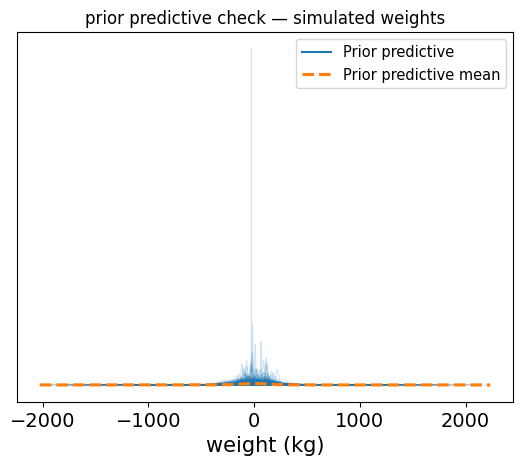
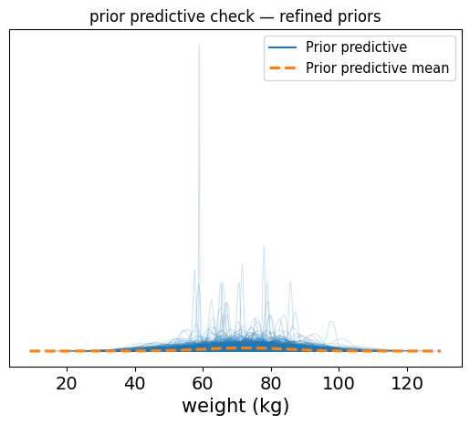
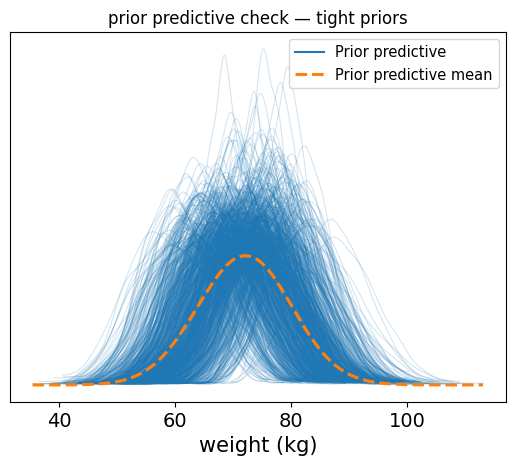
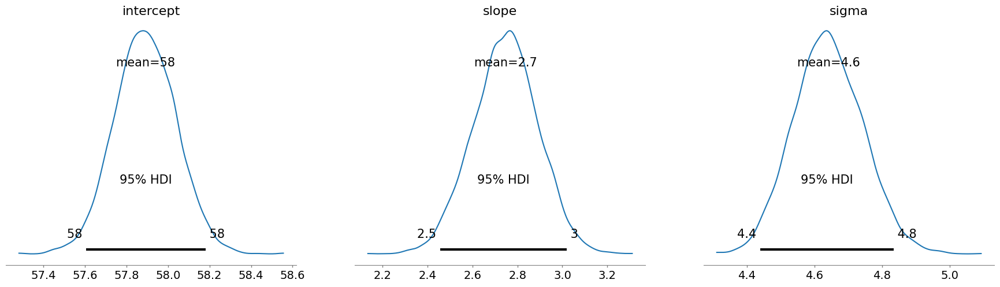
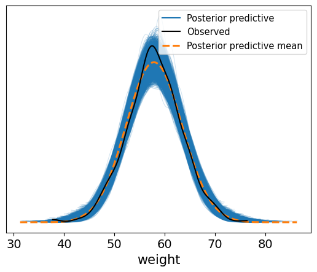

## Start with the data

Before we even get to choosing priors, we need to backup a bit and ask: 

> **What kind of process do I believe created the observations I see?**

This is your _generative model_, and is what determines your _likelihood_. It explains how your data came to be.

The _likelihood_ is just a term for:

> **Given some unknown parameters, what's the probability of observing the data I actually saw?**

### So how do you pick a likelihood?

Start by looking at the **type of data you are modeling**. That usually points to a small set of reasonable choices. Let's look at a few examples:

- If your data is a **count** (like the number of cars crossing a bridge each hour, or the number of people voting in an election), you might assume that the data generation process follows a **Poisson distribution**. Thus, your model might include a *rate* parameter: something that should be *positive* (can't have a negative number of cars!). 

- If your data is a **continuous measurement** (like height, weight, or temperature), a suitable candidate to explain the data generation might be a **Normal distribution**. A model under this assumption might include a _mean_ (any real number) and a _spread_ (standard deviation or variance, which must be positive). 

- If your data is a **proportion** or a **yes/no outcome** (like conversion rates or coin flips), you might assume a **Bernoulli** or **Binomial distribution**. In this case, your model would include a _probability_ parameter that must lie between 0 and 1.

Each of these cases leads to a likelihood; each likelihood comes with one or more **parameters**

### So where do priors come in?

These parameters are the things you don't know yet. They are what you are trying to estimate using both your data _and_ your prior beliefs (about the parameters).

That's where **priors** come in. Let's look into how to choose them next.

## Choose priors for your parameters

Once you've picked a likelihood and figured out which parameters your model includes, it's time to ask:

> **What do I believe about these parameters before seeing the data?**

That belief - or uncertainty - is expressed through a **prior distribution**. In simple words, this is a distribution that you assign to each of the parameters that make up the likelihood, and which reflect what you know about them.

In Bayesian statistics, we always start with a prior. This is not optional. It is part of what makes the approach powerful and honest: it forces you to say what you _do_ or _do not_ know before looking at the data.

### What should guide your choice of prior?

There are two key things to keep in mind:

1. **What kind of parameter is it?** 
This tells you what kind of values the prior is even _allowed_ to take.
2. **How much do you already know (or not know)?**
This helps you decide how _tight_ or _vague_ your prior should be. In other words, how much (un)certainty there is around your parameter.

#### Let's break it down

##### First: Respect the domain of the parameter

- If the parameter must be **positive** (like a rate or standard deviation), your prior should only take on positive values. Common choices include the **Exponential**, **Gamma**, or **Half-Normal** distributions.
- If the parameter is a **probability** (like the chance someone clicks a button on a website), the prior must live between 0 and 1. A **Beta distribution** is a natural choice here.
- If the parameter can be **any real number** (like a mean value), you can use a **Normal distribution** centered somewhere reasonable, with a standard deviation wide enough to reflect your uncertainty (i.e., what you know about that parameter).

##### Second: Ask yourself what you know

Once you've got the domain right, the next step is to think about **how much prior knowledge you have**.

- **If you have strong prior knowledge**, maybe from previous studies, engineering constraints, expert judgment, etc., then use an _informative prior_. For example, if you know that most defect rates are below 5%, you can use a Beta distribution that concentrates most of its mass below 0.05.

- **If you have _some_ idea**, but you're not very confident, use a _weakly informative prior_. These are broad, reasonable guesses that act as gentle regularizers. They help keep estimates from going completely off the rails in small-data situations, but still let the data speak.

- **If you know basically nothing**, it's tempting to use a so-called _non-informative prior_. These include things like flat/uniform distributions, or more technical choices like _Jeffreys priors_. But be careful: these can sometimes behave badly, especially in small samples or complex models.

##### Priors matter more when you have less data

When you have **lots of data**, the influence of the prior usually fades. In such cases, the likelihood dominates, and the posterior is driven by the data.

But when data is **scarce**, your prior can have a big impact. That is not a flaw, that's the model honestly reflecting uncertainty.

##### How do you _check_ if your priors make sense?

Even a reasonable-sounding prior can produce weird results when combined with your model.

That's why the next step is so important: **prior predictive checks**. Let's have a look.

## Check your prior - Prior predictive checks

You've chosen your likelihood, and you've assigned priors to your parameters. Cool! Solid start.

But here's the next important question:

> **Do your priors make sense _in the context of your model_?**

Even if each prior seems reasonable on its own, their combination, i.e., once passed through your _model_, might produce predictions that are complete mumbo jumbo.

This is where **prior predictive checks** come in.

### What is a prior predictive check?

A **prior predictive check** is when you generate fake data (yes, I know, don't take out the pitchfork!) _before_ seeing the real data, using:

- your **model structure** (i.e., your likeliehood, a.k.a. your generative model... starts painting a picture?)
- and your **priors**

In other words, you're simulating data from your model **as if** the priors were true. This gives you a sense of what kinds of observations your model considers plausible, even before seeing any real data.

> **If your model is saying "yeah, human heights of 10 meters sound plausible," that's a red flag.**

### Why is this helpful?

Because it lets you **test your assumptions before committing to them.**

- Are your priors too wide, allowing impossible or absurd values?
- Are they too narrow, ruling out reasonable possibilities?
- Are they combining in weird ways through the model?

A prior predictive check helps catch these issues early, before they distort your inferences.


### A step-by-step prior predictive check

#### Start knowing nothing, or almost nothing

We'll now wealk through a simple example using real height and weight data (the same data I used in this [blog post](https://vflores-io.github.io/posts/20240527_baylinreg_pymc/e01_baylinreg_pymc/)).

Our goal is to define a linear model and explore what happens when we use **very vague** priors, then refine them step by step.

Let's begin by loading the data


```python
import os
import arviz as az
import pymc as pm
import pandas as pd
import numpy as np
import matplotlib.pyplot as plt

# load the data and print the header

if 'google.colab' in str(get_ipython()):
    # Running on Colab
    csv_path = '/content/drive/MyDrive/Projects/Coding/Portfolio/Bayesian Methods Tutorials/Python/PyMC/E01_BayLinReg/data/SOCR-HeightWeight.csv'
else:
    # Running locally
    csv_path = 'data/SOCR-HeightWeight.csv'

data = pd.read_csv(csv_path)
data.head()
```


<div>
<style scoped>
    .dataframe tbody tr th:only-of-type {
        vertical-align: middle;
    }

    .dataframe tbody tr th {
        vertical-align: top;
    }

    .dataframe thead th {
        text-align: right;
    }
</style>
<table border="1" class="dataframe">
  <thead>
    <tr style="text-align: right;">
      <th></th>
      <th>Index</th>
      <th>Height(Inches)</th>
      <th>Weight(Pounds)</th>
    </tr>
  </thead>
  <tbody>
    <tr>
      <th>0</th>
      <td>1</td>
      <td>65.78331</td>
      <td>112.9925</td>
    </tr>
    <tr>
      <th>1</th>
      <td>2</td>
      <td>71.51521</td>
      <td>136.4873</td>
    </tr>
    <tr>
      <th>2</th>
      <td>3</td>
      <td>69.39874</td>
      <td>153.0269</td>
    </tr>
    <tr>
      <th>3</th>
      <td>4</td>
      <td>68.21660</td>
      <td>142.3354</td>
    </tr>
    <tr>
      <th>4</th>
      <td>5</td>
      <td>67.78781</td>
      <td>144.2971</td>
    </tr>
  </tbody>
</table>
</div>


We are using a dataset with two columns: heights (in inches) and weight (in pounds). We'll rename the columns, convert the values to metric as any person who does not want to lose their sanity would, and work with a subset to keep things fast for this example.


```python
# rename the columns for clarity
new_column_names = {data.columns[1]: 'height (cm)', data.columns[2]: 'weight (kg)'}
data.rename(columns = new_column_names, inplace = True)

# convert the values to metric
data[data.columns[1]] = data[data.columns[1]] * 2.54
data[data.columns[2]] = data[data.columns[2]] * 0.454


# use the first 1000 rows for the analysis
height_obs = data['height (cm)'][:1000]
weight_obs = data['weight (kg)'][:1000]

# standardize height: center it and scale it
height_scaled = (height_obs - height_obs.mean()) / height_obs.std()
```

> Standardizing height helps make the model more stable and the priors easier to interpret. Now the intercept corresponds to the average weight, and the slope tells us how weight changes per standard deviation of height.

Now, let's build a model using vague, almost uninformed priors, just to see what happens. This would be the equivalent of "shot in the dark" priors.

Below we choose intentionally absurdly wide priors 🤡:
- The intercept could be anywhere from -300 to +300.
- The slope allows changes of ±100 kg per standard deviation in height (!).
- The noise (`sigma`) could make weight vary by hundreds of kg.


```python
with pm.Model() as model:
  # very vague priors
  intercept = pm.Normal("intercept", mu=0.0, sigma = 100.0)
  slope     = pm.Normal("slope"    , mu=0.0, sigma =  50.0)
  sigma     = pm.Exponential("sigma", 0.01)

  # linear model
  mu = intercept + (slope * height_scaled)

  # likelihood (we're not fitting to real data yet, though!)
  weight = pm.Normal("weight", mu=mu, sigma=sigma, observed=weight_obs)

  # sample from the prior predictive distribution
  prior_pred = pm.sample_prior_predictive(draws=1000)

# plot prior predictive distribution
az.plot_ppc(prior_pred, group="prior", kind="kde", data_pairs={"weight": "weight"})
plt.title("prior predictive check — simulated weights")
plt.xlabel("weight (kg)")
plt.show()
```

    Sampling: [intercept, sigma, slope, weight]


    

    


So the results of how those priors affect the data are shown. These results show a very chaotic spread, with negative values well within the realm of possibility, or values of +300 kg being quite plausible too.

> **This is the model saying "sure, a person could weigh -50 kg or 700 kg, why not?**

Exactly the kind of situation where a **prior predictive check** will save you the embarrassment.

#### Refining our priors (making an educated guess)

Now that we've seen how wild the prior predictive distribution can get with vague priors, let's try something better.

We'll use some simple, real-world intuition:

- Most adult humans weigh somewhere around 60-90 kg (subject to debate, but this is the **assumption we make**), so let's center our **intercept** around 70-75 kg.
- We expect taller people to weight more. A one standard deviation increase in height might correspond to a 5-10 kg increase in weight (again, we make this assumption or educated guess based on our gut, still valid), so we'll center the **slope** around 6.
- We'll also pick a more reasonable prior for the standard deviation `sigma`, reflecting typical variability in weight, not hundreds of kg.

Those priors are still flexible. We're not being overly confident here, but we are still respecting real-world ranges.


```python
with pm.Model() as better_model:
    intercept = pm.Normal("intercept", mu=72, sigma=10)
    slope = pm.Normal("slope", mu=6, sigma=3)
    sigma = pm.Exponential("sigma", 1)

    mu = intercept + slope * height_scaled
    weight = pm.Normal("weight", mu=mu, sigma=sigma, observed=weight_obs)

    better_prior_pred = pm.sample_prior_predictive(draws=1000)

# visualize the results
az.style.use("default")
az.plot_ppc(better_prior_pred, group="prior", kind="kde", data_pairs={"weight": "weight"})
plt.title("prior predictive check — refined priors")
plt.xlabel("weight (kg)")
plt.show()

```

    Sampling: [intercept, sigma, slope, weight]


    

    


Now you should see a clean distribution of predicted weights, mostly falling between 40 and 110 for the most part (I'm just eyeballing here). This is far more reasonable and aligns with what we expect for adult weight. 

#### Final refinement: tighten the priors

The last prior predictive check looked pretty good. Our model was generating realistic weights. But we can take it one step further.

Now that we've seren the prior predictive in action, let's **tighten our priors** slightly. This isn't about being overly confident, it's about acknowledging that we have a pretty good sense of the range we're expecting.

Our intuition:
- Average adult weight is still around 72 kg, but we're more confident now, so we'll reduce the standard deviation to 5
- A one standard deviation increase in height likely increases weight by about 6 kg, but again, we'll narrow the standard deviation slightly, maybe to 1.
- We'll keep `sigma` as-is since our previous setting was reasonable.

These are still **not hard constraints**, they just express **stronger beliefs** based on what we've already seen and know about the domain.


```python
with pm.Model() as tight_model:
    # more confident (but still flexible) priors
    intercept = pm.Normal("intercept", mu=72, sigma=5)
    slope     = pm.Normal("slope", mu=6, sigma=1)
    sigma     = pm.Exponential("sigma", 1)

    # linear model
    mu = intercept + slope * height_scaled

    # likelihood (we're still not fitting to real data yet!)
    weight = pm.Normal("weight", mu=mu, sigma=sigma, observed=weight_obs)

    # sample from the prior predictive distribution
    tight_prior_pred = pm.sample_prior_predictive(draws=1000)

az.plot_ppc(tight_prior_pred, group="prior", kind="kde", data_pairs={"weight": "weight"})
plt.title("prior predictive check — tight priors")
plt.xlabel("weight (kg)")
plt.show()
```

    Sampling: [intercept, sigma, slope, weight]


    

    


So now we see a cleaner, tighter distribution of plausible weight values, tightly centered around realistic values, with some variability.

> **This is the kind of prior predictive you want: it reflects your understanding of the world, respects the data scale, and still leaves room for learning from the actual observations**

## Running inference: let the model see the data

At this point, we've checked our priors, refined them, and made sure they produce reasonable simulated data. Now's it's time to move from **prior** to **posterior**. In other words, to let the model learn from the actual data you have.

We'll keep the same model structure and priors as in the previous step (the tightened version). We can easily do so by extending the posterior data from inference, into the same data container.


```python
tight_prior_pred
```


            <div>
              <div class='xr-header'>
                <div class="xr-obj-type">arviz.InferenceData</div>
              </div>
              <ul class="xr-sections group-sections">

            <li class = "xr-section-item">
                  <input id="idata_prior32eda8bd-2faf-407a-868c-1d6a4148eb9b" class="xr-section-summary-in" type="checkbox">
                  <label for="idata_prior32eda8bd-2faf-407a-868c-1d6a4148eb9b" class = "xr-section-summary">prior</label>
                  <div class="xr-section-inline-details"></div>
                  <div class="xr-section-details">
                      <ul id="xr-dataset-coord-list" class="xr-var-list">
                          <div style="padding-left:2rem;"><div><svg style="position: absolute; width: 0; height: 0; overflow: hidden">
<defs>
<symbol id="icon-database" viewBox="0 0 32 32">
<path d="M16 0c-8.837 0-16 2.239-16 5v4c0 2.761 7.163 5 16 5s16-2.239 16-5v-4c0-2.761-7.163-5-16-5z"></path>
<path d="M16 17c-8.837 0-16-2.239-16-5v6c0 2.761 7.163 5 16 5s16-2.239 16-5v-6c0 2.761-7.163 5-16 5z"></path>
<path d="M16 26c-8.837 0-16-2.239-16-5v6c0 2.761 7.163 5 16 5s16-2.239 16-5v-6c0 2.761-7.163 5-16 5z"></path>
</symbol>
<symbol id="icon-file-text2" viewBox="0 0 32 32">
<path d="M28.681 7.159c-0.694-0.947-1.662-2.053-2.724-3.116s-2.169-2.030-3.116-2.724c-1.612-1.182-2.393-1.319-2.841-1.319h-15.5c-1.378 0-2.5 1.121-2.5 2.5v27c0 1.378 1.122 2.5 2.5 2.5h23c1.378 0 2.5-1.122 2.5-2.5v-19.5c0-0.448-0.137-1.23-1.319-2.841zM24.543 5.457c0.959 0.959 1.712 1.825 2.268 2.543h-4.811v-4.811c0.718 0.556 1.584 1.309 2.543 2.268zM28 29.5c0 0.271-0.229 0.5-0.5 0.5h-23c-0.271 0-0.5-0.229-0.5-0.5v-27c0-0.271 0.229-0.5 0.5-0.5 0 0 15.499-0 15.5 0v7c0 0.552 0.448 1 1 1h7v19.5z"></path>
<path d="M23 26h-14c-0.552 0-1-0.448-1-1s0.448-1 1-1h14c0.552 0 1 0.448 1 1s-0.448 1-1 1z"></path>
<path d="M23 22h-14c-0.552 0-1-0.448-1-1s0.448-1 1-1h14c0.552 0 1 0.448 1 1s-0.448 1-1 1z"></path>
<path d="M23 18h-14c-0.552 0-1-0.448-1-1s0.448-1 1-1h14c0.552 0 1 0.448 1 1s-0.448 1-1 1z"></path>
</symbol>
</defs>
</svg>
<style>/* CSS stylesheet for displaying xarray objects in jupyterlab.
 *
 */

:root {
  --xr-font-color0: var(--jp-content-font-color0, rgba(0, 0, 0, 1));
  --xr-font-color2: var(--jp-content-font-color2, rgba(0, 0, 0, 0.54));
  --xr-font-color3: var(--jp-content-font-color3, rgba(0, 0, 0, 0.38));
  --xr-border-color: var(--jp-border-color2, #e0e0e0);
  --xr-disabled-color: var(--jp-layout-color3, #bdbdbd);
  --xr-background-color: var(--jp-layout-color0, white);
  --xr-background-color-row-even: var(--jp-layout-color1, white);
  --xr-background-color-row-odd: var(--jp-layout-color2, #eeeeee);
}

html[theme="dark"],
html[data-theme="dark"],
body[data-theme="dark"],
body.vscode-dark {
  --xr-font-color0: rgba(255, 255, 255, 1);
  --xr-font-color2: rgba(255, 255, 255, 0.54);
  --xr-font-color3: rgba(255, 255, 255, 0.38);
  --xr-border-color: #1f1f1f;
  --xr-disabled-color: #515151;
  --xr-background-color: #111111;
  --xr-background-color-row-even: #111111;
  --xr-background-color-row-odd: #313131;
}

.xr-wrap {
  display: block !important;
  min-width: 300px;
  max-width: 700px;
}

.xr-text-repr-fallback {
  /* fallback to plain text repr when CSS is not injected (untrusted notebook) */
  display: none;
}

.xr-header {
  padding-top: 6px;
  padding-bottom: 6px;
  margin-bottom: 4px;
  border-bottom: solid 1px var(--xr-border-color);
}

.xr-header > div,
.xr-header > ul {
  display: inline;
  margin-top: 0;
  margin-bottom: 0;
}

.xr-obj-type,
.xr-array-name {
  margin-left: 2px;
  margin-right: 10px;
}

.xr-obj-type {
  color: var(--xr-font-color2);
}

.xr-sections {
  padding-left: 0 !important;
  display: grid;
  grid-template-columns: 150px auto auto 1fr 0 20px 0 20px;
}

.xr-section-item {
  display: contents;
}

.xr-section-item input {
  display: inline-block;
  opacity: 0;
  height: 0;
}

.xr-section-item input + label {
  color: var(--xr-disabled-color);
}

.xr-section-item input:enabled + label {
  cursor: pointer;
  color: var(--xr-font-color2);
}

.xr-section-item input:focus + label {
  border: 2px solid var(--xr-font-color0);
}

.xr-section-item input:enabled + label:hover {
  color: var(--xr-font-color0);
}

.xr-section-summary {
  grid-column: 1;
  color: var(--xr-font-color2);
  font-weight: 500;
}

.xr-section-summary > span {
  display: inline-block;
  padding-left: 0.5em;
}

.xr-section-summary-in:disabled + label {
  color: var(--xr-font-color2);
}

.xr-section-summary-in + label:before {
  display: inline-block;
  content: "►";
  font-size: 11px;
  width: 15px;
  text-align: center;
}

.xr-section-summary-in:disabled + label:before {
  color: var(--xr-disabled-color);
}

.xr-section-summary-in:checked + label:before {
  content: "▼";
}

.xr-section-summary-in:checked + label > span {
  display: none;
}

.xr-section-summary,
.xr-section-inline-details {
  padding-top: 4px;
  padding-bottom: 4px;
}

.xr-section-inline-details {
  grid-column: 2 / -1;
}

.xr-section-details {
  display: none;
  grid-column: 1 / -1;
  margin-bottom: 5px;
}

.xr-section-summary-in:checked ~ .xr-section-details {
  display: contents;
}

.xr-array-wrap {
  grid-column: 1 / -1;
  display: grid;
  grid-template-columns: 20px auto;
}

.xr-array-wrap > label {
  grid-column: 1;
  vertical-align: top;
}

.xr-preview {
  color: var(--xr-font-color3);
}

.xr-array-preview,
.xr-array-data {
  padding: 0 5px !important;
  grid-column: 2;
}

.xr-array-data,
.xr-array-in:checked ~ .xr-array-preview {
  display: none;
}

.xr-array-in:checked ~ .xr-array-data,
.xr-array-preview {
  display: inline-block;
}

.xr-dim-list {
  display: inline-block !important;
  list-style: none;
  padding: 0 !important;
  margin: 0;
}

.xr-dim-list li {
  display: inline-block;
  padding: 0;
  margin: 0;
}

.xr-dim-list:before {
  content: "(";
}

.xr-dim-list:after {
  content: ")";
}

.xr-dim-list li:not(:last-child):after {
  content: ",";
  padding-right: 5px;
}

.xr-has-index {
  font-weight: bold;
}

.xr-var-list,
.xr-var-item {
  display: contents;
}

.xr-var-item > div,
.xr-var-item label,
.xr-var-item > .xr-var-name span {
  background-color: var(--xr-background-color-row-even);
  margin-bottom: 0;
}

.xr-var-item > .xr-var-name:hover span {
  padding-right: 5px;
}

.xr-var-list > li:nth-child(odd) > div,
.xr-var-list > li:nth-child(odd) > label,
.xr-var-list > li:nth-child(odd) > .xr-var-name span {
  background-color: var(--xr-background-color-row-odd);
}

.xr-var-name {
  grid-column: 1;
}

.xr-var-dims {
  grid-column: 2;
}

.xr-var-dtype {
  grid-column: 3;
  text-align: right;
  color: var(--xr-font-color2);
}

.xr-var-preview {
  grid-column: 4;
}

.xr-index-preview {
  grid-column: 2 / 5;
  color: var(--xr-font-color2);
}

.xr-var-name,
.xr-var-dims,
.xr-var-dtype,
.xr-preview,
.xr-attrs dt {
  white-space: nowrap;
  overflow: hidden;
  text-overflow: ellipsis;
  padding-right: 10px;
}

.xr-var-name:hover,
.xr-var-dims:hover,
.xr-var-dtype:hover,
.xr-attrs dt:hover {
  overflow: visible;
  width: auto;
  z-index: 1;
}

.xr-var-attrs,
.xr-var-data,
.xr-index-data {
  display: none;
  background-color: var(--xr-background-color) !important;
  padding-bottom: 5px !important;
}

.xr-var-attrs-in:checked ~ .xr-var-attrs,
.xr-var-data-in:checked ~ .xr-var-data,
.xr-index-data-in:checked ~ .xr-index-data {
  display: block;
}

.xr-var-data > table {
  float: right;
}

.xr-var-name span,
.xr-var-data,
.xr-index-name div,
.xr-index-data,
.xr-attrs {
  padding-left: 25px !important;
}

.xr-attrs,
.xr-var-attrs,
.xr-var-data,
.xr-index-data {
  grid-column: 1 / -1;
}

dl.xr-attrs {
  padding: 0;
  margin: 0;
  display: grid;
  grid-template-columns: 125px auto;
}

.xr-attrs dt,
.xr-attrs dd {
  padding: 0;
  margin: 0;
  float: left;
  padding-right: 10px;
  width: auto;
}

.xr-attrs dt {
  font-weight: normal;
  grid-column: 1;
}

.xr-attrs dt:hover span {
  display: inline-block;
  background: var(--xr-background-color);
  padding-right: 10px;
}

.xr-attrs dd {
  grid-column: 2;
  white-space: pre-wrap;
  word-break: break-all;
}

.xr-icon-database,
.xr-icon-file-text2,
.xr-no-icon {
  display: inline-block;
  vertical-align: middle;
  width: 1em;
  height: 1.5em !important;
  stroke-width: 0;
  stroke: currentColor;
  fill: currentColor;
}
</style><pre class='xr-text-repr-fallback'>&lt;xarray.Dataset&gt; Size: 32kB
Dimensions:    (chain: 1, draw: 1000)
Coordinates:
  * chain      (chain) int64 8B 0
  * draw       (draw) int64 8kB 0 1 2 3 4 5 6 7 ... 993 994 995 996 997 998 999
Data variables:
    slope      (chain, draw) float64 8kB 7.325 6.709 5.764 ... 6.744 6.694 6.318
    sigma      (chain, draw) float64 8kB 1.468 0.3349 0.7264 ... 0.6415 0.3556
    intercept  (chain, draw) float64 8kB 78.56 65.11 70.36 ... 67.82 71.88 72.06
Attributes:
    created_at:                 2025-05-04T07:37:00.127945+00:00
    arviz_version:              0.21.0
    inference_library:          pymc
    inference_library_version:  5.22.0</pre><div class='xr-wrap' style='display:none'><div class='xr-header'><div class='xr-obj-type'>xarray.Dataset</div></div><ul class='xr-sections'><li class='xr-section-item'><input id='section-e8aad7a1-d5f4-4f3d-bf26-7dc50c6bd692' class='xr-section-summary-in' type='checkbox' disabled ><label for='section-e8aad7a1-d5f4-4f3d-bf26-7dc50c6bd692' class='xr-section-summary'  title='Expand/collapse section'>Dimensions:</label><div class='xr-section-inline-details'><ul class='xr-dim-list'><li><span class='xr-has-index'>chain</span>: 1</li><li><span class='xr-has-index'>draw</span>: 1000</li></ul></div><div class='xr-section-details'></div></li><li class='xr-section-item'><input id='section-ac36a889-dec1-446b-8830-63c41f0b2a56' class='xr-section-summary-in' type='checkbox'  checked><label for='section-ac36a889-dec1-446b-8830-63c41f0b2a56' class='xr-section-summary' >Coordinates: <span>(2)</span></label><div class='xr-section-inline-details'></div><div class='xr-section-details'><ul class='xr-var-list'><li class='xr-var-item'><div class='xr-var-name'><span class='xr-has-index'>chain</span></div><div class='xr-var-dims'>(chain)</div><div class='xr-var-dtype'>int64</div><div class='xr-var-preview xr-preview'>0</div><input id='attrs-432626d8-ff93-4b70-ada0-cf81202cea30' class='xr-var-attrs-in' type='checkbox' disabled><label for='attrs-432626d8-ff93-4b70-ada0-cf81202cea30' title='Show/Hide attributes'><svg class='icon xr-icon-file-text2'><use xlink:href='#icon-file-text2'></use></svg></label><input id='data-a6515d4a-e441-43d6-86ba-ad92d2703099' class='xr-var-data-in' type='checkbox'><label for='data-a6515d4a-e441-43d6-86ba-ad92d2703099' title='Show/Hide data repr'><svg class='icon xr-icon-database'><use xlink:href='#icon-database'></use></svg></label><div class='xr-var-attrs'><dl class='xr-attrs'></dl></div><div class='xr-var-data'><pre>array([0])</pre></div></li><li class='xr-var-item'><div class='xr-var-name'><span class='xr-has-index'>draw</span></div><div class='xr-var-dims'>(draw)</div><div class='xr-var-dtype'>int64</div><div class='xr-var-preview xr-preview'>0 1 2 3 4 5 ... 995 996 997 998 999</div><input id='attrs-98b35a2e-2b25-4007-807c-84ba941c3846' class='xr-var-attrs-in' type='checkbox' disabled><label for='attrs-98b35a2e-2b25-4007-807c-84ba941c3846' title='Show/Hide attributes'><svg class='icon xr-icon-file-text2'><use xlink:href='#icon-file-text2'></use></svg></label><input id='data-ec567d86-6f96-4f92-bfc5-21d303c189d9' class='xr-var-data-in' type='checkbox'><label for='data-ec567d86-6f96-4f92-bfc5-21d303c189d9' title='Show/Hide data repr'><svg class='icon xr-icon-database'><use xlink:href='#icon-database'></use></svg></label><div class='xr-var-attrs'><dl class='xr-attrs'></dl></div><div class='xr-var-data'><pre>array([  0,   1,   2, ..., 997, 998, 999], shape=(1000,))</pre></div></li></ul></div></li><li class='xr-section-item'><input id='section-0582c3ee-22c9-4b59-9c25-aa02084d57bf' class='xr-section-summary-in' type='checkbox'  checked><label for='section-0582c3ee-22c9-4b59-9c25-aa02084d57bf' class='xr-section-summary' >Data variables: <span>(3)</span></label><div class='xr-section-inline-details'></div><div class='xr-section-details'><ul class='xr-var-list'><li class='xr-var-item'><div class='xr-var-name'><span>slope</span></div><div class='xr-var-dims'>(chain, draw)</div><div class='xr-var-dtype'>float64</div><div class='xr-var-preview xr-preview'>7.325 6.709 5.764 ... 6.694 6.318</div><input id='attrs-ac227b42-6670-46c1-bb38-a63cec45dc5d' class='xr-var-attrs-in' type='checkbox' disabled><label for='attrs-ac227b42-6670-46c1-bb38-a63cec45dc5d' title='Show/Hide attributes'><svg class='icon xr-icon-file-text2'><use xlink:href='#icon-file-text2'></use></svg></label><input id='data-2a3bd93b-07c8-4a7b-aa03-ca6c8e685fb3' class='xr-var-data-in' type='checkbox'><label for='data-2a3bd93b-07c8-4a7b-aa03-ca6c8e685fb3' title='Show/Hide data repr'><svg class='icon xr-icon-database'><use xlink:href='#icon-database'></use></svg></label><div class='xr-var-attrs'><dl class='xr-attrs'></dl></div><div class='xr-var-data'><pre>array([[7.32471959, 6.70904925, 5.76375148, 6.9327921 , 5.3280196 ,
        6.45535271, 7.10237008, 5.71570878, 6.12545405, 4.45807349,
        6.26697432, 5.94361014, 7.27088744, 4.96305565, 6.35651091,
        6.99805904, 5.24408251, 5.39425836, 6.5891089 , 6.08562963,
        6.96288543, 7.26918272, 6.80123487, 5.49724796, 5.66595849,
        4.38431483, 5.91226974, 7.18456149, 6.64656831, 5.56787237,
        4.71700986, 8.76465968, 5.53203315, 4.49118422, 6.69064182,
        6.00761769, 7.41354693, 6.89315173, 6.82699383, 3.59215915,
        4.76000524, 7.70869305, 5.96718374, 8.05591226, 6.46503797,
        6.26526437, 6.22283641, 6.01246086, 7.19935351, 5.04954143,
        6.40160115, 5.07276974, 5.03793216, 7.3778795 , 5.87641842,
        5.21130005, 6.33872359, 6.18830081, 5.82585627, 7.54615468,
        7.9132323 , 7.83657272, 5.56948762, 5.66675259, 4.60479167,
        4.91564191, 5.1890184 , 6.25470907, 7.71318998, 6.03482181,
        5.58231645, 6.75323429, 6.36520737, 7.70136533, 5.33982926,
        6.89118929, 7.5552105 , 7.72837725, 5.98234959, 6.50018026,
        6.62593567, 7.0144242 , 7.38096306, 5.61020048, 6.41779523,
        3.91271752, 6.71780378, 6.25640825, 6.67802625, 6.21204176,
        6.51258262, 6.29172336, 6.08110621, 4.73699946, 5.61541528,
        5.91173086, 4.4555286 , 6.82242159, 4.43461495, 3.38166868,
...
        6.82570895, 5.25540542, 6.68904137, 6.74475386, 6.15779659,
        5.73969449, 4.08877988, 4.47386388, 5.58140015, 6.81231655,
        6.75099096, 5.23973418, 5.51826229, 5.95470578, 5.94242182,
        5.94311348, 7.30553063, 6.89422003, 7.71447718, 7.91897916,
        5.7338408 , 4.86282117, 6.60378936, 6.13248884, 5.640922  ,
        6.73804863, 6.48179549, 3.90836942, 3.28422973, 7.90504478,
        4.9880608 , 6.08180224, 6.48752135, 5.63499761, 5.05199286,
        6.30664746, 5.48779085, 5.89660363, 6.21562425, 6.73690252,
        4.28276311, 5.69876605, 7.01553993, 7.02484632, 6.0283491 ,
        5.95408228, 7.50140771, 6.16728686, 4.37698184, 5.73168101,
        6.41495696, 7.18486225, 6.16189863, 6.30410927, 7.28201881,
        6.00502234, 6.85604101, 6.04277502, 6.34327231, 6.00045503,
        5.07993387, 7.94094401, 6.63770474, 6.32758467, 6.48611115,
        7.45600656, 3.38171654, 5.26547271, 6.71504934, 7.14270653,
        6.66536701, 5.86312933, 6.37848085, 7.17521596, 6.87530554,
        7.78533997, 6.04067367, 4.79976859, 4.80223437, 7.62493095,
        5.45927993, 5.32156201, 6.80685822, 4.42745474, 6.14811431,
        7.17358921, 6.75140797, 6.37881888, 4.82326094, 6.86990274,
        7.70844367, 8.65819339, 4.92538163, 5.73630751, 5.86950358,
        4.41946155, 4.41374552, 6.74395052, 6.69433403, 6.31847507]])</pre></div></li><li class='xr-var-item'><div class='xr-var-name'><span>sigma</span></div><div class='xr-var-dims'>(chain, draw)</div><div class='xr-var-dtype'>float64</div><div class='xr-var-preview xr-preview'>1.468 0.3349 ... 0.6415 0.3556</div><input id='attrs-08d221fc-6547-4cd4-9a87-8c86b39dd9ec' class='xr-var-attrs-in' type='checkbox' disabled><label for='attrs-08d221fc-6547-4cd4-9a87-8c86b39dd9ec' title='Show/Hide attributes'><svg class='icon xr-icon-file-text2'><use xlink:href='#icon-file-text2'></use></svg></label><input id='data-afee1d13-e9e4-4a9f-9be8-5ef17cebdccc' class='xr-var-data-in' type='checkbox'><label for='data-afee1d13-e9e4-4a9f-9be8-5ef17cebdccc' title='Show/Hide data repr'><svg class='icon xr-icon-database'><use xlink:href='#icon-database'></use></svg></label><div class='xr-var-attrs'><dl class='xr-attrs'></dl></div><div class='xr-var-data'><pre>array([[1.46803832e+00, 3.34871914e-01, 7.26379154e-01, 8.14857661e-01,
        2.97374396e-01, 1.52426445e+00, 3.24875324e+00, 5.45406668e-01,
        8.38844712e-02, 4.22580226e+00, 4.59318151e-01, 2.29343591e-01,
        2.81048236e-02, 2.44699962e-01, 7.18596164e-01, 1.26711008e+00,
        1.73531111e-01, 1.53386734e+00, 1.54152371e+00, 1.46804418e+00,
        1.66751317e+00, 2.48878781e+00, 3.21919586e-01, 1.18678113e+00,
        6.62366431e-01, 1.93470917e+00, 3.49799274e-01, 1.07078771e-01,
        6.12213145e-01, 1.06901599e+00, 8.43248042e-01, 4.53789562e-01,
        6.40091312e-01, 1.33199109e-01, 1.29999529e+00, 7.80589175e-02,
        5.87333432e+00, 8.64987441e-01, 1.21498105e+00, 1.84456257e+00,
        1.04506645e+00, 3.75802374e+00, 1.09064872e+00, 2.11076422e+00,
        1.25429399e-01, 3.79165303e-01, 4.83041492e-01, 2.53194130e+00,
        1.31318967e-01, 1.02222425e+00, 4.84915993e-01, 8.73690541e-01,
        9.44278766e-01, 1.84883513e+00, 7.16305268e-01, 1.88782016e-01,
        2.95803701e-01, 1.08546110e+00, 3.62419320e-01, 1.19144855e+00,
        2.78137041e-01, 2.61950191e-01, 7.05558118e-01, 1.91734846e+00,
        2.11792300e+00, 1.56679801e+00, 2.75804143e+00, 2.85240681e+00,
        1.65612846e+00, 8.09975735e-01, 3.41746283e+00, 1.87659045e-01,
        2.61581932e-01, 6.64947683e-01, 1.38475403e+00, 1.58207355e+00,
        6.77746996e-01, 1.49075208e+00, 5.48088045e-01, 2.91826442e-01,
...
        2.67821555e+00, 9.59120088e-01, 5.39169980e-01, 1.05629092e+00,
        1.52785614e-01, 1.85320356e-02, 2.36283031e-01, 2.45540051e-01,
        7.29898417e-02, 3.48885574e-01, 8.68276851e-02, 1.42416992e-01,
        2.99600957e+00, 2.07437573e+00, 1.71655949e+00, 9.41987606e-01,
        2.39094561e-02, 4.03643169e+00, 2.24533384e+00, 7.82099782e-01,
        2.04691870e-01, 7.17929876e-01, 9.18338663e-01, 5.68641581e-01,
        6.28804737e-01, 3.84900937e+00, 9.05449234e-01, 6.73935787e-01,
        3.67510514e-01, 6.64799566e-01, 4.53497545e-01, 1.72745493e+00,
        8.82289027e-01, 1.13194768e+00, 7.21864404e-02, 2.98329019e-01,
        5.13386539e-02, 2.99378179e+00, 1.27616834e+00, 3.53433226e-01,
        4.74610607e-01, 1.92513984e-01, 3.29884026e-01, 1.55636360e+00,
        3.50262017e-01, 3.90189267e-01, 4.09096346e-01, 2.98784887e+00,
        6.18098296e-02, 2.76309643e-01, 6.65999087e-01, 4.93991919e-02,
        4.52958473e-01, 6.48043753e-01, 8.37649415e-01, 4.91369440e-01,
        2.96955493e+00, 1.31607443e+00, 4.15399326e-01, 2.73706400e-01,
        1.42431016e+00, 1.31688773e+00, 9.85647210e-01, 2.12190665e+00,
        4.16922634e+00, 9.58230669e-01, 1.03643935e+00, 4.47551637e-01,
        1.11085958e+00, 1.43740805e-01, 1.23195880e+00, 7.21526037e-01,
        3.03484212e+00, 2.10473197e+00, 5.31343229e-01, 2.64384856e-01,
        1.05815460e+00, 1.18415307e-01, 6.41522094e-01, 3.55643038e-01]])</pre></div></li><li class='xr-var-item'><div class='xr-var-name'><span>intercept</span></div><div class='xr-var-dims'>(chain, draw)</div><div class='xr-var-dtype'>float64</div><div class='xr-var-preview xr-preview'>78.56 65.11 70.36 ... 71.88 72.06</div><input id='attrs-6f31db36-9c42-4c07-832b-bae8196f3bb5' class='xr-var-attrs-in' type='checkbox' disabled><label for='attrs-6f31db36-9c42-4c07-832b-bae8196f3bb5' title='Show/Hide attributes'><svg class='icon xr-icon-file-text2'><use xlink:href='#icon-file-text2'></use></svg></label><input id='data-7563df40-74c2-4cac-9f51-3f0d3dc3cbbd' class='xr-var-data-in' type='checkbox'><label for='data-7563df40-74c2-4cac-9f51-3f0d3dc3cbbd' title='Show/Hide data repr'><svg class='icon xr-icon-database'><use xlink:href='#icon-database'></use></svg></label><div class='xr-var-attrs'><dl class='xr-attrs'></dl></div><div class='xr-var-data'><pre>array([[78.56055076, 65.10934717, 70.363445  , 78.86736986, 72.05488676,
        72.46129404, 76.06578464, 68.54223486, 70.33861775, 76.23082722,
        70.69146958, 62.39088945, 75.92098577, 79.65911382, 72.95504154,
        69.92846917, 71.55278536, 73.44824254, 73.76320182, 79.53518927,
        77.29821369, 74.35081707, 77.4023562 , 67.82879286, 67.07802994,
        79.31434154, 76.16888204, 72.24287136, 72.64621665, 82.38298229,
        74.22459994, 70.61946804, 64.54315895, 64.42565716, 73.73230836,
        74.59005178, 82.07981414, 74.82009873, 76.32506217, 72.20636237,
        65.33662082, 73.14920263, 67.28089605, 74.19313327, 67.26757064,
        61.66443705, 68.93017881, 70.29910745, 71.30287107, 74.83373553,
        65.24894057, 68.81686174, 74.16393811, 82.17839831, 82.53167539,
        80.02518363, 73.25569427, 71.83313763, 74.04117595, 68.94646668,
        66.13436511, 67.48778528, 76.21719563, 68.00296346, 77.48863689,
        72.02314833, 68.90503617, 76.76090586, 65.98474287, 71.47035635,
        74.70420137, 71.64392893, 68.26021779, 65.25928277, 74.50810709,
        75.47355113, 64.67124831, 66.51434978, 74.1771098 , 74.66521468,
        61.81115458, 72.4692975 , 72.88113874, 70.53224203, 74.51484804,
        70.61346741, 74.23568118, 72.8968779 , 71.58435373, 73.57939789,
        72.55339109, 66.74538104, 75.56813547, 75.74153282, 72.46623572,
        73.48543114, 67.67344376, 80.61174478, 76.8988908 , 73.67042457,
...
        66.08659351, 74.26921798, 68.07387664, 76.13399273, 74.83484334,
        81.12051857, 73.44409698, 71.22530751, 70.02897913, 62.21005043,
        69.19257536, 72.30286036, 79.15824329, 70.12887913, 76.52894693,
        67.95025814, 74.24792088, 73.61956086, 74.52882123, 71.71714116,
        70.70376582, 70.40718307, 70.92228294, 72.40681578, 76.44173684,
        87.54464764, 68.62330758, 75.0435643 , 78.22799058, 69.24552393,
        75.94426702, 66.58280753, 69.71462128, 67.22140255, 74.4210992 ,
        63.35987611, 75.92776639, 68.9448472 , 58.78679491, 66.99081781,
        80.13501412, 71.9667722 , 68.76418812, 80.84905259, 82.94651833,
        67.78948955, 65.55013128, 68.47660979, 77.87269496, 75.96982799,
        71.95450493, 71.43459104, 76.16321132, 71.61563424, 69.16184685,
        86.9321615 , 62.09946522, 64.51738758, 65.72712874, 83.12706416,
        72.46281049, 72.03583569, 67.99476992, 76.83696657, 75.52678509,
        69.36074125, 74.67829588, 73.34154229, 77.80630984, 66.38845633,
        61.70236298, 70.3580222 , 72.28129732, 74.83215794, 67.2998099 ,
        69.88530768, 72.31438344, 75.14489616, 69.47291039, 70.29945035,
        74.07891225, 67.75592308, 75.72879797, 74.39118915, 65.33783539,
        84.90343563, 72.37587571, 59.10160786, 78.9834782 , 64.44643707,
        71.09151993, 83.54241386, 63.91466571, 72.1782841 , 74.79031585,
        67.94661909, 70.50260631, 67.81725525, 71.87773171, 72.05889358]])</pre></div></li></ul></div></li><li class='xr-section-item'><input id='section-388b1d06-344a-47cc-862e-9259237cf2bf' class='xr-section-summary-in' type='checkbox'  ><label for='section-388b1d06-344a-47cc-862e-9259237cf2bf' class='xr-section-summary' >Indexes: <span>(2)</span></label><div class='xr-section-inline-details'></div><div class='xr-section-details'><ul class='xr-var-list'><li class='xr-var-item'><div class='xr-index-name'><div>chain</div></div><div class='xr-index-preview'>PandasIndex</div><input type='checkbox' disabled/><label></label><input id='index-c61a1805-1c14-417f-81ce-bb8f699222df' class='xr-index-data-in' type='checkbox'/><label for='index-c61a1805-1c14-417f-81ce-bb8f699222df' title='Show/Hide index repr'><svg class='icon xr-icon-database'><use xlink:href='#icon-database'></use></svg></label><div class='xr-index-data'><pre>PandasIndex(Index([0], dtype=&#x27;int64&#x27;, name=&#x27;chain&#x27;))</pre></div></li><li class='xr-var-item'><div class='xr-index-name'><div>draw</div></div><div class='xr-index-preview'>PandasIndex</div><input type='checkbox' disabled/><label></label><input id='index-090b6dad-5307-4a02-a981-1dbe66fedd12' class='xr-index-data-in' type='checkbox'/><label for='index-090b6dad-5307-4a02-a981-1dbe66fedd12' title='Show/Hide index repr'><svg class='icon xr-icon-database'><use xlink:href='#icon-database'></use></svg></label><div class='xr-index-data'><pre>PandasIndex(Index([  0,   1,   2,   3,   4,   5,   6,   7,   8,   9,
       ...
       990, 991, 992, 993, 994, 995, 996, 997, 998, 999],
      dtype=&#x27;int64&#x27;, name=&#x27;draw&#x27;, length=1000))</pre></div></li></ul></div></li><li class='xr-section-item'><input id='section-1e20ef6d-6789-44b2-b58e-e4d8d44abf90' class='xr-section-summary-in' type='checkbox'  checked><label for='section-1e20ef6d-6789-44b2-b58e-e4d8d44abf90' class='xr-section-summary' >Attributes: <span>(4)</span></label><div class='xr-section-inline-details'></div><div class='xr-section-details'><dl class='xr-attrs'><dt><span>created_at :</span></dt><dd>2025-05-04T07:37:00.127945+00:00</dd><dt><span>arviz_version :</span></dt><dd>0.21.0</dd><dt><span>inference_library :</span></dt><dd>pymc</dd><dt><span>inference_library_version :</span></dt><dd>5.22.0</dd></dl></div></li></ul></div></div><br></div>
                      </ul>
                  </div>
            </li>

            <li class = "xr-section-item">
                  <input id="idata_prior_predictive724dd2f2-1acc-4eef-8962-f9e0a831071c" class="xr-section-summary-in" type="checkbox">
                  <label for="idata_prior_predictive724dd2f2-1acc-4eef-8962-f9e0a831071c" class = "xr-section-summary">prior_predictive</label>
                  <div class="xr-section-inline-details"></div>
                  <div class="xr-section-details">
                      <ul id="xr-dataset-coord-list" class="xr-var-list">
                          <div style="padding-left:2rem;"><div><svg style="position: absolute; width: 0; height: 0; overflow: hidden">
<defs>
<symbol id="icon-database" viewBox="0 0 32 32">
<path d="M16 0c-8.837 0-16 2.239-16 5v4c0 2.761 7.163 5 16 5s16-2.239 16-5v-4c0-2.761-7.163-5-16-5z"></path>
<path d="M16 17c-8.837 0-16-2.239-16-5v6c0 2.761 7.163 5 16 5s16-2.239 16-5v-6c0 2.761-7.163 5-16 5z"></path>
<path d="M16 26c-8.837 0-16-2.239-16-5v6c0 2.761 7.163 5 16 5s16-2.239 16-5v-6c0 2.761-7.163 5-16 5z"></path>
</symbol>
<symbol id="icon-file-text2" viewBox="0 0 32 32">
<path d="M28.681 7.159c-0.694-0.947-1.662-2.053-2.724-3.116s-2.169-2.030-3.116-2.724c-1.612-1.182-2.393-1.319-2.841-1.319h-15.5c-1.378 0-2.5 1.121-2.5 2.5v27c0 1.378 1.122 2.5 2.5 2.5h23c1.378 0 2.5-1.122 2.5-2.5v-19.5c0-0.448-0.137-1.23-1.319-2.841zM24.543 5.457c0.959 0.959 1.712 1.825 2.268 2.543h-4.811v-4.811c0.718 0.556 1.584 1.309 2.543 2.268zM28 29.5c0 0.271-0.229 0.5-0.5 0.5h-23c-0.271 0-0.5-0.229-0.5-0.5v-27c0-0.271 0.229-0.5 0.5-0.5 0 0 15.499-0 15.5 0v7c0 0.552 0.448 1 1 1h7v19.5z"></path>
<path d="M23 26h-14c-0.552 0-1-0.448-1-1s0.448-1 1-1h14c0.552 0 1 0.448 1 1s-0.448 1-1 1z"></path>
<path d="M23 22h-14c-0.552 0-1-0.448-1-1s0.448-1 1-1h14c0.552 0 1 0.448 1 1s-0.448 1-1 1z"></path>
<path d="M23 18h-14c-0.552 0-1-0.448-1-1s0.448-1 1-1h14c0.552 0 1 0.448 1 1s-0.448 1-1 1z"></path>
</symbol>
</defs>
</svg>
<style>/* CSS stylesheet for displaying xarray objects in jupyterlab.
 *
 */

:root {
  --xr-font-color0: var(--jp-content-font-color0, rgba(0, 0, 0, 1));
  --xr-font-color2: var(--jp-content-font-color2, rgba(0, 0, 0, 0.54));
  --xr-font-color3: var(--jp-content-font-color3, rgba(0, 0, 0, 0.38));
  --xr-border-color: var(--jp-border-color2, #e0e0e0);
  --xr-disabled-color: var(--jp-layout-color3, #bdbdbd);
  --xr-background-color: var(--jp-layout-color0, white);
  --xr-background-color-row-even: var(--jp-layout-color1, white);
  --xr-background-color-row-odd: var(--jp-layout-color2, #eeeeee);
}

html[theme="dark"],
html[data-theme="dark"],
body[data-theme="dark"],
body.vscode-dark {
  --xr-font-color0: rgba(255, 255, 255, 1);
  --xr-font-color2: rgba(255, 255, 255, 0.54);
  --xr-font-color3: rgba(255, 255, 255, 0.38);
  --xr-border-color: #1f1f1f;
  --xr-disabled-color: #515151;
  --xr-background-color: #111111;
  --xr-background-color-row-even: #111111;
  --xr-background-color-row-odd: #313131;
}

.xr-wrap {
  display: block !important;
  min-width: 300px;
  max-width: 700px;
}

.xr-text-repr-fallback {
  /* fallback to plain text repr when CSS is not injected (untrusted notebook) */
  display: none;
}

.xr-header {
  padding-top: 6px;
  padding-bottom: 6px;
  margin-bottom: 4px;
  border-bottom: solid 1px var(--xr-border-color);
}

.xr-header > div,
.xr-header > ul {
  display: inline;
  margin-top: 0;
  margin-bottom: 0;
}

.xr-obj-type,
.xr-array-name {
  margin-left: 2px;
  margin-right: 10px;
}

.xr-obj-type {
  color: var(--xr-font-color2);
}

.xr-sections {
  padding-left: 0 !important;
  display: grid;
  grid-template-columns: 150px auto auto 1fr 0 20px 0 20px;
}

.xr-section-item {
  display: contents;
}

.xr-section-item input {
  display: inline-block;
  opacity: 0;
  height: 0;
}

.xr-section-item input + label {
  color: var(--xr-disabled-color);
}

.xr-section-item input:enabled + label {
  cursor: pointer;
  color: var(--xr-font-color2);
}

.xr-section-item input:focus + label {
  border: 2px solid var(--xr-font-color0);
}

.xr-section-item input:enabled + label:hover {
  color: var(--xr-font-color0);
}

.xr-section-summary {
  grid-column: 1;
  color: var(--xr-font-color2);
  font-weight: 500;
}

.xr-section-summary > span {
  display: inline-block;
  padding-left: 0.5em;
}

.xr-section-summary-in:disabled + label {
  color: var(--xr-font-color2);
}

.xr-section-summary-in + label:before {
  display: inline-block;
  content: "►";
  font-size: 11px;
  width: 15px;
  text-align: center;
}

.xr-section-summary-in:disabled + label:before {
  color: var(--xr-disabled-color);
}

.xr-section-summary-in:checked + label:before {
  content: "▼";
}

.xr-section-summary-in:checked + label > span {
  display: none;
}

.xr-section-summary,
.xr-section-inline-details {
  padding-top: 4px;
  padding-bottom: 4px;
}

.xr-section-inline-details {
  grid-column: 2 / -1;
}

.xr-section-details {
  display: none;
  grid-column: 1 / -1;
  margin-bottom: 5px;
}

.xr-section-summary-in:checked ~ .xr-section-details {
  display: contents;
}

.xr-array-wrap {
  grid-column: 1 / -1;
  display: grid;
  grid-template-columns: 20px auto;
}

.xr-array-wrap > label {
  grid-column: 1;
  vertical-align: top;
}

.xr-preview {
  color: var(--xr-font-color3);
}

.xr-array-preview,
.xr-array-data {
  padding: 0 5px !important;
  grid-column: 2;
}

.xr-array-data,
.xr-array-in:checked ~ .xr-array-preview {
  display: none;
}

.xr-array-in:checked ~ .xr-array-data,
.xr-array-preview {
  display: inline-block;
}

.xr-dim-list {
  display: inline-block !important;
  list-style: none;
  padding: 0 !important;
  margin: 0;
}

.xr-dim-list li {
  display: inline-block;
  padding: 0;
  margin: 0;
}

.xr-dim-list:before {
  content: "(";
}

.xr-dim-list:after {
  content: ")";
}

.xr-dim-list li:not(:last-child):after {
  content: ",";
  padding-right: 5px;
}

.xr-has-index {
  font-weight: bold;
}

.xr-var-list,
.xr-var-item {
  display: contents;
}

.xr-var-item > div,
.xr-var-item label,
.xr-var-item > .xr-var-name span {
  background-color: var(--xr-background-color-row-even);
  margin-bottom: 0;
}

.xr-var-item > .xr-var-name:hover span {
  padding-right: 5px;
}

.xr-var-list > li:nth-child(odd) > div,
.xr-var-list > li:nth-child(odd) > label,
.xr-var-list > li:nth-child(odd) > .xr-var-name span {
  background-color: var(--xr-background-color-row-odd);
}

.xr-var-name {
  grid-column: 1;
}

.xr-var-dims {
  grid-column: 2;
}

.xr-var-dtype {
  grid-column: 3;
  text-align: right;
  color: var(--xr-font-color2);
}

.xr-var-preview {
  grid-column: 4;
}

.xr-index-preview {
  grid-column: 2 / 5;
  color: var(--xr-font-color2);
}

.xr-var-name,
.xr-var-dims,
.xr-var-dtype,
.xr-preview,
.xr-attrs dt {
  white-space: nowrap;
  overflow: hidden;
  text-overflow: ellipsis;
  padding-right: 10px;
}

.xr-var-name:hover,
.xr-var-dims:hover,
.xr-var-dtype:hover,
.xr-attrs dt:hover {
  overflow: visible;
  width: auto;
  z-index: 1;
}

.xr-var-attrs,
.xr-var-data,
.xr-index-data {
  display: none;
  background-color: var(--xr-background-color) !important;
  padding-bottom: 5px !important;
}

.xr-var-attrs-in:checked ~ .xr-var-attrs,
.xr-var-data-in:checked ~ .xr-var-data,
.xr-index-data-in:checked ~ .xr-index-data {
  display: block;
}

.xr-var-data > table {
  float: right;
}

.xr-var-name span,
.xr-var-data,
.xr-index-name div,
.xr-index-data,
.xr-attrs {
  padding-left: 25px !important;
}

.xr-attrs,
.xr-var-attrs,
.xr-var-data,
.xr-index-data {
  grid-column: 1 / -1;
}

dl.xr-attrs {
  padding: 0;
  margin: 0;
  display: grid;
  grid-template-columns: 125px auto;
}

.xr-attrs dt,
.xr-attrs dd {
  padding: 0;
  margin: 0;
  float: left;
  padding-right: 10px;
  width: auto;
}

.xr-attrs dt {
  font-weight: normal;
  grid-column: 1;
}

.xr-attrs dt:hover span {
  display: inline-block;
  background: var(--xr-background-color);
  padding-right: 10px;
}

.xr-attrs dd {
  grid-column: 2;
  white-space: pre-wrap;
  word-break: break-all;
}

.xr-icon-database,
.xr-icon-file-text2,
.xr-no-icon {
  display: inline-block;
  vertical-align: middle;
  width: 1em;
  height: 1.5em !important;
  stroke-width: 0;
  stroke: currentColor;
  fill: currentColor;
}
</style><pre class='xr-text-repr-fallback'>&lt;xarray.Dataset&gt; Size: 8MB
Dimensions:       (chain: 1, draw: 1000, weight_dim_0: 1000)
Coordinates:
  * chain         (chain) int64 8B 0
  * draw          (draw) int64 8kB 0 1 2 3 4 5 6 ... 993 994 995 996 997 998 999
  * weight_dim_0  (weight_dim_0) int64 8kB 0 1 2 3 4 5 ... 995 996 997 998 999
Data variables:
    weight        (chain, draw, weight_dim_0) float64 8MB 72.73 92.82 ... 71.1
Attributes:
    created_at:                 2025-05-04T07:37:00.128822+00:00
    arviz_version:              0.21.0
    inference_library:          pymc
    inference_library_version:  5.22.0</pre><div class='xr-wrap' style='display:none'><div class='xr-header'><div class='xr-obj-type'>xarray.Dataset</div></div><ul class='xr-sections'><li class='xr-section-item'><input id='section-7e04441f-7842-4a3c-adaf-b36bf7dfa1ba' class='xr-section-summary-in' type='checkbox' disabled ><label for='section-7e04441f-7842-4a3c-adaf-b36bf7dfa1ba' class='xr-section-summary'  title='Expand/collapse section'>Dimensions:</label><div class='xr-section-inline-details'><ul class='xr-dim-list'><li><span class='xr-has-index'>chain</span>: 1</li><li><span class='xr-has-index'>draw</span>: 1000</li><li><span class='xr-has-index'>weight_dim_0</span>: 1000</li></ul></div><div class='xr-section-details'></div></li><li class='xr-section-item'><input id='section-072f070f-5071-43ef-ab81-6cbf56fe8f72' class='xr-section-summary-in' type='checkbox'  checked><label for='section-072f070f-5071-43ef-ab81-6cbf56fe8f72' class='xr-section-summary' >Coordinates: <span>(3)</span></label><div class='xr-section-inline-details'></div><div class='xr-section-details'><ul class='xr-var-list'><li class='xr-var-item'><div class='xr-var-name'><span class='xr-has-index'>chain</span></div><div class='xr-var-dims'>(chain)</div><div class='xr-var-dtype'>int64</div><div class='xr-var-preview xr-preview'>0</div><input id='attrs-b42773f0-3ae3-4b44-a5bf-0183e509614b' class='xr-var-attrs-in' type='checkbox' disabled><label for='attrs-b42773f0-3ae3-4b44-a5bf-0183e509614b' title='Show/Hide attributes'><svg class='icon xr-icon-file-text2'><use xlink:href='#icon-file-text2'></use></svg></label><input id='data-935563a6-f3fb-4b48-bb94-e5c51e8b2113' class='xr-var-data-in' type='checkbox'><label for='data-935563a6-f3fb-4b48-bb94-e5c51e8b2113' title='Show/Hide data repr'><svg class='icon xr-icon-database'><use xlink:href='#icon-database'></use></svg></label><div class='xr-var-attrs'><dl class='xr-attrs'></dl></div><div class='xr-var-data'><pre>array([0])</pre></div></li><li class='xr-var-item'><div class='xr-var-name'><span class='xr-has-index'>draw</span></div><div class='xr-var-dims'>(draw)</div><div class='xr-var-dtype'>int64</div><div class='xr-var-preview xr-preview'>0 1 2 3 4 5 ... 995 996 997 998 999</div><input id='attrs-e65d3453-209b-4446-a6d6-52449c9ce463' class='xr-var-attrs-in' type='checkbox' disabled><label for='attrs-e65d3453-209b-4446-a6d6-52449c9ce463' title='Show/Hide attributes'><svg class='icon xr-icon-file-text2'><use xlink:href='#icon-file-text2'></use></svg></label><input id='data-35522608-b791-471f-97a4-7e952aedf4b2' class='xr-var-data-in' type='checkbox'><label for='data-35522608-b791-471f-97a4-7e952aedf4b2' title='Show/Hide data repr'><svg class='icon xr-icon-database'><use xlink:href='#icon-database'></use></svg></label><div class='xr-var-attrs'><dl class='xr-attrs'></dl></div><div class='xr-var-data'><pre>array([  0,   1,   2, ..., 997, 998, 999], shape=(1000,))</pre></div></li><li class='xr-var-item'><div class='xr-var-name'><span class='xr-has-index'>weight_dim_0</span></div><div class='xr-var-dims'>(weight_dim_0)</div><div class='xr-var-dtype'>int64</div><div class='xr-var-preview xr-preview'>0 1 2 3 4 5 ... 995 996 997 998 999</div><input id='attrs-956871f4-32f3-41e6-a08b-67d4c93e4d4f' class='xr-var-attrs-in' type='checkbox' disabled><label for='attrs-956871f4-32f3-41e6-a08b-67d4c93e4d4f' title='Show/Hide attributes'><svg class='icon xr-icon-file-text2'><use xlink:href='#icon-file-text2'></use></svg></label><input id='data-ed1850e4-16fb-4043-a606-4ca303fdac49' class='xr-var-data-in' type='checkbox'><label for='data-ed1850e4-16fb-4043-a606-4ca303fdac49' title='Show/Hide data repr'><svg class='icon xr-icon-database'><use xlink:href='#icon-database'></use></svg></label><div class='xr-var-attrs'><dl class='xr-attrs'></dl></div><div class='xr-var-data'><pre>array([  0,   1,   2, ..., 997, 998, 999], shape=(1000,))</pre></div></li></ul></div></li><li class='xr-section-item'><input id='section-6df69c24-7944-4f0d-9aee-bb3184512d34' class='xr-section-summary-in' type='checkbox'  checked><label for='section-6df69c24-7944-4f0d-9aee-bb3184512d34' class='xr-section-summary' >Data variables: <span>(1)</span></label><div class='xr-section-inline-details'></div><div class='xr-section-details'><ul class='xr-var-list'><li class='xr-var-item'><div class='xr-var-name'><span>weight</span></div><div class='xr-var-dims'>(chain, draw, weight_dim_0)</div><div class='xr-var-dtype'>float64</div><div class='xr-var-preview xr-preview'>72.73 92.82 85.79 ... 62.83 71.1</div><input id='attrs-387d0ef8-06ac-4ce7-a534-e294e9ed02fa' class='xr-var-attrs-in' type='checkbox' disabled><label for='attrs-387d0ef8-06ac-4ce7-a534-e294e9ed02fa' title='Show/Hide attributes'><svg class='icon xr-icon-file-text2'><use xlink:href='#icon-file-text2'></use></svg></label><input id='data-4f79332b-808c-489c-a5fc-cc3052d7df23' class='xr-var-data-in' type='checkbox'><label for='data-4f79332b-808c-489c-a5fc-cc3052d7df23' title='Show/Hide data repr'><svg class='icon xr-icon-database'><use xlink:href='#icon-database'></use></svg></label><div class='xr-var-attrs'><dl class='xr-attrs'></dl></div><div class='xr-var-data'><pre>array([[[72.7282349 , 92.8249412 , 85.79386126, ..., 87.66985465,
         66.57384052, 78.35269327],
        [57.45818074, 76.53051656, 70.0559871 , ..., 74.91668711,
         55.41020834, 64.49038124],
        [64.94736915, 80.82925791, 74.96478371, ..., 78.63139219,
         62.52244709, 68.84586327],
        ...,
        [59.99311535, 80.02958426, 72.39202699, ..., 77.36145156,
         57.74149323, 66.62351927],
        [63.53758648, 84.25784225, 76.28015904, ..., 80.51151263,
         61.21801455, 69.78468001],
        [64.56175616, 82.97105776, 76.47376701, ..., 81.04571814,
         62.83018656, 71.09774372]]], shape=(1, 1000, 1000))</pre></div></li></ul></div></li><li class='xr-section-item'><input id='section-238470a0-1694-49f0-9b53-c914d7f19c57' class='xr-section-summary-in' type='checkbox'  ><label for='section-238470a0-1694-49f0-9b53-c914d7f19c57' class='xr-section-summary' >Indexes: <span>(3)</span></label><div class='xr-section-inline-details'></div><div class='xr-section-details'><ul class='xr-var-list'><li class='xr-var-item'><div class='xr-index-name'><div>chain</div></div><div class='xr-index-preview'>PandasIndex</div><input type='checkbox' disabled/><label></label><input id='index-a6a73169-2aa3-4e95-ae7c-f2dfc89139af' class='xr-index-data-in' type='checkbox'/><label for='index-a6a73169-2aa3-4e95-ae7c-f2dfc89139af' title='Show/Hide index repr'><svg class='icon xr-icon-database'><use xlink:href='#icon-database'></use></svg></label><div class='xr-index-data'><pre>PandasIndex(Index([0], dtype=&#x27;int64&#x27;, name=&#x27;chain&#x27;))</pre></div></li><li class='xr-var-item'><div class='xr-index-name'><div>draw</div></div><div class='xr-index-preview'>PandasIndex</div><input type='checkbox' disabled/><label></label><input id='index-f5b9b963-3e54-46f8-ad6f-6c46a2d5ae15' class='xr-index-data-in' type='checkbox'/><label for='index-f5b9b963-3e54-46f8-ad6f-6c46a2d5ae15' title='Show/Hide index repr'><svg class='icon xr-icon-database'><use xlink:href='#icon-database'></use></svg></label><div class='xr-index-data'><pre>PandasIndex(Index([  0,   1,   2,   3,   4,   5,   6,   7,   8,   9,
       ...
       990, 991, 992, 993, 994, 995, 996, 997, 998, 999],
      dtype=&#x27;int64&#x27;, name=&#x27;draw&#x27;, length=1000))</pre></div></li><li class='xr-var-item'><div class='xr-index-name'><div>weight_dim_0</div></div><div class='xr-index-preview'>PandasIndex</div><input type='checkbox' disabled/><label></label><input id='index-26cd105f-3bf7-4c09-9a4b-cd55f2aaae23' class='xr-index-data-in' type='checkbox'/><label for='index-26cd105f-3bf7-4c09-9a4b-cd55f2aaae23' title='Show/Hide index repr'><svg class='icon xr-icon-database'><use xlink:href='#icon-database'></use></svg></label><div class='xr-index-data'><pre>PandasIndex(Index([  0,   1,   2,   3,   4,   5,   6,   7,   8,   9,
       ...
       990, 991, 992, 993, 994, 995, 996, 997, 998, 999],
      dtype=&#x27;int64&#x27;, name=&#x27;weight_dim_0&#x27;, length=1000))</pre></div></li></ul></div></li><li class='xr-section-item'><input id='section-8797eb6b-7d82-46c3-b7ce-1b4465f4d735' class='xr-section-summary-in' type='checkbox'  checked><label for='section-8797eb6b-7d82-46c3-b7ce-1b4465f4d735' class='xr-section-summary' >Attributes: <span>(4)</span></label><div class='xr-section-inline-details'></div><div class='xr-section-details'><dl class='xr-attrs'><dt><span>created_at :</span></dt><dd>2025-05-04T07:37:00.128822+00:00</dd><dt><span>arviz_version :</span></dt><dd>0.21.0</dd><dt><span>inference_library :</span></dt><dd>pymc</dd><dt><span>inference_library_version :</span></dt><dd>5.22.0</dd></dl></div></li></ul></div></div><br></div>
                      </ul>
                  </div>
            </li>

            <li class = "xr-section-item">
                  <input id="idata_observed_datad594df2e-86eb-473a-818f-cd4668403e77" class="xr-section-summary-in" type="checkbox">
                  <label for="idata_observed_datad594df2e-86eb-473a-818f-cd4668403e77" class = "xr-section-summary">observed_data</label>
                  <div class="xr-section-inline-details"></div>
                  <div class="xr-section-details">
                      <ul id="xr-dataset-coord-list" class="xr-var-list">
                          <div style="padding-left:2rem;"><div><svg style="position: absolute; width: 0; height: 0; overflow: hidden">
<defs>
<symbol id="icon-database" viewBox="0 0 32 32">
<path d="M16 0c-8.837 0-16 2.239-16 5v4c0 2.761 7.163 5 16 5s16-2.239 16-5v-4c0-2.761-7.163-5-16-5z"></path>
<path d="M16 17c-8.837 0-16-2.239-16-5v6c0 2.761 7.163 5 16 5s16-2.239 16-5v-6c0 2.761-7.163 5-16 5z"></path>
<path d="M16 26c-8.837 0-16-2.239-16-5v6c0 2.761 7.163 5 16 5s16-2.239 16-5v-6c0 2.761-7.163 5-16 5z"></path>
</symbol>
<symbol id="icon-file-text2" viewBox="0 0 32 32">
<path d="M28.681 7.159c-0.694-0.947-1.662-2.053-2.724-3.116s-2.169-2.030-3.116-2.724c-1.612-1.182-2.393-1.319-2.841-1.319h-15.5c-1.378 0-2.5 1.121-2.5 2.5v27c0 1.378 1.122 2.5 2.5 2.5h23c1.378 0 2.5-1.122 2.5-2.5v-19.5c0-0.448-0.137-1.23-1.319-2.841zM24.543 5.457c0.959 0.959 1.712 1.825 2.268 2.543h-4.811v-4.811c0.718 0.556 1.584 1.309 2.543 2.268zM28 29.5c0 0.271-0.229 0.5-0.5 0.5h-23c-0.271 0-0.5-0.229-0.5-0.5v-27c0-0.271 0.229-0.5 0.5-0.5 0 0 15.499-0 15.5 0v7c0 0.552 0.448 1 1 1h7v19.5z"></path>
<path d="M23 26h-14c-0.552 0-1-0.448-1-1s0.448-1 1-1h14c0.552 0 1 0.448 1 1s-0.448 1-1 1z"></path>
<path d="M23 22h-14c-0.552 0-1-0.448-1-1s0.448-1 1-1h14c0.552 0 1 0.448 1 1s-0.448 1-1 1z"></path>
<path d="M23 18h-14c-0.552 0-1-0.448-1-1s0.448-1 1-1h14c0.552 0 1 0.448 1 1s-0.448 1-1 1z"></path>
</symbol>
</defs>
</svg>
<style>/* CSS stylesheet for displaying xarray objects in jupyterlab.
 *
 */

:root {
  --xr-font-color0: var(--jp-content-font-color0, rgba(0, 0, 0, 1));
  --xr-font-color2: var(--jp-content-font-color2, rgba(0, 0, 0, 0.54));
  --xr-font-color3: var(--jp-content-font-color3, rgba(0, 0, 0, 0.38));
  --xr-border-color: var(--jp-border-color2, #e0e0e0);
  --xr-disabled-color: var(--jp-layout-color3, #bdbdbd);
  --xr-background-color: var(--jp-layout-color0, white);
  --xr-background-color-row-even: var(--jp-layout-color1, white);
  --xr-background-color-row-odd: var(--jp-layout-color2, #eeeeee);
}

html[theme="dark"],
html[data-theme="dark"],
body[data-theme="dark"],
body.vscode-dark {
  --xr-font-color0: rgba(255, 255, 255, 1);
  --xr-font-color2: rgba(255, 255, 255, 0.54);
  --xr-font-color3: rgba(255, 255, 255, 0.38);
  --xr-border-color: #1f1f1f;
  --xr-disabled-color: #515151;
  --xr-background-color: #111111;
  --xr-background-color-row-even: #111111;
  --xr-background-color-row-odd: #313131;
}

.xr-wrap {
  display: block !important;
  min-width: 300px;
  max-width: 700px;
}

.xr-text-repr-fallback {
  /* fallback to plain text repr when CSS is not injected (untrusted notebook) */
  display: none;
}

.xr-header {
  padding-top: 6px;
  padding-bottom: 6px;
  margin-bottom: 4px;
  border-bottom: solid 1px var(--xr-border-color);
}

.xr-header > div,
.xr-header > ul {
  display: inline;
  margin-top: 0;
  margin-bottom: 0;
}

.xr-obj-type,
.xr-array-name {
  margin-left: 2px;
  margin-right: 10px;
}

.xr-obj-type {
  color: var(--xr-font-color2);
}

.xr-sections {
  padding-left: 0 !important;
  display: grid;
  grid-template-columns: 150px auto auto 1fr 0 20px 0 20px;
}

.xr-section-item {
  display: contents;
}

.xr-section-item input {
  display: inline-block;
  opacity: 0;
  height: 0;
}

.xr-section-item input + label {
  color: var(--xr-disabled-color);
}

.xr-section-item input:enabled + label {
  cursor: pointer;
  color: var(--xr-font-color2);
}

.xr-section-item input:focus + label {
  border: 2px solid var(--xr-font-color0);
}

.xr-section-item input:enabled + label:hover {
  color: var(--xr-font-color0);
}

.xr-section-summary {
  grid-column: 1;
  color: var(--xr-font-color2);
  font-weight: 500;
}

.xr-section-summary > span {
  display: inline-block;
  padding-left: 0.5em;
}

.xr-section-summary-in:disabled + label {
  color: var(--xr-font-color2);
}

.xr-section-summary-in + label:before {
  display: inline-block;
  content: "►";
  font-size: 11px;
  width: 15px;
  text-align: center;
}

.xr-section-summary-in:disabled + label:before {
  color: var(--xr-disabled-color);
}

.xr-section-summary-in:checked + label:before {
  content: "▼";
}

.xr-section-summary-in:checked + label > span {
  display: none;
}

.xr-section-summary,
.xr-section-inline-details {
  padding-top: 4px;
  padding-bottom: 4px;
}

.xr-section-inline-details {
  grid-column: 2 / -1;
}

.xr-section-details {
  display: none;
  grid-column: 1 / -1;
  margin-bottom: 5px;
}

.xr-section-summary-in:checked ~ .xr-section-details {
  display: contents;
}

.xr-array-wrap {
  grid-column: 1 / -1;
  display: grid;
  grid-template-columns: 20px auto;
}

.xr-array-wrap > label {
  grid-column: 1;
  vertical-align: top;
}

.xr-preview {
  color: var(--xr-font-color3);
}

.xr-array-preview,
.xr-array-data {
  padding: 0 5px !important;
  grid-column: 2;
}

.xr-array-data,
.xr-array-in:checked ~ .xr-array-preview {
  display: none;
}

.xr-array-in:checked ~ .xr-array-data,
.xr-array-preview {
  display: inline-block;
}

.xr-dim-list {
  display: inline-block !important;
  list-style: none;
  padding: 0 !important;
  margin: 0;
}

.xr-dim-list li {
  display: inline-block;
  padding: 0;
  margin: 0;
}

.xr-dim-list:before {
  content: "(";
}

.xr-dim-list:after {
  content: ")";
}

.xr-dim-list li:not(:last-child):after {
  content: ",";
  padding-right: 5px;
}

.xr-has-index {
  font-weight: bold;
}

.xr-var-list,
.xr-var-item {
  display: contents;
}

.xr-var-item > div,
.xr-var-item label,
.xr-var-item > .xr-var-name span {
  background-color: var(--xr-background-color-row-even);
  margin-bottom: 0;
}

.xr-var-item > .xr-var-name:hover span {
  padding-right: 5px;
}

.xr-var-list > li:nth-child(odd) > div,
.xr-var-list > li:nth-child(odd) > label,
.xr-var-list > li:nth-child(odd) > .xr-var-name span {
  background-color: var(--xr-background-color-row-odd);
}

.xr-var-name {
  grid-column: 1;
}

.xr-var-dims {
  grid-column: 2;
}

.xr-var-dtype {
  grid-column: 3;
  text-align: right;
  color: var(--xr-font-color2);
}

.xr-var-preview {
  grid-column: 4;
}

.xr-index-preview {
  grid-column: 2 / 5;
  color: var(--xr-font-color2);
}

.xr-var-name,
.xr-var-dims,
.xr-var-dtype,
.xr-preview,
.xr-attrs dt {
  white-space: nowrap;
  overflow: hidden;
  text-overflow: ellipsis;
  padding-right: 10px;
}

.xr-var-name:hover,
.xr-var-dims:hover,
.xr-var-dtype:hover,
.xr-attrs dt:hover {
  overflow: visible;
  width: auto;
  z-index: 1;
}

.xr-var-attrs,
.xr-var-data,
.xr-index-data {
  display: none;
  background-color: var(--xr-background-color) !important;
  padding-bottom: 5px !important;
}

.xr-var-attrs-in:checked ~ .xr-var-attrs,
.xr-var-data-in:checked ~ .xr-var-data,
.xr-index-data-in:checked ~ .xr-index-data {
  display: block;
}

.xr-var-data > table {
  float: right;
}

.xr-var-name span,
.xr-var-data,
.xr-index-name div,
.xr-index-data,
.xr-attrs {
  padding-left: 25px !important;
}

.xr-attrs,
.xr-var-attrs,
.xr-var-data,
.xr-index-data {
  grid-column: 1 / -1;
}

dl.xr-attrs {
  padding: 0;
  margin: 0;
  display: grid;
  grid-template-columns: 125px auto;
}

.xr-attrs dt,
.xr-attrs dd {
  padding: 0;
  margin: 0;
  float: left;
  padding-right: 10px;
  width: auto;
}

.xr-attrs dt {
  font-weight: normal;
  grid-column: 1;
}

.xr-attrs dt:hover span {
  display: inline-block;
  background: var(--xr-background-color);
  padding-right: 10px;
}

.xr-attrs dd {
  grid-column: 2;
  white-space: pre-wrap;
  word-break: break-all;
}

.xr-icon-database,
.xr-icon-file-text2,
.xr-no-icon {
  display: inline-block;
  vertical-align: middle;
  width: 1em;
  height: 1.5em !important;
  stroke-width: 0;
  stroke: currentColor;
  fill: currentColor;
}
</style><pre class='xr-text-repr-fallback'>&lt;xarray.Dataset&gt; Size: 16kB
Dimensions:       (weight_dim_0: 1000)
Coordinates:
  * weight_dim_0  (weight_dim_0) int64 8kB 0 1 2 3 4 5 ... 995 996 997 998 999
Data variables:
    weight        (weight_dim_0) float64 8kB 51.3 61.97 69.47 ... 64.18 61.7
Attributes:
    created_at:                 2025-05-04T07:37:00.129232+00:00
    arviz_version:              0.21.0
    inference_library:          pymc
    inference_library_version:  5.22.0</pre><div class='xr-wrap' style='display:none'><div class='xr-header'><div class='xr-obj-type'>xarray.Dataset</div></div><ul class='xr-sections'><li class='xr-section-item'><input id='section-3b600533-5a2f-415c-9c59-f8f17b32cb7b' class='xr-section-summary-in' type='checkbox' disabled ><label for='section-3b600533-5a2f-415c-9c59-f8f17b32cb7b' class='xr-section-summary'  title='Expand/collapse section'>Dimensions:</label><div class='xr-section-inline-details'><ul class='xr-dim-list'><li><span class='xr-has-index'>weight_dim_0</span>: 1000</li></ul></div><div class='xr-section-details'></div></li><li class='xr-section-item'><input id='section-80c5b759-dc6b-4d1b-a569-0828261290b9' class='xr-section-summary-in' type='checkbox'  checked><label for='section-80c5b759-dc6b-4d1b-a569-0828261290b9' class='xr-section-summary' >Coordinates: <span>(1)</span></label><div class='xr-section-inline-details'></div><div class='xr-section-details'><ul class='xr-var-list'><li class='xr-var-item'><div class='xr-var-name'><span class='xr-has-index'>weight_dim_0</span></div><div class='xr-var-dims'>(weight_dim_0)</div><div class='xr-var-dtype'>int64</div><div class='xr-var-preview xr-preview'>0 1 2 3 4 5 ... 995 996 997 998 999</div><input id='attrs-8cd44b4a-3903-4361-8f25-bb59ab652a70' class='xr-var-attrs-in' type='checkbox' disabled><label for='attrs-8cd44b4a-3903-4361-8f25-bb59ab652a70' title='Show/Hide attributes'><svg class='icon xr-icon-file-text2'><use xlink:href='#icon-file-text2'></use></svg></label><input id='data-88582f74-17bf-409d-bcaf-8acdf31a0ab4' class='xr-var-data-in' type='checkbox'><label for='data-88582f74-17bf-409d-bcaf-8acdf31a0ab4' title='Show/Hide data repr'><svg class='icon xr-icon-database'><use xlink:href='#icon-database'></use></svg></label><div class='xr-var-attrs'><dl class='xr-attrs'></dl></div><div class='xr-var-data'><pre>array([  0,   1,   2, ..., 997, 998, 999], shape=(1000,))</pre></div></li></ul></div></li><li class='xr-section-item'><input id='section-e9b031ca-00bd-480a-b16e-6242829f0acd' class='xr-section-summary-in' type='checkbox'  checked><label for='section-e9b031ca-00bd-480a-b16e-6242829f0acd' class='xr-section-summary' >Data variables: <span>(1)</span></label><div class='xr-section-inline-details'></div><div class='xr-section-details'><ul class='xr-var-list'><li class='xr-var-item'><div class='xr-var-name'><span>weight</span></div><div class='xr-var-dims'>(weight_dim_0)</div><div class='xr-var-dtype'>float64</div><div class='xr-var-preview xr-preview'>51.3 61.97 69.47 ... 64.18 61.7</div><input id='attrs-fe3aab7c-a6b1-4c01-871f-db93f3b3eb9a' class='xr-var-attrs-in' type='checkbox' disabled><label for='attrs-fe3aab7c-a6b1-4c01-871f-db93f3b3eb9a' title='Show/Hide attributes'><svg class='icon xr-icon-file-text2'><use xlink:href='#icon-file-text2'></use></svg></label><input id='data-2b14c388-747e-4870-9c41-a81e7027518e' class='xr-var-data-in' type='checkbox'><label for='data-2b14c388-747e-4870-9c41-a81e7027518e' title='Show/Hide data repr'><svg class='icon xr-icon-database'><use xlink:href='#icon-database'></use></svg></label><div class='xr-var-attrs'><dl class='xr-attrs'></dl></div><div class='xr-var-data'><pre>array([51.298595  , 61.9652342 , 69.4742126 , 64.6202716 , 65.5108834 ,
       55.9792896 , 64.2385938 , 61.9538842 , 51.0170242 , 54.7829088 ,
       57.8630264 , 51.820922  , 57.0272578 , 55.5976572 , 52.7033164 ,
       63.558865  , 58.7940442 , 64.9098782 , 62.607735  , 56.3163846 ,
       64.1414378 , 65.1667968 , 44.44746714, 58.7942258 , 64.3999454 ,
       58.8948776 , 64.660269  , 59.7237908 , 49.1829096 , 51.7070588 ,
       46.8989264 , 54.8221344 , 57.1080244 , 61.845015  , 63.606081  ,
       58.4519098 , 64.3769276 , 55.0392826 , 59.6319012 , 48.447021  ,
       56.4593492 , 56.6860314 , 63.4106794 , 62.3657984 , 48.3282546 ,
       58.4588106 , 66.1403998 , 53.035826  , 65.204161  , 61.259355  ,
       66.7479426 , 57.353139  , 56.9696906 , 52.5316136 , 56.0640968 ,
       67.1432404 , 70.7780098 , 58.1456868 , 54.1940254 , 60.7519192 ,
       58.444555  , 62.4455662 , 58.9112216 , 58.486096  , 61.433691  ,
       49.7635302 , 64.6806536 , 60.268046  , 47.001485  , 56.6273746 ,
       58.7084198 , 60.843945  , 63.7401926 , 46.6871354 , 58.3487156 ,
       54.6157914 , 62.9260344 , 60.3626596 , 52.4929782 , 55.625896  ,
       61.1199316 , 55.3419644 , 70.5410218 , 58.5395772 , 58.6119902 ,
       63.3208782 , 63.9641054 , 59.7425864 , 54.9899328 , 59.7067658 ,
       61.9927466 , 64.2362784 , 63.8371216 , 50.9121502 , 60.589478  ,
       59.8372454 , 54.492939  , 55.8861288 , 58.1770128 , 52.4260586 ,
...
       58.0828078 , 50.1523812 , 58.0831256 , 53.6481812 , 58.8948322 ,
       59.2966676 , 47.6887956 , 55.6739746 , 62.7999586 , 48.9130974 ,
       64.2145318 , 69.7782564 , 61.0880154 , 49.7853222 , 53.2101166 ,
       56.4250722 , 56.8495622 , 60.4844224 , 55.6623068 , 61.2288008 ,
       50.5985724 , 53.0479932 , 64.9913258 , 45.36541882, 58.0771328 ,
       62.042732  , 66.0091938 , 57.5135372 , 58.2020282 , 55.7660912 ,
       60.4987234 , 53.0093124 , 65.396657  , 60.1619462 , 56.2883728 ,
       51.3666042 , 56.2738448 , 60.8263298 , 58.1809626 , 55.0646612 ,
       55.7106578 , 56.9377744 , 56.6937494 , 52.9319962 , 58.969606  ,
       56.245606  , 62.4963234 , 59.419747  , 64.4546524 , 57.0829636 ,
       47.4025032 , 53.149099  , 59.8221726 , 56.9651052 , 58.8263236 ,
       59.0678062 , 59.896447  , 64.678883  , 57.9499674 , 69.6051462 ,
       57.5494486 , 51.7677132 , 60.8216536 , 57.9244526 , 57.4245986 ,
       54.8273554 , 57.4981466 , 60.4159138 , 57.1880646 , 55.0795524 ,
       58.9212096 , 59.0449246 , 56.023827  , 62.3247114 , 58.0009516 ,
       60.6931262 , 51.723085  , 61.5700272 , 55.660627  , 54.0020288 ,
       60.9587162 , 56.4207138 , 59.3369374 , 56.6045838 , 58.6040906 ,
       55.3633024 , 57.3260806 , 61.1139388 , 59.8588104 , 47.0265912 ,
       52.842195  , 56.073313  , 68.254133  , 61.4006398 , 51.0561136 ,
       62.4186894 , 60.2867508 , 57.2169844 , 64.1770314 , 61.701551  ])</pre></div></li></ul></div></li><li class='xr-section-item'><input id='section-4cd79979-9f74-49f3-80a5-7514ddd9b492' class='xr-section-summary-in' type='checkbox'  ><label for='section-4cd79979-9f74-49f3-80a5-7514ddd9b492' class='xr-section-summary' >Indexes: <span>(1)</span></label><div class='xr-section-inline-details'></div><div class='xr-section-details'><ul class='xr-var-list'><li class='xr-var-item'><div class='xr-index-name'><div>weight_dim_0</div></div><div class='xr-index-preview'>PandasIndex</div><input type='checkbox' disabled/><label></label><input id='index-9b337e00-92f8-4b18-ba31-0fad6f711812' class='xr-index-data-in' type='checkbox'/><label for='index-9b337e00-92f8-4b18-ba31-0fad6f711812' title='Show/Hide index repr'><svg class='icon xr-icon-database'><use xlink:href='#icon-database'></use></svg></label><div class='xr-index-data'><pre>PandasIndex(Index([  0,   1,   2,   3,   4,   5,   6,   7,   8,   9,
       ...
       990, 991, 992, 993, 994, 995, 996, 997, 998, 999],
      dtype=&#x27;int64&#x27;, name=&#x27;weight_dim_0&#x27;, length=1000))</pre></div></li></ul></div></li><li class='xr-section-item'><input id='section-b4309eb5-5304-4974-b0fe-5929058ebeef' class='xr-section-summary-in' type='checkbox'  checked><label for='section-b4309eb5-5304-4974-b0fe-5929058ebeef' class='xr-section-summary' >Attributes: <span>(4)</span></label><div class='xr-section-inline-details'></div><div class='xr-section-details'><dl class='xr-attrs'><dt><span>created_at :</span></dt><dd>2025-05-04T07:37:00.129232+00:00</dd><dt><span>arviz_version :</span></dt><dd>0.21.0</dd><dt><span>inference_library :</span></dt><dd>pymc</dd><dt><span>inference_library_version :</span></dt><dd>5.22.0</dd></dl></div></li></ul></div></div><br></div>
                      </ul>
                  </div>
            </li>

              </ul>
            </div>
            <style> /* CSS stylesheet for displaying InferenceData objects in jupyterlab.
 *
 */

:root {
  --xr-font-color0: var(--jp-content-font-color0, rgba(0, 0, 0, 1));
  --xr-font-color2: var(--jp-content-font-color2, rgba(0, 0, 0, 0.54));
  --xr-font-color3: var(--jp-content-font-color3, rgba(0, 0, 0, 0.38));
  --xr-border-color: var(--jp-border-color2, #e0e0e0);
  --xr-disabled-color: var(--jp-layout-color3, #bdbdbd);
  --xr-background-color: var(--jp-layout-color0, white);
  --xr-background-color-row-even: var(--jp-layout-color1, white);
  --xr-background-color-row-odd: var(--jp-layout-color2, #eeeeee);
}

html[theme=dark],
body.vscode-dark {
  --xr-font-color0: rgba(255, 255, 255, 1);
  --xr-font-color2: rgba(255, 255, 255, 0.54);
  --xr-font-color3: rgba(255, 255, 255, 0.38);
  --xr-border-color: #1F1F1F;
  --xr-disabled-color: #515151;
  --xr-background-color: #111111;
  --xr-background-color-row-even: #111111;
  --xr-background-color-row-odd: #313131;
}

.xr-wrap {
  display: block;
  min-width: 300px;
  max-width: 700px;
}

.xr-text-repr-fallback {
  /* fallback to plain text repr when CSS is not injected (untrusted notebook) */
  display: none;
}

.xr-header {
  padding-top: 6px;
  padding-bottom: 6px;
  margin-bottom: 4px;
  border-bottom: solid 1px var(--xr-border-color);
}

.xr-header > div,
.xr-header > ul {
  display: inline;
  margin-top: 0;
  margin-bottom: 0;
}

.xr-obj-type,
.xr-array-name {
  margin-left: 2px;
  margin-right: 10px;
}

.xr-obj-type {
  color: var(--xr-font-color2);
}

.xr-sections {
  padding-left: 0 !important;
  display: grid;
  grid-template-columns: 150px auto auto 1fr 20px 20px;
}

.xr-sections.group-sections {
  grid-template-columns: auto;
}

.xr-section-item {
  display: contents;
}

.xr-section-item input {
  display: none;
}

.xr-section-item input + label {
  color: var(--xr-disabled-color);
}

.xr-section-item input:enabled + label {
  cursor: pointer;
  color: var(--xr-font-color2);
}

.xr-section-item input:enabled + label:hover {
  color: var(--xr-font-color0);
}

.xr-section-summary {
  grid-column: 1;
  color: var(--xr-font-color2);
  font-weight: 500;
}

.xr-section-summary > span {
  display: inline-block;
  padding-left: 0.5em;
}

.xr-section-summary-in:disabled + label {
  color: var(--xr-font-color2);
}

.xr-section-summary-in + label:before {
  display: inline-block;
  content: '►';
  font-size: 11px;
  width: 15px;
  text-align: center;
}

.xr-section-summary-in:disabled + label:before {
  color: var(--xr-disabled-color);
}

.xr-section-summary-in:checked + label:before {
  content: '▼';
}

.xr-section-summary-in:checked + label > span {
  display: none;
}

.xr-section-summary,
.xr-section-inline-details {
  padding-top: 4px;
  padding-bottom: 4px;
}

.xr-section-inline-details {
  grid-column: 2 / -1;
}

.xr-section-details {
  display: none;
  grid-column: 1 / -1;
  margin-bottom: 5px;
}

.xr-section-summary-in:checked ~ .xr-section-details {
  display: contents;
}

.xr-array-wrap {
  grid-column: 1 / -1;
  display: grid;
  grid-template-columns: 20px auto;
}

.xr-array-wrap > label {
  grid-column: 1;
  vertical-align: top;
}

.xr-preview {
  color: var(--xr-font-color3);
}

.xr-array-preview,
.xr-array-data {
  padding: 0 5px !important;
  grid-column: 2;
}

.xr-array-data,
.xr-array-in:checked ~ .xr-array-preview {
  display: none;
}

.xr-array-in:checked ~ .xr-array-data,
.xr-array-preview {
  display: inline-block;
}

.xr-dim-list {
  display: inline-block !important;
  list-style: none;
  padding: 0 !important;
  margin: 0;
}

.xr-dim-list li {
  display: inline-block;
  padding: 0;
  margin: 0;
}

.xr-dim-list:before {
  content: '(';
}

.xr-dim-list:after {
  content: ')';
}

.xr-dim-list li:not(:last-child):after {
  content: ',';
  padding-right: 5px;
}

.xr-has-index {
  font-weight: bold;
}

.xr-var-list,
.xr-var-item {
  display: contents;
}

.xr-var-item > div,
.xr-var-item label,
.xr-var-item > .xr-var-name span {
  background-color: var(--xr-background-color-row-even);
  margin-bottom: 0;
}

.xr-var-item > .xr-var-name:hover span {
  padding-right: 5px;
}

.xr-var-list > li:nth-child(odd) > div,
.xr-var-list > li:nth-child(odd) > label,
.xr-var-list > li:nth-child(odd) > .xr-var-name span {
  background-color: var(--xr-background-color-row-odd);
}

.xr-var-name {
  grid-column: 1;
}

.xr-var-dims {
  grid-column: 2;
}

.xr-var-dtype {
  grid-column: 3;
  text-align: right;
  color: var(--xr-font-color2);
}

.xr-var-preview {
  grid-column: 4;
}

.xr-var-name,
.xr-var-dims,
.xr-var-dtype,
.xr-preview,
.xr-attrs dt {
  white-space: nowrap;
  overflow: hidden;
  text-overflow: ellipsis;
  padding-right: 10px;
}

.xr-var-name:hover,
.xr-var-dims:hover,
.xr-var-dtype:hover,
.xr-attrs dt:hover {
  overflow: visible;
  width: auto;
  z-index: 1;
}

.xr-var-attrs,
.xr-var-data {
  display: none;
  background-color: var(--xr-background-color) !important;
  padding-bottom: 5px !important;
}

.xr-var-attrs-in:checked ~ .xr-var-attrs,
.xr-var-data-in:checked ~ .xr-var-data {
  display: block;
}

.xr-var-data > table {
  float: right;
}

.xr-var-name span,
.xr-var-data,
.xr-attrs {
  padding-left: 25px !important;
}

.xr-attrs,
.xr-var-attrs,
.xr-var-data {
  grid-column: 1 / -1;
}

dl.xr-attrs {
  padding: 0;
  margin: 0;
  display: grid;
  grid-template-columns: 125px auto;
}

.xr-attrs dt,
.xr-attrs dd {
  padding: 0;
  margin: 0;
  float: left;
  padding-right: 10px;
  width: auto;
}

.xr-attrs dt {
  font-weight: normal;
  grid-column: 1;
}

.xr-attrs dt:hover span {
  display: inline-block;
  background: var(--xr-background-color);
  padding-right: 10px;
}

.xr-attrs dd {
  grid-column: 2;
  white-space: pre-wrap;
  word-break: break-all;
}

.xr-icon-database,
.xr-icon-file-text2 {
  display: inline-block;
  vertical-align: middle;
  width: 1em;
  height: 1.5em !important;
  stroke-width: 0;
  stroke: currentColor;
  fill: currentColor;
}
.xr-wrap{width:700px!important;} </style>


```python
with tight_model:
    # sample from the posterior
    trace = pm.sample(2000, tune=1000)

# plot the posterior
az.plot_posterior(trace, var_names=["intercept", "slope", "sigma"], hdi_prob=0.95)

```

    Initializing NUTS using jitter+adapt_diag...
    Multiprocess sampling (4 chains in 4 jobs)
    NUTS: [intercept, slope, sigma]


    Output()


<pre style="white-space:pre;overflow-x:auto;line-height:normal;font-family:Menlo,'DejaVu Sans Mono',consolas,'Courier New',monospace"></pre>


    Sampling 4 chains for 1_000 tune and 2_000 draw iterations (4_000 + 8_000 draws total) took 1 seconds.


    array([<Axes: title={'center': 'intercept'}>,
           <Axes: title={'center': 'slope'}>,
           <Axes: title={'center': 'sigma'}>], dtype=object)


    

    


#### Sanity check: posterior predictive check

finally, we can check how well our model does **after seeing the data** by sampling from the **posterior predictive distribution**.


```python
with tight_model:
    # sample from the posterior predictive distribution
    post_pred = pm.sample_posterior_predictive(trace, var_names=["weight"])

# plot the posterior predictive distribution
az.plot_ppc(post_pred, group="posterior", kind="kde", data_pairs={"weight": "weight"})
```

    Sampling: [weight]


    Output()


<pre style="white-space:pre;overflow-x:auto;line-height:normal;font-family:Menlo,'DejaVu Sans Mono',consolas,'Courier New',monospace"></pre>


    <Axes: xlabel='weight'>


    /opt/anaconda3/envs/pymc_env/lib/python3.12/site-packages/IPython/core/events.py:82: UserWarning: Creating legend with loc="best" can be slow with large amounts of data.
      func(*args, **kwargs)
    /opt/anaconda3/envs/pymc_env/lib/python3.12/site-packages/IPython/core/pylabtools.py:170: UserWarning: Creating legend with loc="best" can be slow with large amounts of data.
      fig.canvas.print_figure(bytes_io, **kw)


    

    


The resulting plot shows how well the model predicts the observed weights. The black line shows the real data, while the blue curves show what our model now thinks is likely.

> **You'll notice it's more concentrated than the prior predictive. That's the model learning. After seeing the data, our uncertainty about weight has narrowed sifnificantly**

This is a nice sanity check that confirms our model is reasonable and captures the data-generating process well.

### What did the model learn?

Here is what the posterior tells us:
- The intercept (average weight at mean height) is around 58 kg.
- The slope is about 2.7 kg per SD of height: so taller people do weight more, but the effect isn't huge.
- The sigma (unexplained variation in weight) is around 4.6 kg, showing there's still some natural variabilty not captured by height alone.

These estiamtes make sense, and most importantly, they came from priors we were happy with, so we can trust the posterior.

## Wrap-up: what we learned about priors

Let's recap what we did:

- We started with vague priors, saw that they produced absurd predictions, and realized that was a problem.
- We refined those priors using basic knowledge, and verified our assumptions using prior predictive checks.
- Once we were happy, we ran inference, and saw how the model combined our beliefs and data to update our understanding.

> **Bayesian modeling is not just about plug n' chug the data. It is about thinking carefully and honestly about what you believe and letting the data update that belief.**

The key takeaway: **keep in mind where to begin when choosing priors, check them, and don't be afraid to tweak them. Your model will thank you**.
