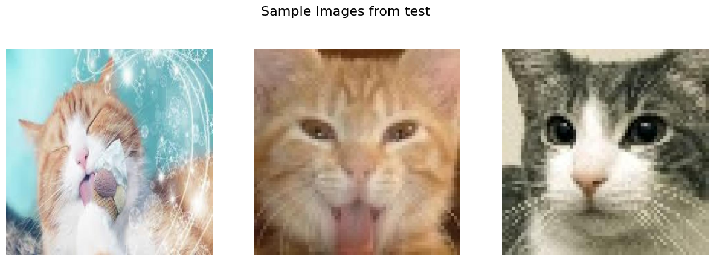
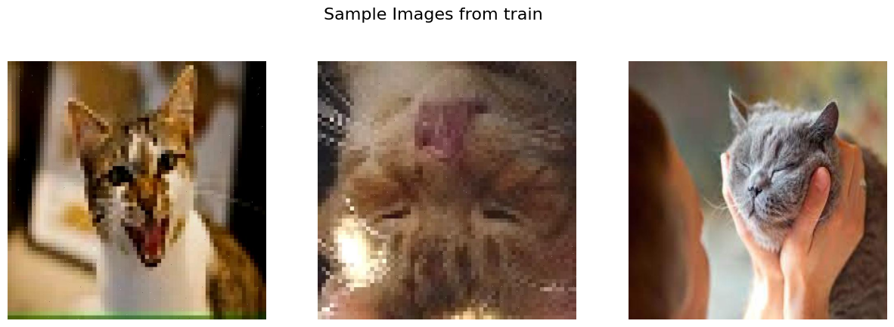
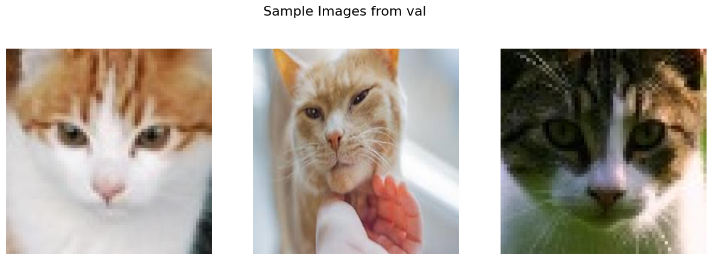
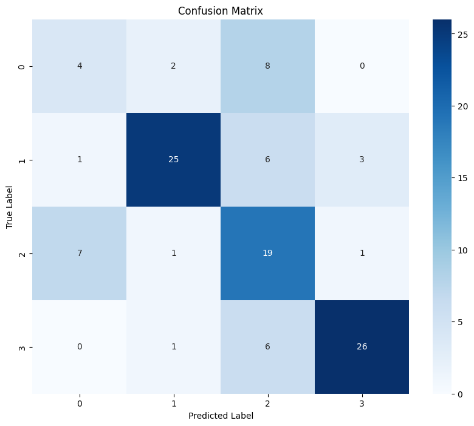
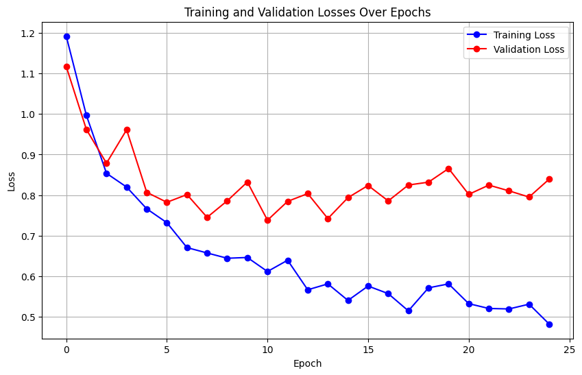
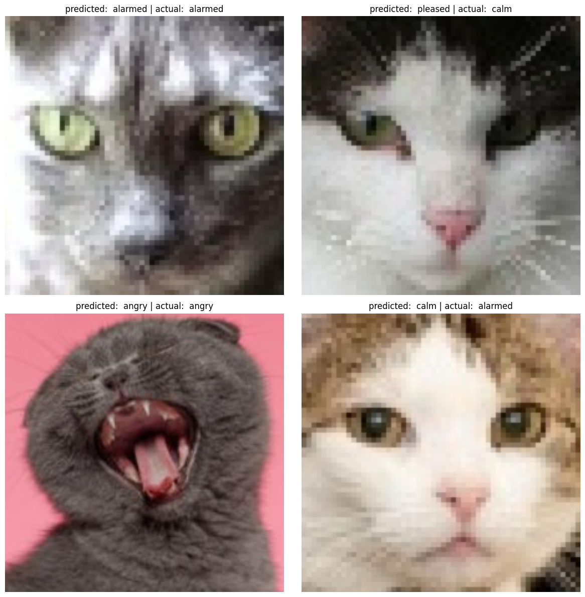
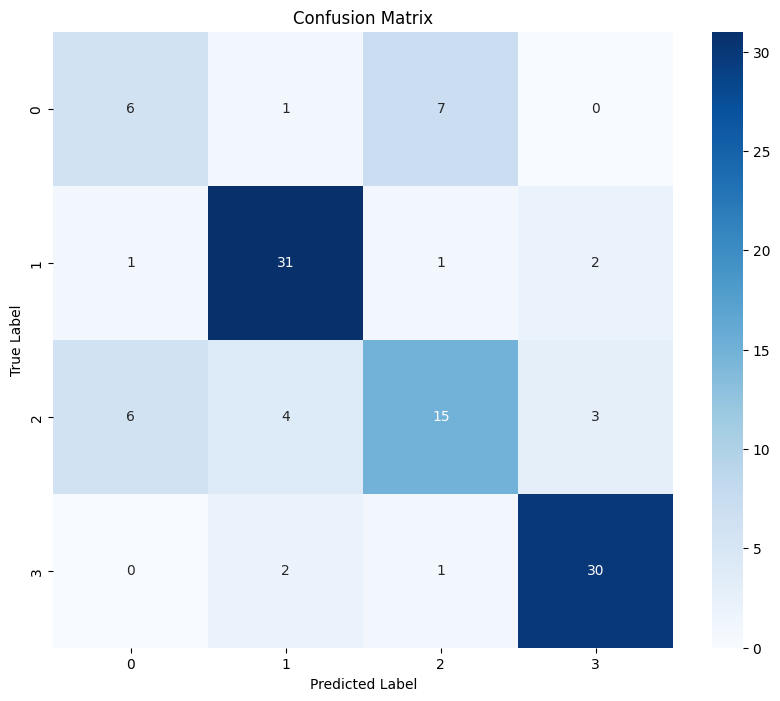
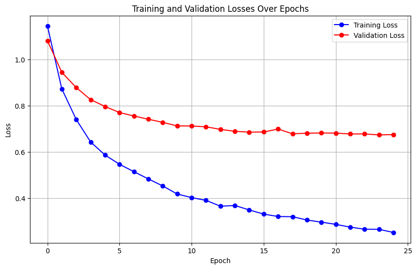
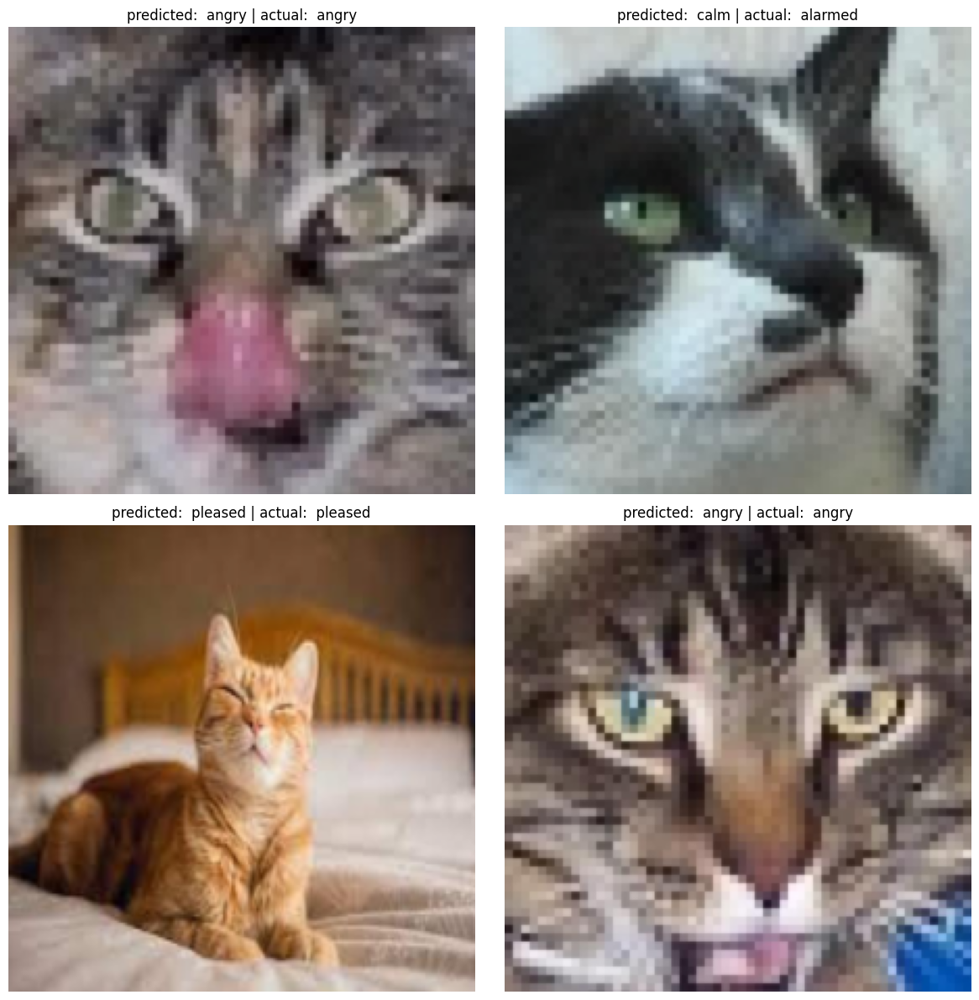

+++
title = "MARKDOWN Transfer Learning Classifier Using PyTorch"
date = 2024-05-15T14:53:29+08:00
draft = false
summary = "Things we learn here include image data exploration, transfer learning, custom datasets, comparing ML models, saving/loading models and model data, conditional setup for different work environments."
tags = ["Classification", "Deep Learning", "Machine Learning", "PyTorch", "Transfer Learning"]
+++

<a href="https://colab.research.google.com/github/vflores-io/cat_mood/blob/main/cat_mood_classification.ipynb" target="_parent"></a>

# Cat Expression Classifier Using Convolutional Neural Networks
___

This project aims to build a cat expression classifier with convolutional neural networks (CNNs) using PyTorch. This project serves as an introduction to image classification and also dives into the nuances of handling a specific, custom dataset and adapting pre-trained models for our purposes.

### Objective
The primary objective of this project is to develop a model capable of classifying images of cat faces into one of four moods: alarmed, angry, calm, and pleased. By the end of this tutorial, you will learn how to preprocess image data, leverage transfer learning for image classification, and evaluate a model's performance.

### Tools and Techniques
We will employ PyTorch, a powerful and versatile deep learning library, to construct our CNN. The model of choice for this tutorial is ResNet18, a robust architecture that is commonly used in image recognition tasks. Given the straightforward nature of our classificaiton problem, ResNet18 provides an ecellent balance between complexity and performance.

### Why *Transfer Learning*?
In this tutorial, we utilize *transfer learning* to take advantage of a pre-trained ResNet18 model. This approach allows us to use a model that has already learned a significant amount of relevant features from a vast and diverse dataset (ImageNet). By fine-tuning this model to our specific task, we can achieve high accuracy with relatively little data and reduce the computational cost typycally associated with training a deep neural network from scratch.

### Dataset
The dataset comprises images of cat faces, labeled according to their expressed mood. These images are organized into training, validation, and testing sets, each with a corresponding CSV file which maps filenames to mood labels. This guide will walk you through the process of loading, preprocessing, and augmenting this data to suit the needs of our CNN.

The dataset was obtained [here](https://universe.roboflow.com/mubbarryz/domestic-cats-facial-expressions).

Let's get started!

## Dataset Exploration


### Listing the Number of Images in Each Set and Visualizing The Set

Below we will mount the drive to retrieve the data set files.
Then, will use Python's `os` module to list the number of images in the dataset. This will give us an idea of the size of the set.

Additionally, we will include a flag to tell the model whether we want to train it or to load a previously saved model... this will become clear later.

Finally, we will set up a function to visualize some sample images from each set.


```python
import os

# flag to control whether to train the model or load a saved model
should_train_resnet = False
should_train_vit = False

def set_path():
  # check if the notebook is running on google colab
  if 'google.colab' in str(get_ipython()):
    print('Running on Google Colab.')
    from google.colab import drive
    drive.mount('/content/drive')
    path = '/content/drive/MyDrive/Projects/Software Projects/cat_mood/data/cat_expression_data'
  else:
    print('Running locally.')
    path = './data/cat_expression_data'

  return path

base_dir = set_path()

```

    Running on Google Colab.
    Mounted at /content/drive
    


```python
# base directories
train_dir = os.path.join(base_dir, 'train')
test_dir = os.path.join(base_dir, 'test')
val_dir = os.path.join(base_dir, 'val')
```


```python
def list_images(directory):
  """ list folders and count image files in each folder """
  dir_name = os.path.basename(directory)
  image_files = [f for f in os.listdir(directory) if f.lower().endswith(('.jpg', 'jpeg', '.bmp', '.gif'))]
  print(f'Total image files in {dir_name}: {len(image_files)}')

list_images(train_dir)
list_images(val_dir)
list_images(test_dir)
```

    Total image files in train: 1149
    Total image files in val: 110
    Total image files in test: 55
    

Finally, we will make a dictionary that maps the classes to index-based labels, from the CSV file. We will need this way later, but we will define the dictionary this early on.

### Visualizing Some of the Data

Let's visualize a few images from each folder to ensure to have a better feel of the data.

We will do this by making a dataframe out of the annotations file where the labels are stored. We will use the test annotations, since this is the smallest dataset, and the other two have the same labels anyway.


```python
import pandas as pd

# define the annotations file
annotations_filename = '_classes.csv'

# define the full path to the annotations file
test_annotations = os.path.join(test_dir, annotations_filename)

# load the annotations file
df = pd.read_csv(test_annotations)

class_names = {index: col for index, col in enumerate(df.columns[1:])}  # Adjust slicing if there are other columns
print(class_names)
```

    {0: ' alarmed', 1: ' angry', 2: ' calm', 3: ' pleased'}
    


```python
import matplotlib.pyplot as plt
from PIL import Image
import random

def show_sample_images(main_directory, num_samples=5):
    """Display sample images from each subfolder within the main directory."""
    subfolders = [f.path for f in os.scandir(main_directory) if f.is_dir()]

    for directory in subfolders:
        image_files = [os.path.join(directory, f) for f in os.listdir(directory) if f.lower().endswith(('.jpg', '.jpeg'))]
        if len(image_files) > 0:
            chosen_samples = random.sample(image_files, min(len(image_files), num_samples))

            # Plot settings
            fig, axes = plt.subplots(1, min(len(image_files), num_samples), figsize=(15, 5))
            fig.suptitle(f'Sample Images from {os.path.basename(directory)}', fontsize=16)

            for ax, img_path in zip(axes.flatten(), chosen_samples):
                image = Image.open(img_path)
                ax.imshow(image)
                ax.axis('off')
                # ax.set_title(os.path.basename(img_path))

            plt.show()
        else:
            print(f"No images to display in {os.path.basename(directory)}.")

# Example usage with the base directory containing train, validation, and test subfolders
show_sample_images(base_dir, num_samples = 3)

```


    

    


    

    


    

    


## Data Preprocessing
---
This steps involves preparing the dataset for training a PyTorch model by resizing, normalizing, and applying data augmentation.

**NOTE:** At this point, it is important to know what is the model or CNN architecture we will be using. Important aspects to consider include the image size, any data transformations for training and validation, data augmentation techniques, and setting up data loaders later.

In this example, we will use `ResNet18 `. The inputs must follow a specific format, as per the PyTorch ResNet documentation found [here](https://pytorch.org/hub/pytorch_vision_resnet/):

> All pre-trained models expect input images normalized in the same way, i.e. mini-batches of 3-channel RGB images of shape `(3 x H x W)`, where `H` and `W` are expected to be at least 224. The images have to be loaded in to a range of `[0, 1]` and then normalized using `mean = [0.485, 0.456, 0.406]` and `std = [0.229, 0.224, 0.225]`.


### Tools for Data Preprocessing in PyTorch

- `torchvision.transforms`: Provides common image transformations like resizing, normalization, and augmentation.
- `torch.utils.data.Dataset`: A base class for creating custom datasets.
- `torch.utils.data.DataLoader`: Loads and batches data for training.

### The Data

The data set we are using consists of three folders: `train`, `val`, `test`. Each of them contain a set of images of cats. The labels in this case, are in the form of a CSV file that maps the filename with a one-hot encoding to label the classification of the image, i.e. the cat's mood - alarmed, angry, calm, pleased.

Because this dataset structure is not exactly suitable for the `ImageFolder` module in PyTorch, whereby labelling is made easier and based on the folder structure, we need to create a custom dataset and loader. Let's get started!


### Define Image Transformations

- Specify resizing dimensions, normalization parameters, and augmentation techniques (like random rotation, flips, etc.).
- Create separate transformations for training and validation datasets.


```python
# import transforms
import torch
import torchvision.transforms as transforms

# define the image size
image_size = (224, 224)  # adjusted for ResNet18

# define transformations for the training dataset
train_transforms = transforms.Compose([
    transforms.Resize(256),  # resize to ensure minimum size
    transforms.CenterCrop(224), # center crop to 224x224
    transforms.RandomHorizontalFlip(), # data augmentation
    transforms.RandomRotation(15), # data augmentation
    transforms.ConvertImageDtype(torch.float),  # important, because the read_image reads as uint8, needs to be float
                                                # given that below we apply normalization
    transforms.Normalize(mean = [0.485, 0.456, 0.406],
                         std = [0.229, 0.224, 0.225])
])

val_transforms = transforms.Compose([
    transforms.Resize(256),
    transforms.CenterCrop(224),
    transforms.ConvertImageDtype(torch.float),
    transforms.Normalize(mean = [0.485, 0.456, 0.406],
                         std = [0.229, 0.224, 0.225])
])
```

With these transformations, the data pipeline will align with common practices for pre-trained models like ResNet18.

### Create Custom Datasets and Cada Loaders

Given the structure of our dataset, where labels are provided in a CSV file rather than through directory structure, we need to use a custom dataset class. This will allow us to link echc image with its respective label based on our CSV file's structure.


#### Creating Custom Dataset
We will extend the `torch.utils.data.Dataset` class to create our custom dataset. this class will override the necessary methods to handle our specific dataset setup:

1. Initialization: Load the CSV file and set up the path to the images
2. Length: Return the total number of images
3. Get item: Load each image by index, apply the specified transformations, and parse the label from the CSV data


```python
import pandas as pd
import torch
from torch.utils.data import Dataset
from torchvision.io import read_image

class CustomImageDataset(Dataset):
  """ a custom dataset class that loads images and their labels from a CSV """

  def __init__(self, annotations_file, img_dir, transform = None):
    """
    args:
      annotations_file (string): path to the CSV file with annotations
      img_dir (str): directory with all the images
      transform (callable, optional): transform to be applied on a sample
    """
    self.img_labels = pd.read_csv(annotations_file) # load annotations
    self.img_dir = img_dir
    self.transform = transform

  def __len__(self):
    """ returns the number of items in the dataset """
    return len(self.img_labels)

  def __getitem__(self, idx):
    """ fetches the image and label at the index idx from the dataset """
    img_path = os.path.join(self.img_dir, self.img_labels.iloc[idx, 0])
    image = read_image(img_path)

    # convert one-hot encoded labels to a categorical label
    one_hot_label = self.img_labels.iloc[idx, 1:].values.astype('float32')

    # next find the index of the element in the slice which contains the '1'
    # since all other numbers will be 0; this will correspond to the label
    # 0, 1, 2, 3
    label = torch.argmax(torch.tensor(one_hot_label)).item()

    if self.transform:
      image = self.transform(image)  # apply transformations

    return image, label

```

Now that we have defined the data classes, we can create objects for each of our datasets, as a `CustomImageDataset` class.


```python
# annotations_filename = '_classes.csv'    # previously defined

# paths to annotation files
train_annotations = os.path.join(train_dir, annotations_filename)
val_annotations = os.path.join(val_dir, annotations_filename)
test_annotations = os.path.join(test_dir, annotations_filename)    # previously defined

# create dataset objects
train_dataset = CustomImageDataset(train_annotations, train_dir,
                                   transform = train_transforms)
val_dataset = CustomImageDataset(val_annotations, val_dir,
                                   transform = val_transforms)
test_dataset = CustomImageDataset(test_annotations, test_dir,
                                   transform = val_transforms)
```

#### Creating Data Loaders

Data loaders in PyTorch provide the necessary functionality to batch, shuffle, and feed the data to your model during training in an efficient manner. They also handle parallel processing using multiple worker threads, which can significantly speed up data loading.

In short, data loaders take the dataset objects and handle the process of creating batches, shuffling the data, and parallelizing the data loading process.

Below we will create a data loaders for our datasets.


```python
from torch.utils.data import DataLoader

train_loader = DataLoader(
    train_dataset,
    batch_size = 64,   # defines how many samples per batch to load
    shuffle = True    # shuffles the dataset at every epoch
)

val_loader = DataLoader(
    val_dataset,
    batch_size = 64,
    shuffle = False   # no need to shuffle validation data
)

test_loader = DataLoader(
    test_dataset,
    batch_size = 64,
    shuffle = False
)
```

In the loader above, we have the following main parts:

- Batch size: typycally set based on the system's memory capacity and how large the model is. A larger batch size can speed up training but requires more memory.
- Shuffle: shuffling helps ensure that each batch sees a varierty of data across epochs, which can improve model generalization.
- Number of workers: this controls how many subproceses to use for data loading. More workers can lead to faster data preprocessing and reduced time to train each epoch but also increases memory usage.


### Integration with the Training Loop

With the data loaders set up, we are now ready to integrate them into the model's training and validation loops.

The code **snippet** below shows how this would be done. We will implement the actual integration when we get to the training section.

```python
for epoch in range(num_epochs):
    for images, labels in train_loader:
        # Forward pass, backward pass, and optimize
        outputs = model(images)
        loss = criterion(outputs, labels)
        optimizer.zero_grad()
        loss.backward()
        optimizer.step()
    
    # Validation step at the end of each epoch
    model.eval()
    with torch.no_grad():
        for images, labels in val_loader:
            predictions = model(images)
            # Calculate validation accuracy, loss, etc.
```

## Model Training
---
Now that the data is ready and properly formatted for input into a neural network, the next step involves setting up and training the `ResNet18` model. We will configure the model, define the loss function and optimizer, and implement the training and validation loops.


### Next Steps

1. Model setup:
- Load the pre-trained `ResNet18` model and modify it for our specific classification task (number of classes based on cat facial expressions)

2.  Loss function and optimizer:
- Define a loss function suitable for classification, e.g. `CrossEntropyLoss`
- Set up an optimizer (like `Adam` or `SGD`) to adjust the model weights during training based on the computed gradients

3. Training loop:
- Implement the loop that processes the data through the model, computes the loss, updates the model parameters, and evaluates the model performance on the validation dataset periodically

4. Monitoring and saving the model:
- Track performance metrics such as loss and accuracy
- Implement functionality to save the trained model for later use or further evaluation


### Model Setup

In this section, we'll configure a ResNet18 model to suit our specific classification task. Since the model is originally designed for ImageNet with 1000 classes, we'll adapt it for our use case, which involves classifying images into four mood categories (alarmed, angry, calm, pleased).

#### Import the Necessary Libraries


```python
# import torch  # this has already been imported before
import torch.nn as nn
import torch.optim as optim
from torchvision import models
```

#### Load and Modify the Pre-trained ResNet18

We will load a pre-trained ResNet18 model and modify its final layer to suit our classification needs. This is known as **transfer learning**, and it is a technique that uses a pre-trained model and leverages its learned parameters to focus on a similar, more specific task. This is a powerful technique, since it uses the existing knowledge (such as edges and features) so that the new classification task is more robust, and faster to tune to the specific task.

#### Understanding Transfer Learning

**Transfer Learning** is a powerful technique in machine learning where a model developed for a particular task is reused as the starting point for a model on a second task. It's especially popular in deep learning given the vast compute and time resources required to develop neural network models on large datasets and from scratch.

#### Why Use Transfer Learning?
1. Efficiency: transfer learning allows us to leverage pre-trained networks that have already learned a good amount of features on large datasets. This is beneficial as it can drastically reduce the time and computational cost to achieve high performance.
3. Performance: models trained on large-scalr datasets like ImageNet havve proven to generalize well to other datasets. Starting with these can provide a significand head-start in terms of performance.

##### Applying Transfer Learning
- Model adaptation: for our specific task fo classifying cat moods, we take a pre-trained ResNet18 model and tailor it to our needs. The pre-trained model brings the advantage of learned features from ImageNet, a vast and diverse dataset.
- Feature extraction: by **freezing** (i.e. keeping the weight values as they are) the pre-trained layers, we utilize them as a feature extractor. Only the final layers are trained to adapt those features to our specific classification task.

#### Model Setup with a Custom Classifier

We have mentioned replacing the funal layer(s) as a transfer learning techniques. In this case, we replace the final fully connected (fc) layer of ResNet18 with a different layer which will suit our need to have 4 classes. Additionally, we will replace this fc layer with a more complex classifier portion, which involves adding additional layers such as ReLU for non-linearity, and dropout for regularization to prevent overfitting.

- ReLU Activation: introduces non-linearity into the model, allowing it to learn more complex patterns.
- Dropout: Randomly zeros some of the elements of the input (to the layer, not input to the model) tensor with probability $p$ during training, which helps prevent overfitting.

Let's implement this classifier in our transfer learning setup.


```python
# assign the model weights
weights = models.ResNet18_Weights.DEFAULT

# create the model object with pre-trained weights
model = models.resnet18(weights = weights)

# freeze all the layers in the network
for param in model.parameters():
  param.requires_grad = False

# replace the fc layer with a more complex classifier
num_features = model.fc.in_features
model.fc = nn.Sequential(
    nn.Linear(num_features, 256),    # first linear layer
    nn.ReLU(),                       # non-linearity
    nn.Dropout(0.5),                 # dropout for regularization
    nn.Linear(256, len(class_names))                # output layer, 4 classes for cat moods
)

# move model to GPU if available
device = torch.device('cuda' if torch.cuda.is_available() else 'cpu')
model = model.to(device)
```

    Downloading: "https://download.pytorch.org/models/resnet18-f37072fd.pth" to /root/.cache/torch/hub/checkpoints/resnet18-f37072fd.pth
    100%|██████████| 44.7M/44.7M [00:00<00:00, 117MB/s]
    

### Loss Function and Optimizer

For our classification task, we need a loss function that effectively measures the discrepancy between the predicted labels and the actual labels. Since we've configured out model outputs to be class indices (from our dataset's one-hot encoded labels), we'll use [`CrossEntropyLoss`](https://pytorch.org/docs/stable/generated/torch.nn.CrossEntropyLoss.html), which is ideal for such clasification tasks.

We'll par this with the [`Adam`](https://pytorch.org/docs/stable/generated/torch.optim.Adam.html) optimizer, which is known for its efficiency in handling sparse gradients and adaptive learning rate capabilities, making it well-suited for this task.

Let's set up our loss function and optimizer.


```python
# loss function
criterion = nn.CrossEntropyLoss()

# optimizer
# optimize only the final classifier layers
optimizer = optim.Adam(model.fc.parameters(), lr = 0.001)
```


### Training and Validation Loops

Now, let's write the code to train and validate our model. This involves running the model over several epochs, making predictions, calculating loss, updating the model parameters, and evaluating the model's perfomance on the validation dataset.

- Training loop: here, the model learns by adjusting its weights based on the calculated loss from the training data
- Validation loop: validation occurs post the training phase in each epoch and helps in evaluating the model's performance on unseen data, ensuring it generalizes well and doesn't overfit


### Saving/Loading the Model

#### Save the Trained Model

If we have performed training, we can save the model to use next time, so that we can avoid re-training everytime we run the notebook.

We will implement this part as an `if` statement, that would run the training loop and save the model if we choose to, otherwise, we would just load the model weights.


```python
import pickle

# define a function to set the save model path
def model_save_path():
      # check if the notebook is running on google colab
      if 'google.colab' in str(get_ipython()):
        print('Running on Google Colab.')
        path = '/content/drive/MyDrive/Projects/Software Projects/cat_mood/saved_models'
      else:
        print('Running locally.')
        path = './saved_models'

      return path
```


```python
def training_loop(flag, model, criterion, optimizer, model_filename, model_data_filename,
                  num_epochs = None):
  if flag:

    # num_epochs = 25   # define the number of epochs for training
    train_losses = []
    val_losses = []

    for epoch in range(num_epochs):
      model.train()   # set the model to training mode
      total_train_loss = 0

      for images, labels in train_loader:
        images, labels = images.to(device), labels.to(device)

        # forward pass to get outputs
        outputs = model(images)
        loss = criterion(outputs, labels)

        # backpropagation and optimization
        optimizer.zero_grad()
        loss.backward()
        optimizer.step()

        total_train_loss += loss.item() * images.size(0)

      # calculate average training loss for the epoch
      avg_train_loss = total_train_loss / len(train_loader.dataset)
      train_losses.append(avg_train_loss)

      # print average training loss per epoch"
      print(f'Epoch {epoch + 1}/{num_epochs}, Training Loss: {avg_train_loss:.4f}')

      #------------------#
      # validation phase #
      #------------------#
      model.eval()   # set the model to evaluation mode
      total_val_loss = 0
      total_val_accuracy = 0

      with torch.no_grad():
        for images, labels in val_loader:
          images, labels = images.to(device), labels.to(device)
          outputs = model(images)
          loss = criterion(outputs, labels)
          total_val_loss += loss.item() * images.size(0)
          _, predicted = torch.max(outputs, 1)
          total_val_accuracy += (predicted == labels).sum().item()

      # calculate average validation loss for the epoch
      avg_val_loss = total_val_loss / len(val_loader.dataset)
      val_losses.append(avg_val_loss)
      # calculate validation accuracy
      val_accuracy = 100 * total_val_accuracy / len(val_loader.dataset)

      # print validation accuracy
      print(f' Validation loss: {avg_val_loss:.4f}, Validation accuracy: {val_accuracy:.2f}%')

    # save model and training data
    save_model_path = model_save_path()
    # model_filename = 'vit_cat_mood.pth'
    model_path = os.path.join(save_model_path, model_filename)
    torch.save(model.state_dict(), model_path)
    print('Model saved to', model_path)

    # save the training and validation losses
    def save_training_data(train_losses, val_losses, filename):
        with open(filename, 'wb') as f:
            pickle.dump({'train_losses': train_losses, 'val_losses': val_losses}, f)
        print(f"Training data saved to {filename}")

    # Specify the filename for saving training data
    training_data_filename = os.path.join(save_model_path, model_data_filename)
    save_training_data(train_losses, val_losses, training_data_filename)

    return train_losses, val_losses

  else:
    # load the trained model
    save_model_path = model_save_path()
    # model_filename = 'vit_cat_mood.pth'
    model_path = os.path.join(save_model_path, model_filename)
    model.load_state_dict(torch.load(model_path, map_location = device))
    model.eval()
    print('Model loaded and set to evaluation mode.')

    # load training data

    # Load the training and validation losses
    def load_training_data(filename):
      with open(filename, 'rb') as f:
        data = pickle.load(f)
        return data

    training_data_filename = os.path.join(save_model_path, model_data_filename)
    training_data = load_training_data(training_data_filename)
    train_losses = training_data['train_losses']
    val_losses = training_data['val_losses']
    print('Training data loaded successfully.')

    return train_losses, val_losses

```


```python
model_filename = 'resnet18_cat_mood.pth'
model_data_filename = 'resnet18_training_data.pkl'

train_losses, val_losses = training_loop(should_train_resnet, model, criterion, optimizer, model_filename, model_data_filename, num_epochs = 25)
```

    Running on Google Colab.
    Model loaded and set to evaluation mode.
    Training data loaded successfully.
    

----
## Model Evaluation

Now that the model is trained, the next step is to evaluate its performance more thoroughly, and possibly improve it based on the insights gained.

Evaluating the model involves checking the accuracy and also looking at other metrics like precision, recall, and F1-score, especially if the dataset is imbalanced or if specific classes are more important than others.


### Model Evaluation on Validation Set

After training a machine learning model, it's crucial to evaluate its performance comprehensively. Here, we will detail three key diagnostic tools"

1. Confusion matrix
2. Plotting training and validation losses
3. Visualization of the predictions


#### Confusion Matrix
A confusion matrix provides a detailed breakdown of the model's predictions, showing exactly how many samples from each class were correctly or incorrectly predicted as each other class. This is crucial for understanding the model's performance across different categories.


```python
from sklearn.metrics import confusion_matrix, classification_report
import seaborn as sns
import matplotlib.pyplot as plt

def evaluate_model(model, data_loader, device):
  model.eval()
  true_labels = []
  predictions = []

  with torch.no_grad():
    for images, labels in data_loader:
      images, labels = images.to(device), labels.to(device)

      outputs = model(images)
      _, preds = torch.max(outputs, 1)
      predictions.extend(preds.cpu().numpy())
      true_labels.extend(labels.cpu().numpy())

  # compute the confusion matrix
  cm = confusion_matrix(true_labels, predictions)
  clf_report = classification_report(true_labels, predictions, output_dict = True)

  # Convert classification report dictionary to DataFrame
  clf_report_df = pd.DataFrame(clf_report).transpose()

  return cm, clf_report_df

cm, clf_report_df = evaluate_model(model, val_loader, device)

# Plot the confusion matrix
plt.figure(figsize=(10, 8))
sns.heatmap(cm, annot=True, fmt='d', cmap='Blues')
plt.title('Confusion Matrix')
plt.ylabel('True Label')
plt.xlabel('Predicted Label')
plt.show()

# Print classification report
print('Classification Report:')
print(clf_report_df)
```


    

    


    Classification Report:
                  precision    recall  f1-score     support
    0              0.333333  0.285714  0.307692   14.000000
    1              0.862069  0.714286  0.781250   35.000000
    2              0.487179  0.678571  0.567164   28.000000
    3              0.866667  0.787879  0.825397   33.000000
    accuracy       0.672727  0.672727  0.672727    0.672727
    macro avg      0.637312  0.616613  0.620376  110.000000
    weighted avg   0.700728  0.672727  0.679728  110.000000
    

#### Plotting Training and Validation Losses

Plotting the training and validation losses over epochs allows us to monitor the learning process, identifying issues such as overfitting or underfitting.


```python
def plot_losses(train_losses, val_losses):
  """
  Plot the training and validation losses.

  Parameters:
  - train_losses: list of training loss values per epoch
  - val_losses: list of validation loss values per epoch
  """

  plt.figure(figsize = (10, 6))
  plt.plot(train_losses, label = 'Training Loss', color = 'blue', marker = 'o')
  plt.plot(val_losses, label = 'Validation Loss', color = 'red', marker = 'o')
  plt.title('Training and Validation Losses Over Epochs')
  plt.xlabel('Epoch')
  plt.ylabel('Loss')
  plt.legend()
  plt.grid(True)
  plt.show()

# take the tracked losses from thet training loop
plot_losses(train_losses, val_losses)
```


    

    


#### Visualization of the Predictions
Visualizing model predictions on actual data points provides immediate qualitative feedback about model behavior. It helps identify paterns in which the model performs well or poorly, revealing potential biases, underfitting, or overfitting.


```python
import numpy as np

def visualize_predictions(model, data_loader, device, class_names, num_images = 10):
  model.eval()
  images_so_far = 0
  rows = num_images // 2 if num_images % 2 == 0 else num_images // 2 + 1
  fig, axes = plt.subplots(nrows = rows, ncols = 2,
                           figsize = (12, num_images * 3))
  # define the mean and std deviation used for normalization
  mean = np.array([0.485, 0.456, 0.406])
  std = np.array([0.229, 0.224, 0.225])

  with torch.no_grad():
    for i, (images, labels) in enumerate(data_loader):
      images, labels = images.to(device), labels.to(device)
      outputs = model(images)
      _, preds = torch.max(outputs, 1)

      for j in range(images.size(0)):
        if images_so_far < num_images:
          ax = axes[images_so_far // 2, images_so_far % 2] if num_images > 1 else axes # arrange in grid
          ax.axis('off')
          # convert tensors to integers
          predicted_label = preds[j].item()
          actual_label = labels[j].item()
          # reverse normalization transform
          img = images.cpu().data[j].numpy().transpose((1, 2, 0)) # change CxHxW to HxWxC
          img = std * img + mean   # reverse normalization
          img = np.clip(img, 0, 1)   # clip values to ensure they fall between 0 and 1
          # use converted integers to access class names
          ax.set_title(f'predicted: {class_names[predicted_label]} | actual: {class_names[actual_label]}',
                       fontsize = 12)
          ax.imshow(img)
          images_so_far += 1
        else:
          plt.tight_layout()   # adjust layout
          plt.show()
          return


# make new loader for random samples
vis_loader = DataLoader(
    val_dataset,
    batch_size = 10,
    shuffle = True,
)

visualize_predictions(model, vis_loader, device, class_names, num_images = 4)
```


    

    


## Evaluation of Model Performance

Our Cat Expression Classifier, built on a modified ResNet18 architecture, demonstrates a promising ability to classify cat expressions into four categories: alarmed, angry, calm, and pleased. Here, we provide a detailed analysis of the model's performance based on our the training and validation efforts.

### Overall Performance Metrics

The model achieves an overall accuracy of 68.18% on the validation set. This is a decent foundation but indicates room for further refinement, especially in distinguishing between expressions that share subtle features. Here is a breakdown of the key performance metrics:

- Precision: Measures the accuracy of positive predictions. for example, the `pleased` category shows high precision, indicating that the model reliably identifies this expression.
- Recall: Reflects the model's ability to identify all relevant instances of a class. The `angry` category has a high recall, suggesting that the model effectively captures most of the `angry` expressions.
- F1-Score: Balances precision and recall and is particularly useful in scenarios where class distribution is uneven.

### Confusion Matrix Insights

the confusion matrix provides a granular view of the model's performance across the different classes. It highlights specific areas where the model performs well and others where it struggles, such as:
- Misclassifications between `alarmed` and `angry` suggest that the model may be conflating these expressions due to their similar features.
- The high accuracy in identifying `pleased` expressions shows that distinct features of this mood are well captured by the model.

### Training and Validation Losses

The training and validation loss plots reveal the learning dynamics over the epochs:
- A steady decrease in training loss indicates that the model is effectively learning from the training data.
- The pattern of validation loss provides insights into the model's generalization ability. Increases in validation loss suggest moments where the model might be overfitting to the training data.

---
## Trying out VisionTransformers

### Data Transformations for Vision Transformer

When transitioning from a CNN like `ResNet18` to a Vision Transformer (ViT), it's essential to evaluate whether the existing preprocessing steps - particulary the data transformations - are suitable for the new model architecture. For ViT , wed must consider their unique handling of image data, which relies on dividing the image into fixed-size patches and understanding global dependencies through self-attention mechanisms.

For this exercise, we will maintain the same transformations we have previously defined.

The decision to retain the initial transformations is based on the principle of consistency and the minimal impact expected by changing model architectures regarding how images are scaled and augmented. The chosen transformations ensure that the images are adequately prepared for the neural network without introducing complexities or distortions that could hinder the learning of global patterns, which are vital for Vision Transformers due to their reliance on self-attention mechanisms.

Additionally, maintaining these transformations allows for a more straightforward comparison between the ResNet18 model and the Vision Transformer model, as any changes in model performance can more confidently be attributed to the architectural differences rather than changes in data preprocessing.

### Load Pre-Trained Vision Transformer Model

First, we need to load the ViT model that has been pre-trained on a large dataset. We'll then adapt the classifier _head_ to our needs, which is classifying cat moods into four categories.


```python
# load the ViT pre-trained model
weights_vit = models.ViT_B_16_Weights.DEFAULT

model_vit = models.vit_b_16(weights = weights_vit)

# print the model structure to understand what needs to be replaced
print(model_vit)
```

    Downloading: "https://download.pytorch.org/models/vit_b_16-c867db91.pth" to /root/.cache/torch/hub/checkpoints/vit_b_16-c867db91.pth
    100%|██████████| 330M/330M [00:02<00:00, 124MB/s]
    

    VisionTransformer(
      (conv_proj): Conv2d(3, 768, kernel_size=(16, 16), stride=(16, 16))
      (encoder): Encoder(
        (dropout): Dropout(p=0.0, inplace=False)
        (layers): Sequential(
          (encoder_layer_0): EncoderBlock(
            (ln_1): LayerNorm((768,), eps=1e-06, elementwise_affine=True)
            (self_attention): MultiheadAttention(
              (out_proj): NonDynamicallyQuantizableLinear(in_features=768, out_features=768, bias=True)
            )
            (dropout): Dropout(p=0.0, inplace=False)
            (ln_2): LayerNorm((768,), eps=1e-06, elementwise_affine=True)
            (mlp): MLPBlock(
              (0): Linear(in_features=768, out_features=3072, bias=True)
              (1): GELU(approximate='none')
              (2): Dropout(p=0.0, inplace=False)
              (3): Linear(in_features=3072, out_features=768, bias=True)
              (4): Dropout(p=0.0, inplace=False)
            )
          )
          (encoder_layer_1): EncoderBlock(
            (ln_1): LayerNorm((768,), eps=1e-06, elementwise_affine=True)
            (self_attention): MultiheadAttention(
              (out_proj): NonDynamicallyQuantizableLinear(in_features=768, out_features=768, bias=True)
            )
            (dropout): Dropout(p=0.0, inplace=False)
            (ln_2): LayerNorm((768,), eps=1e-06, elementwise_affine=True)
            (mlp): MLPBlock(
              (0): Linear(in_features=768, out_features=3072, bias=True)
              (1): GELU(approximate='none')
              (2): Dropout(p=0.0, inplace=False)
              (3): Linear(in_features=3072, out_features=768, bias=True)
              (4): Dropout(p=0.0, inplace=False)
            )
          )
          (encoder_layer_2): EncoderBlock(
            (ln_1): LayerNorm((768,), eps=1e-06, elementwise_affine=True)
            (self_attention): MultiheadAttention(
              (out_proj): NonDynamicallyQuantizableLinear(in_features=768, out_features=768, bias=True)
            )
            (dropout): Dropout(p=0.0, inplace=False)
            (ln_2): LayerNorm((768,), eps=1e-06, elementwise_affine=True)
            (mlp): MLPBlock(
              (0): Linear(in_features=768, out_features=3072, bias=True)
              (1): GELU(approximate='none')
              (2): Dropout(p=0.0, inplace=False)
              (3): Linear(in_features=3072, out_features=768, bias=True)
              (4): Dropout(p=0.0, inplace=False)
            )
          )
          (encoder_layer_3): EncoderBlock(
            (ln_1): LayerNorm((768,), eps=1e-06, elementwise_affine=True)
            (self_attention): MultiheadAttention(
              (out_proj): NonDynamicallyQuantizableLinear(in_features=768, out_features=768, bias=True)
            )
            (dropout): Dropout(p=0.0, inplace=False)
            (ln_2): LayerNorm((768,), eps=1e-06, elementwise_affine=True)
            (mlp): MLPBlock(
              (0): Linear(in_features=768, out_features=3072, bias=True)
              (1): GELU(approximate='none')
              (2): Dropout(p=0.0, inplace=False)
              (3): Linear(in_features=3072, out_features=768, bias=True)
              (4): Dropout(p=0.0, inplace=False)
            )
          )
          (encoder_layer_4): EncoderBlock(
            (ln_1): LayerNorm((768,), eps=1e-06, elementwise_affine=True)
            (self_attention): MultiheadAttention(
              (out_proj): NonDynamicallyQuantizableLinear(in_features=768, out_features=768, bias=True)
            )
            (dropout): Dropout(p=0.0, inplace=False)
            (ln_2): LayerNorm((768,), eps=1e-06, elementwise_affine=True)
            (mlp): MLPBlock(
              (0): Linear(in_features=768, out_features=3072, bias=True)
              (1): GELU(approximate='none')
              (2): Dropout(p=0.0, inplace=False)
              (3): Linear(in_features=3072, out_features=768, bias=True)
              (4): Dropout(p=0.0, inplace=False)
            )
          )
          (encoder_layer_5): EncoderBlock(
            (ln_1): LayerNorm((768,), eps=1e-06, elementwise_affine=True)
            (self_attention): MultiheadAttention(
              (out_proj): NonDynamicallyQuantizableLinear(in_features=768, out_features=768, bias=True)
            )
            (dropout): Dropout(p=0.0, inplace=False)
            (ln_2): LayerNorm((768,), eps=1e-06, elementwise_affine=True)
            (mlp): MLPBlock(
              (0): Linear(in_features=768, out_features=3072, bias=True)
              (1): GELU(approximate='none')
              (2): Dropout(p=0.0, inplace=False)
              (3): Linear(in_features=3072, out_features=768, bias=True)
              (4): Dropout(p=0.0, inplace=False)
            )
          )
          (encoder_layer_6): EncoderBlock(
            (ln_1): LayerNorm((768,), eps=1e-06, elementwise_affine=True)
            (self_attention): MultiheadAttention(
              (out_proj): NonDynamicallyQuantizableLinear(in_features=768, out_features=768, bias=True)
            )
            (dropout): Dropout(p=0.0, inplace=False)
            (ln_2): LayerNorm((768,), eps=1e-06, elementwise_affine=True)
            (mlp): MLPBlock(
              (0): Linear(in_features=768, out_features=3072, bias=True)
              (1): GELU(approximate='none')
              (2): Dropout(p=0.0, inplace=False)
              (3): Linear(in_features=3072, out_features=768, bias=True)
              (4): Dropout(p=0.0, inplace=False)
            )
          )
          (encoder_layer_7): EncoderBlock(
            (ln_1): LayerNorm((768,), eps=1e-06, elementwise_affine=True)
            (self_attention): MultiheadAttention(
              (out_proj): NonDynamicallyQuantizableLinear(in_features=768, out_features=768, bias=True)
            )
            (dropout): Dropout(p=0.0, inplace=False)
            (ln_2): LayerNorm((768,), eps=1e-06, elementwise_affine=True)
            (mlp): MLPBlock(
              (0): Linear(in_features=768, out_features=3072, bias=True)
              (1): GELU(approximate='none')
              (2): Dropout(p=0.0, inplace=False)
              (3): Linear(in_features=3072, out_features=768, bias=True)
              (4): Dropout(p=0.0, inplace=False)
            )
          )
          (encoder_layer_8): EncoderBlock(
            (ln_1): LayerNorm((768,), eps=1e-06, elementwise_affine=True)
            (self_attention): MultiheadAttention(
              (out_proj): NonDynamicallyQuantizableLinear(in_features=768, out_features=768, bias=True)
            )
            (dropout): Dropout(p=0.0, inplace=False)
            (ln_2): LayerNorm((768,), eps=1e-06, elementwise_affine=True)
            (mlp): MLPBlock(
              (0): Linear(in_features=768, out_features=3072, bias=True)
              (1): GELU(approximate='none')
              (2): Dropout(p=0.0, inplace=False)
              (3): Linear(in_features=3072, out_features=768, bias=True)
              (4): Dropout(p=0.0, inplace=False)
            )
          )
          (encoder_layer_9): EncoderBlock(
            (ln_1): LayerNorm((768,), eps=1e-06, elementwise_affine=True)
            (self_attention): MultiheadAttention(
              (out_proj): NonDynamicallyQuantizableLinear(in_features=768, out_features=768, bias=True)
            )
            (dropout): Dropout(p=0.0, inplace=False)
            (ln_2): LayerNorm((768,), eps=1e-06, elementwise_affine=True)
            (mlp): MLPBlock(
              (0): Linear(in_features=768, out_features=3072, bias=True)
              (1): GELU(approximate='none')
              (2): Dropout(p=0.0, inplace=False)
              (3): Linear(in_features=3072, out_features=768, bias=True)
              (4): Dropout(p=0.0, inplace=False)
            )
          )
          (encoder_layer_10): EncoderBlock(
            (ln_1): LayerNorm((768,), eps=1e-06, elementwise_affine=True)
            (self_attention): MultiheadAttention(
              (out_proj): NonDynamicallyQuantizableLinear(in_features=768, out_features=768, bias=True)
            )
            (dropout): Dropout(p=0.0, inplace=False)
            (ln_2): LayerNorm((768,), eps=1e-06, elementwise_affine=True)
            (mlp): MLPBlock(
              (0): Linear(in_features=768, out_features=3072, bias=True)
              (1): GELU(approximate='none')
              (2): Dropout(p=0.0, inplace=False)
              (3): Linear(in_features=3072, out_features=768, bias=True)
              (4): Dropout(p=0.0, inplace=False)
            )
          )
          (encoder_layer_11): EncoderBlock(
            (ln_1): LayerNorm((768,), eps=1e-06, elementwise_affine=True)
            (self_attention): MultiheadAttention(
              (out_proj): NonDynamicallyQuantizableLinear(in_features=768, out_features=768, bias=True)
            )
            (dropout): Dropout(p=0.0, inplace=False)
            (ln_2): LayerNorm((768,), eps=1e-06, elementwise_affine=True)
            (mlp): MLPBlock(
              (0): Linear(in_features=768, out_features=3072, bias=True)
              (1): GELU(approximate='none')
              (2): Dropout(p=0.0, inplace=False)
              (3): Linear(in_features=3072, out_features=768, bias=True)
              (4): Dropout(p=0.0, inplace=False)
            )
          )
        )
        (ln): LayerNorm((768,), eps=1e-06, elementwise_affine=True)
      )
      (heads): Sequential(
        (head): Linear(in_features=768, out_features=1000, bias=True)
      )
    )
    

### Freezing the Encoder Layers
Freezing the encoder layers prevents their weights from being updated during training, which means they retain the knowledge they have already gained from ImageNet. We only want to train the classifier that we will modify to our specific task.


```python
# freeze all layers in the model by disabling gradient computation
for param in model_vit.parameters():
  param.requires_grad = False
```

### Modify the Classifier
The standard ViT model includes a classifier at the end (usually named `heads` in `torchvision` models), which is a linear layer designed for the original classification task, e.g. 1000 classes for ImageNet. We will replace this with a new classifier suited for our task (4 cat moods).


```python
# replace the classifier head
# as we saw in the architecture above, the classifier is called `heads`
num_features = model_vit.heads.head.in_features   # ge tthe number of input features

# replace with a new head for len(class_names) = 4
model_vit.heads = nn.Sequential(
    nn.Linear(num_features, len(class_names))
)

# move model to appropriate device
model_vit.to(device)
```


    VisionTransformer(
      (conv_proj): Conv2d(3, 768, kernel_size=(16, 16), stride=(16, 16))
      (encoder): Encoder(
        (dropout): Dropout(p=0.0, inplace=False)
        (layers): Sequential(
          (encoder_layer_0): EncoderBlock(
            (ln_1): LayerNorm((768,), eps=1e-06, elementwise_affine=True)
            (self_attention): MultiheadAttention(
              (out_proj): NonDynamicallyQuantizableLinear(in_features=768, out_features=768, bias=True)
            )
            (dropout): Dropout(p=0.0, inplace=False)
            (ln_2): LayerNorm((768,), eps=1e-06, elementwise_affine=True)
            (mlp): MLPBlock(
              (0): Linear(in_features=768, out_features=3072, bias=True)
              (1): GELU(approximate='none')
              (2): Dropout(p=0.0, inplace=False)
              (3): Linear(in_features=3072, out_features=768, bias=True)
              (4): Dropout(p=0.0, inplace=False)
            )
          )
          (encoder_layer_1): EncoderBlock(
            (ln_1): LayerNorm((768,), eps=1e-06, elementwise_affine=True)
            (self_attention): MultiheadAttention(
              (out_proj): NonDynamicallyQuantizableLinear(in_features=768, out_features=768, bias=True)
            )
            (dropout): Dropout(p=0.0, inplace=False)
            (ln_2): LayerNorm((768,), eps=1e-06, elementwise_affine=True)
            (mlp): MLPBlock(
              (0): Linear(in_features=768, out_features=3072, bias=True)
              (1): GELU(approximate='none')
              (2): Dropout(p=0.0, inplace=False)
              (3): Linear(in_features=3072, out_features=768, bias=True)
              (4): Dropout(p=0.0, inplace=False)
            )
          )
          (encoder_layer_2): EncoderBlock(
            (ln_1): LayerNorm((768,), eps=1e-06, elementwise_affine=True)
            (self_attention): MultiheadAttention(
              (out_proj): NonDynamicallyQuantizableLinear(in_features=768, out_features=768, bias=True)
            )
            (dropout): Dropout(p=0.0, inplace=False)
            (ln_2): LayerNorm((768,), eps=1e-06, elementwise_affine=True)
            (mlp): MLPBlock(
              (0): Linear(in_features=768, out_features=3072, bias=True)
              (1): GELU(approximate='none')
              (2): Dropout(p=0.0, inplace=False)
              (3): Linear(in_features=3072, out_features=768, bias=True)
              (4): Dropout(p=0.0, inplace=False)
            )
          )
          (encoder_layer_3): EncoderBlock(
            (ln_1): LayerNorm((768,), eps=1e-06, elementwise_affine=True)
            (self_attention): MultiheadAttention(
              (out_proj): NonDynamicallyQuantizableLinear(in_features=768, out_features=768, bias=True)
            )
            (dropout): Dropout(p=0.0, inplace=False)
            (ln_2): LayerNorm((768,), eps=1e-06, elementwise_affine=True)
            (mlp): MLPBlock(
              (0): Linear(in_features=768, out_features=3072, bias=True)
              (1): GELU(approximate='none')
              (2): Dropout(p=0.0, inplace=False)
              (3): Linear(in_features=3072, out_features=768, bias=True)
              (4): Dropout(p=0.0, inplace=False)
            )
          )
          (encoder_layer_4): EncoderBlock(
            (ln_1): LayerNorm((768,), eps=1e-06, elementwise_affine=True)
            (self_attention): MultiheadAttention(
              (out_proj): NonDynamicallyQuantizableLinear(in_features=768, out_features=768, bias=True)
            )
            (dropout): Dropout(p=0.0, inplace=False)
            (ln_2): LayerNorm((768,), eps=1e-06, elementwise_affine=True)
            (mlp): MLPBlock(
              (0): Linear(in_features=768, out_features=3072, bias=True)
              (1): GELU(approximate='none')
              (2): Dropout(p=0.0, inplace=False)
              (3): Linear(in_features=3072, out_features=768, bias=True)
              (4): Dropout(p=0.0, inplace=False)
            )
          )
          (encoder_layer_5): EncoderBlock(
            (ln_1): LayerNorm((768,), eps=1e-06, elementwise_affine=True)
            (self_attention): MultiheadAttention(
              (out_proj): NonDynamicallyQuantizableLinear(in_features=768, out_features=768, bias=True)
            )
            (dropout): Dropout(p=0.0, inplace=False)
            (ln_2): LayerNorm((768,), eps=1e-06, elementwise_affine=True)
            (mlp): MLPBlock(
              (0): Linear(in_features=768, out_features=3072, bias=True)
              (1): GELU(approximate='none')
              (2): Dropout(p=0.0, inplace=False)
              (3): Linear(in_features=3072, out_features=768, bias=True)
              (4): Dropout(p=0.0, inplace=False)
            )
          )
          (encoder_layer_6): EncoderBlock(
            (ln_1): LayerNorm((768,), eps=1e-06, elementwise_affine=True)
            (self_attention): MultiheadAttention(
              (out_proj): NonDynamicallyQuantizableLinear(in_features=768, out_features=768, bias=True)
            )
            (dropout): Dropout(p=0.0, inplace=False)
            (ln_2): LayerNorm((768,), eps=1e-06, elementwise_affine=True)
            (mlp): MLPBlock(
              (0): Linear(in_features=768, out_features=3072, bias=True)
              (1): GELU(approximate='none')
              (2): Dropout(p=0.0, inplace=False)
              (3): Linear(in_features=3072, out_features=768, bias=True)
              (4): Dropout(p=0.0, inplace=False)
            )
          )
          (encoder_layer_7): EncoderBlock(
            (ln_1): LayerNorm((768,), eps=1e-06, elementwise_affine=True)
            (self_attention): MultiheadAttention(
              (out_proj): NonDynamicallyQuantizableLinear(in_features=768, out_features=768, bias=True)
            )
            (dropout): Dropout(p=0.0, inplace=False)
            (ln_2): LayerNorm((768,), eps=1e-06, elementwise_affine=True)
            (mlp): MLPBlock(
              (0): Linear(in_features=768, out_features=3072, bias=True)
              (1): GELU(approximate='none')
              (2): Dropout(p=0.0, inplace=False)
              (3): Linear(in_features=3072, out_features=768, bias=True)
              (4): Dropout(p=0.0, inplace=False)
            )
          )
          (encoder_layer_8): EncoderBlock(
            (ln_1): LayerNorm((768,), eps=1e-06, elementwise_affine=True)
            (self_attention): MultiheadAttention(
              (out_proj): NonDynamicallyQuantizableLinear(in_features=768, out_features=768, bias=True)
            )
            (dropout): Dropout(p=0.0, inplace=False)
            (ln_2): LayerNorm((768,), eps=1e-06, elementwise_affine=True)
            (mlp): MLPBlock(
              (0): Linear(in_features=768, out_features=3072, bias=True)
              (1): GELU(approximate='none')
              (2): Dropout(p=0.0, inplace=False)
              (3): Linear(in_features=3072, out_features=768, bias=True)
              (4): Dropout(p=0.0, inplace=False)
            )
          )
          (encoder_layer_9): EncoderBlock(
            (ln_1): LayerNorm((768,), eps=1e-06, elementwise_affine=True)
            (self_attention): MultiheadAttention(
              (out_proj): NonDynamicallyQuantizableLinear(in_features=768, out_features=768, bias=True)
            )
            (dropout): Dropout(p=0.0, inplace=False)
            (ln_2): LayerNorm((768,), eps=1e-06, elementwise_affine=True)
            (mlp): MLPBlock(
              (0): Linear(in_features=768, out_features=3072, bias=True)
              (1): GELU(approximate='none')
              (2): Dropout(p=0.0, inplace=False)
              (3): Linear(in_features=3072, out_features=768, bias=True)
              (4): Dropout(p=0.0, inplace=False)
            )
          )
          (encoder_layer_10): EncoderBlock(
            (ln_1): LayerNorm((768,), eps=1e-06, elementwise_affine=True)
            (self_attention): MultiheadAttention(
              (out_proj): NonDynamicallyQuantizableLinear(in_features=768, out_features=768, bias=True)
            )
            (dropout): Dropout(p=0.0, inplace=False)
            (ln_2): LayerNorm((768,), eps=1e-06, elementwise_affine=True)
            (mlp): MLPBlock(
              (0): Linear(in_features=768, out_features=3072, bias=True)
              (1): GELU(approximate='none')
              (2): Dropout(p=0.0, inplace=False)
              (3): Linear(in_features=3072, out_features=768, bias=True)
              (4): Dropout(p=0.0, inplace=False)
            )
          )
          (encoder_layer_11): EncoderBlock(
            (ln_1): LayerNorm((768,), eps=1e-06, elementwise_affine=True)
            (self_attention): MultiheadAttention(
              (out_proj): NonDynamicallyQuantizableLinear(in_features=768, out_features=768, bias=True)
            )
            (dropout): Dropout(p=0.0, inplace=False)
            (ln_2): LayerNorm((768,), eps=1e-06, elementwise_affine=True)
            (mlp): MLPBlock(
              (0): Linear(in_features=768, out_features=3072, bias=True)
              (1): GELU(approximate='none')
              (2): Dropout(p=0.0, inplace=False)
              (3): Linear(in_features=3072, out_features=768, bias=True)
              (4): Dropout(p=0.0, inplace=False)
            )
          )
        )
        (ln): LayerNorm((768,), eps=1e-06, elementwise_affine=True)
      )
      (heads): Sequential(
        (0): Linear(in_features=768, out_features=4, bias=True)
      )
    )


### Define Loss Function and Optimizer

Now, define the loss function and an optimizer. Since we are only training the classifier layer, ensure the optimizer is set to only update the parameters of the classifier.


```python
# optimizer will not change, but still show it here:
criterion = nn.CrossEntropyLoss()

# optimizer - only optimize the classifier parameters
optimizer = optim.Adam(model_vit.heads.parameters(), lr = 0.001)

```

### Training Loop

Here, we revisit the training process, adapting our previously established procedures to the Vision Transformer (ViT) model. Much like our approach with Resnet18, we utilize a similar training loop structure to ensure consistency and comparability. the core steps of training - forward pass, loss computation, backward pass, and parameters update - are maintained, but they are now applied to a differently structured model that leverages self-attention mechanisms rather than convolutional layers. This section briefly outlines these steps, focusing on any adjustments specific to the ViT to optimize it for our cat mood classification task.


```python
model_filename = 'vit_cat_mood.pth'
model_data_filename = 'vit_training_data.pkl'

train_losses, val_losses = training_loop(should_train_vit, model_vit, criterion, optimizer, model_filename, model_data_filename, num_epochs = 25)
```

    Running on Google Colab.
    Model loaded and set to evaluation mode.
    Training data loaded successfully.
    

### Model Evaluation

#### Confusion Matrix

The confusion matrix below shows the following results:

- Class `alarmed`: moderate confusion with other classes, indicating difficulty in distinguishing `alarmed` from other moods.
- Class `angry`: high accuracy, showing that `angry is well-recognized, with few misclassifications
- Class `calm`: some confusion, particularly with `pleased`, suggesting similar features or expressions between these moods that the model confuses
- Class `pleased`: best performance, indicating clear distinguishing features that the model learnes effectively

### Considerations on Data Quality

Throughout the development and evaluation of our models, it has become evident that the quality of the dataset significantly impacts the classification accuracy. Certain misclassifications observed, such as the confusion between 'pleased' and 'calm' or 'alarmed' and 'angry,' suggest that the labels may not always align perfectly with the visual cues present in the images. This discrepancy can stem from subjective interpretations of cat expressions during labeling. Improving the dataset by refining the labeling process, possibly with the assistance of animal behavior experts, or by curating a more consistently labeled dataset could enhance model performance. Enhancing data quality would help in training more accurate and reliable models, thereby increasing the robustness of the classification outcomes.

#### Classification Report

From the classification report, we can draw the following conclusions:

- Class `pleased` shows the highest precision, indicating a high rate of true positive predictions
- Class `angry` has the highes recall, suggesting effective identification of this mood
- Classes `angry` and `pleased` show high F1-scores, indicating robust performance.

#### Overall Accuracy

The model achieves and accuracy of 74.55%, which is a solid performance but suggests room for improvement, particularly in reducing misclassifications among less distinct moods.


```python
cm, clf_report_df = evaluate_model(model_vit, val_loader, device)

# Plot the confusion matrix
plt.figure(figsize=(10, 8))
sns.heatmap(cm, annot=True, fmt='d', cmap='Blues')
plt.title('Confusion Matrix')
plt.ylabel('True Label')
plt.xlabel('Predicted Label')
plt.show()

# Print classification report
print('Classification Report:')
print(clf_report_df)
```


    

    


    Classification Report:
                  precision    recall  f1-score     support
    0              0.461538  0.428571  0.444444   14.000000
    1              0.815789  0.885714  0.849315   35.000000
    2              0.625000  0.535714  0.576923   28.000000
    3              0.857143  0.909091  0.882353   33.000000
    accuracy       0.745455  0.745455  0.745455    0.745455
    macro avg      0.689868  0.689773  0.688259  110.000000
    weighted avg   0.734544  0.745455  0.738361  110.000000
    

### Training and Validation Losses

The plot of training loss shows a consistent decrease, indicating that the model is effectively learning from the data. The vlaidation loss decreases alongside the training loss but begins to plateau, suggesting that the model might be nearing its learning capacity with the current configuration and dataset.


```python
# take the tracked losses from thet training loop
plot_losses(train_losses, val_losses)
```


    

    


```python
visualize_predictions(model_vit, vis_loader, device, class_names, num_images = 4)
```


    

    


## Conclusion 

This tutorial guides you through creating a cat expression classifier using convolutional neural networks with ResNet18 and later with a Vision Transformer (ViT). It demonstrates how to apply transfer learning to improve efficiency and accuracy with limited data. 

The guide is structured to provide clear steps and practical examples for each phase of the project, from data preprocessing and model training to evaluation. By breaking down complex concepts and processes into manageable parts, it ensures that readers can easily follow along and apply these techniques to their projects.
